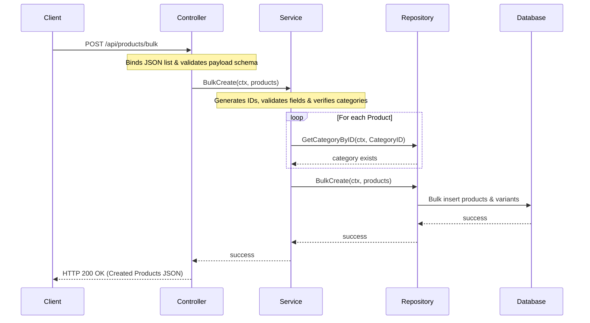

# Bulk Operations Feature Module (`internal/core/catalog/features/bulk`)

This feature submodule implements product bulk creation, update, and deletion capabilities, allowing administrators to manage multiple products and their variants efficiently in single batch requests.

## Features

- **Bulk Create**: Create multiple products (along with their variants) in a single request. Unique IDs are generated for new products and variants if not provided.
- **Bulk Update**: Modify multiple existing products and variants in one request. Requires product IDs.
- **Bulk Delete**: Delete multiple products by their IDs in a single request.
- **Validation Rules**:
  - Products must have a name and a category ID.
  - Products must have at least one variant.
  - Variant prices cannot be negative.
  - Variant SKUs must be unique within a product.

## Folder Structure

- [controller.go](controller.go): Handles request binding, payload validation, and routes requests to the bulk service.
- [service.go](service.go): Implements ID generation, business logic verification (e.g. validating category exists), and orchestrates repository updates.
- [repository.go](repository.go): Declares the storage contract (`Repository`) for bulk operations.
- [routes.go](routes.go): Maps HTTP routes (`POST`, `PUT`, `DELETE` at `/products/bulk`) to controller handlers.

## Architecture & Data Flow



## API Endpoint Details

### 1. Bulk Create Products
Creates multiple products with their variants in a single call.

* **Path**: `/api/products/bulk`
* **Method**: `POST`
* **Headers**:
  * `Content-Type: application/json`
  * `Authorization: Bearer <token>`
* **Body**:
  ```json
  [
      {
          "name": "Wireless Mouse Pro",
          "description": "Ergonomic wireless mouse",
          "category_id": "cat_accessories",
          "variants": [
              {
                  "sku": "MS-WIRE-PRO-01",
                  "name": "Black",
                  "price": 49.99,
                  "attributes": {
                      "color": "Black"
                  }
              }
          ]
      }
  ]
  ```
* **Success Response (HTTP 200)**:
  ```json
  [
      {
          "id": "prod_d9f9a0c8b6a3",
          "name": "Wireless Mouse Pro",
          "description": "Ergonomic wireless mouse",
          "category_id": "cat_accessories",
          "variants": [
              {
                  "id": "var_ef2a7b8c9d01",
                  "sku": "MS-WIRE-PRO-01",
                  "name": "Black",
                  "price": 49.99,
                  "stock": 0,
                  "attributes": {
                      "color": "Black"
                  }
              }
          ]
      }
  ]
  ```

---

### 2. Bulk Update Products
Updates multiple existing products and their variants.

* **Path**: `/api/products/bulk`
* **Method**: `PUT`
* **Headers**:
  * `Content-Type: application/json`
  * `Authorization: Bearer <token>`
* **Body**:
  ```json
  [
      {
          "id": "prod_d9f9a0c8b6a3",
          "name": "Wireless Mouse Pro V2",
          "description": "Updated ergonomic wireless mouse",
          "category_id": "cat_accessories",
          "variants": [
              {
                  "id": "var_ef2a7b8c9d01",
                  "sku": "MS-WIRE-PRO-01",
                  "name": "Black",
                  "price": 54.99,
                  "attributes": {
                      "color": "Black"
                  }
              }
          ]
      }
  ]
  ```
* **Success Response (HTTP 200)**:
  ```json
  [
      {
          "id": "prod_d9f9a0c8b6a3",
          "name": "Wireless Mouse Pro V2",
          "description": "Updated ergonomic wireless mouse",
          "category_id": "cat_accessories",
          "variants": [
              {
                  "id": "var_ef2a7b8c9d01",
                  "sku": "MS-WIRE-PRO-01",
                  "name": "Black",
                  "price": 54.99,
                  "stock": 0,
                  "attributes": {
                      "color": "Black"
                  }
              }
          ]
      }
  ]
  ```

---

### 3. Bulk Delete Products
Deletes multiple products simultaneously by their IDs.

* **Path**: `/api/products/bulk`
* **Method**: `DELETE`
* **Headers**:
  * `Content-Type: application/json`
  * `Authorization: Bearer <token>`
* **Body**:
  ```json
  {
      "ids": [
          "prod_d9f9a0c8b6a3"
      ]
  }
  ```
* **Success Response (HTTP 200)**:
  ```json
  {
      "message": "products bulk deleted"
  }
  ```
