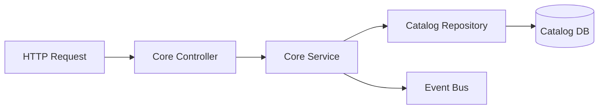
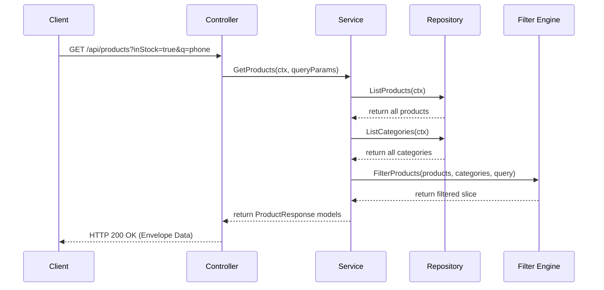
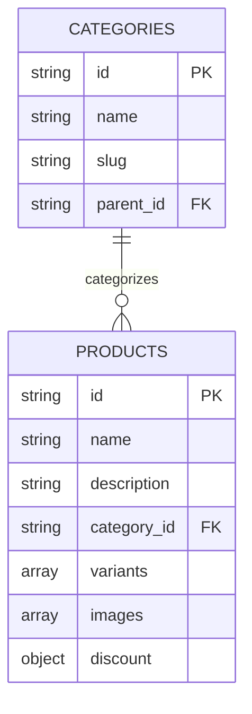

# Core Catalog Feature (`internal/core/catalog/features/core`)

This feature submodule implements the core catalog capabilities including products CRUD, query filtering, category hierarchies, and search.

## Features

- **Product Management**: Create, update, view, and delete product catalog items.
- **Category Hierarchy**: Support nested categories and resolve categories recursively during filtering.
- **Product Retrieval & Filtering**: Query and filter products by category, price ranges, attributes, inventory stock status, and text keywords.
- **Event Synchronization**: Listen to inventory stock change events and automatically update product stocks.

## Folder Structure

- [controller.go](controller.go): Receives incoming requests, maps payloads to structures, translates HTTP query bindings, and parses validation constraints.
- [service.go](service.go): Contains core business logic rules, ID generators, domain schema validation calls, and stock event subscriptions.
- [repository.go](repository.go): Declares the persistence interface (`Repository`) for product and category models.
- [dto.go](dto.go): Holds requests and responses payload structures (e.g. `CreateProductRequest`, `ProductResponse`).
- [filter.go](filter.go): Pure helper functions for evaluating product categories, price ranges, and case-insensitive attribute filters.
- [routes.go](routes.go): Maps product and category HTTP endpoints to the controller functions.

## Architecture



## Data Flow

### Product Query & Filter



## Database Design

The data schemas map to MongoDB collections or document entities inside the catalog boundary:



## Usage

Instantiation occurs during dependency injection wiring:

```go
// Wire service and repository
coreService := core.NewCatalogService(coreRepo)
coreController := core.NewController(coreService)

// Subscribe to stock changed notifications
coreService.SubscribeStockEvents(eventBus)

// Register routes on RouterGroup
core.RegisterRoutes(routerGroup, coreController, authMiddleware)
```
