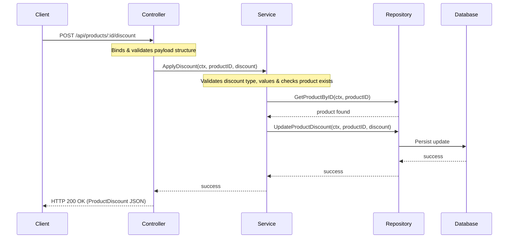

# Discounts Feature Module (`internal/core/catalog/features/discounts`)

This feature submodule implements product discount capabilities, allowing administrators to apply or remove percentage-based or fixed price reductions on individual catalog products.

## Features

- **Apply Discount**: Set a fixed or percentage reduction on any product.
- **Remove Discount**: Revoke any active discount on a product.
- **Validation Rules**:
  - Discount values cannot be negative.
  - Percentage discounts cannot exceed 100%.
  - Disallows invalid discount type formats (must be `percentage` or `fixed`).

## Folder Structure

- [controller.go](controller.go): Receives incoming discount update payloads, performs basic validation, and routes requests.
- [service.go](service.go): Enforces discount business validation logic and coordinates repository persistence updates.
- [repository.go](repository.go): Declares the storage contract (`Repository`) for reading and updating product discounts.
- [routes.go](routes.go): Maps discounts HTTP endpoints (POST & DELETE) to controller actions.

## Architecture & Data Flow



## API Endpoint Details

### 1. Apply Discount
Applies an active discount to a product.

* **Path**: `/api/products/:id/discount`
* **Method**: `POST`
* **Headers**:
  * `Content-Type: application/json`
  * `Authorization: Bearer <token>`
* **Body**:
  ```json
  {
      "type": "percentage",
      "value": 15.0
  }
  ```
  *(Alternative type: `"fixed"` with any value `>= 0`)*
* **Success Response (HTTP 200)**:
  ```json
  {
      "success": true,
      "data": {
          "type": "percentage",
          "value": 15.0
      }
  }
  ```

### 2. Remove Discount
Removes any active discount from a product.

* **Path**: `/api/products/:id/discount`
* **Method**: `DELETE`
* **Headers**:
  * `Authorization: Bearer <token>`
* **Success Response (HTTP 200)**:
  ```json
  {
      "success": true,
      "data": {
          "message": "discount removed"
      }
  }
  ```
