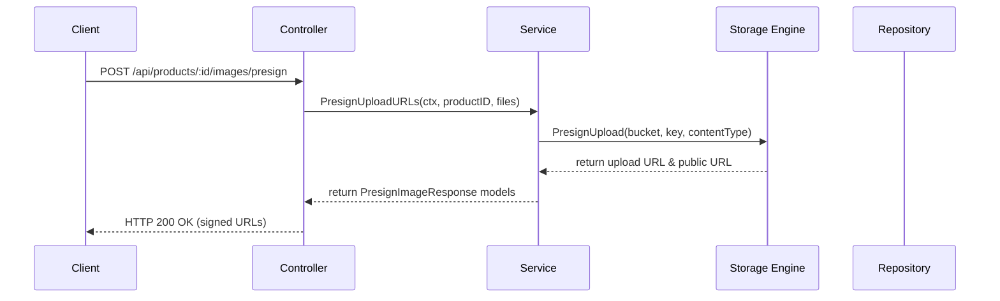

# Product Images Feature Module (`internal/core/catalog/features/images`)

This feature submodule implements the product image management capabilities of the e-commerce system. It supports client-side presigned upload generation, remote storage image registration, primary image selection, and resource deletion.

## Features

- **Client Presigned Uploads**: Generates highly-secure short-lived signed URLs for frontend clients to upload assets directly to storage buckets.
- **Registration of Uploaded Images**: Binds existing bucket storage objects into the product database representation.
- **Primary Image Management**: Toggles or updates the primary image reference of a product.
- **Secure Deletions**: Deletes image storage objects and cleans up metadata indexes inside Go structures.

## Folder Structure

- [controller.go](controller.go): HTTP handler layer supporting JSON bindings and action mapping.
- [service.go](service.go): Enforces constraints such as promoting the first uploaded image to primary and resolving storage bucket locations.
- [repository.go](repository.go): Storage port interface for reading and writing product image fields.
- [routes.go](routes.go): Connects endpoints (POST, DELETE, PUT) to controllers and guards them with both `authMiddleware` and `adminOnlyMiddleware`.

## Architecture & Data Flow



## API Endpoint Details

All endpoints are protected and require valid Admin JWT headers:
`Authorization: Bearer <admin_token>`

### 1. Presigned Upload URLs
* **Path**: `/api/products/:id/images/presign`
* **Method**: `POST`
* **Body**:
  ```json
  {
      "files": [
          {
              "filename": "camera.png",
              "content_type": "image/png"
          }
      ]
  }
  ```

### 2. Register Uploaded Images
* **Path**: `/api/products/:id/images/register`
* **Method**: `POST`
* **Body**:
  ```json
  {
      "images": [
          {
              "key": "products/prod_123/img_abc.png",
              "is_primary": true
          }
      ]
  }
  ```

### 3. Set Primary Image
* **Path**: `/api/products/:id/images/:imageId/primary`
* **Method**: `PUT`

### 4. Delete Image
* **Path**: `/api/products/:id/images/:imageId`
* **Method**: `DELETE`
