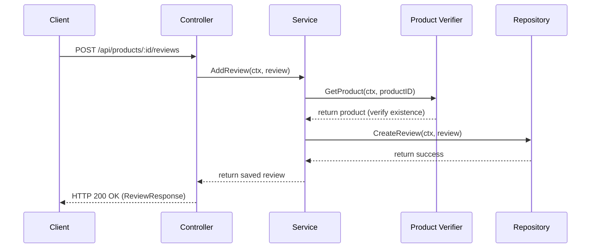

# Product Reviews Feature Module (`internal/core/catalog/features/reviews`)

This feature submodule implements the product review and rating summary system. It allows customers to submit ratings and comments on products, retrieves a list of reviews for a product, summarizes average ratings, and handles authorized deletion of reviews by the author or an admin.

## Features

- **Submit Review**: Customers can rate products (1 to 5 stars) and write comments.
- **Review Listings**: Publicly view all customer reviews for a given product.
- **Rating Summary**: Retrieve average ratings and total review counts to display star ratings on product pages.
- **Authorized Deletion**: Review creators or administrators can delete reviews.

## Folder Structure

- [review.go](./review.go): Core domain entity definitions and validation rules (e.g. valid rating bounds, non-empty comments).
- [dto.go](ecom-engine/internal/core/catalog/features/reviews/dto.go): Request/response payloads (JSON format rules).
- [controller.go](ecom-engine/internal/core/catalog/features/reviews/controller.go): HTTP router endpoint handlers, parameter binding, context user extraction, and error translation.
- [service.go](ecom-engine/internal/core/catalog/features/reviews/service.go): Orchestrates business logic, product verification, rating calculations, and deletion authorization.
- [repository.go](ecom-engine/internal/core/catalog/features/reviews/repository.go): Data access layer interface and in-memory mock repository.
- [routes.go](ecom-engine/internal/core/catalog/features/reviews/routes.go): Connects endpoints (GET, POST, DELETE) to handlers and configures authentication middleware.

## Architecture & Data Flow



## API Endpoint Details

### 1. Submit Product Review

- **Path**: `/api/products/:id/reviews`
- **Method**: `POST`
- **Headers**: `Authorization: Bearer <user_token>`
- **Body**:
  ```json
  {
    "rating": 5,
    "comment": "Outstanding quality, very satisfied!"
  }
  ```

### 2. Get Product Reviews

- **Path**: `/api/products/:id/reviews`
- **Method**: `GET`
- **Headers**: None (Public)

### 3. Get Product Rating Summary

- **Path**: `/api/products/:id/reviews/rating`
- **Method**: `GET`
- **Headers**: None (Public)
- **Response Data**:
  ```json
  {
    "success": true,
    "data": {
      "product_id": "prod_123",
      "average_rating": 4.5,
      "review_count": 12
    }
  }
  ```

### 4. Delete Review

- **Path**: `/api/products/:id/reviews/:reviewId`
- **Method**: `DELETE`
- **Headers**: `Authorization: Bearer <user_token>`

---

## Production Readiness Analysis

During the analysis of the module, the following concerns were identified which should be resolved before deploying to a highly-scalable production environment:

### 1. In-Memory Repository Concurrency & Data Races

- **Issue**: The current memory repository (`memReviewRepo`) stores direct pointers (`*Review`) in its internal map and returns them to callers via `GetReviewByID`. This means fields can be modified concurrently by caller routines without locking the mutex, presenting data race risks.
- **Mitigation**: Adjust the repository to store copy-on-write and return cloned/deep-copied structures instead of direct references.

### 2. In-Memory Calculation of Rating Summary

- **Issue**: In `service.go`'s `GetAverageRating`, the service pulls _all_ reviews for the product into memory from the repo just to calculate the average and count. At scale (thousands of reviews per product), this leads to excessive memory usage, GC overhead, and poor response times.
- **Mitigation**: Introduce a database-level query (`GetRatingSummary(productID)`) that performs count and average aggregation (`SELECT COUNT(*), AVG(rating) FROM reviews ...`) directly on the database engine.

### 3. Lack of Pagination

- **Issue**: The `GET /api/products/:id/reviews` endpoint returns all reviews in a single list. If a popular product accumulates thousands of reviews, listing them without limit/offset or cursor pagination will degrade performance.
- **Mitigation**: Add optional query parameters for pagination (e.g. `?limit=20&page=1` or `?cursor=...`).
