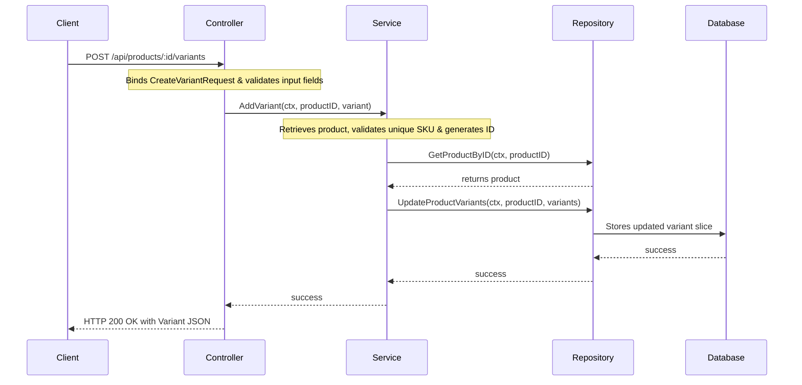

# Product Variants Feature Module (`internal/core/catalog/features/variants`)

This submodule manages individual product variants, enabling retrieve, add, update, and delete actions for specific product configurations (e.g. storage, color, price adjustments).

## Features

- **Get Variants**: Retrieve all variant items belonging to a given product ID.
- **Add Variant**: Add a new variant item to a product. Auto-generates an ID with the prefix `var_` if not provided.
- **Update Variant**: Modify fields (SKU, Name, Price, Attributes) of an existing variant.
- **Delete Variant**: Remove a specific variant from a product.
- **Validation Rules**:
  - A product must always have at least one variant; deleting the final variant is rejected.
  - Variant price values must be greater than or equal to zero.
  - Variant SKU values must be unique within a single product.

## Folder Structure

- [controller.go](controller.go): HTTP handler binding request payloads and returning appropriate responses.
- [service.go](service.go): Contains variant orchestration, ID generation, validation checks, and CRUD business logic.
- [repository.go](repository.go): Storage interface mapping variant repository requirements.
- [routes.go](routes.go): Maps URL routes to controller handler functions.

## Architecture & Data Flow



## API Endpoint Details

### 1. Get Product Variants
Gets all variants belonging to a specific product.

* **Path**: `/api/products/:id/variants`
* **Method**: `GET`
* **Headers**: None
* **Response (HTTP 200)**:
  ```json
  {
      "success": true,
      "data": [
          {
              "id": "var_base",
              "sku": "SP-BASE",
              "name": "Base Variant",
              "price": 499.99,
              "stock": 10,
              "attributes": {
                  "color": "Silver"
              }
          }
      ]
  }
  ```

---

### 2. Add Variant
Appends a variant to a product.

* **Path**: `/api/products/:id/variants`
* **Method**: `POST`
* **Headers**:
  * `Content-Type: application/json`
  * `Authorization: Bearer <token>`
* **Body**:
  ```json
  {
      "sku": "SP-PRO",
      "name": "Pro Model Variant",
      "price": 799.99,
      "attributes": {
          "storage": "256GB",
          "color": "Titanium"
      }
  }
  ```
* **Response (HTTP 200)**:
  ```json
  {
      "success": true,
      "data": {
          "id": "var_01j0e3bc821a",
          "sku": "SP-PRO",
          "name": "Pro Model Variant",
          "price": 799.99,
          "stock": 0,
          "attributes": {
              "color": "Titanium",
              "storage": "256GB"
          }
      }
  }
  ```

---

### 3. Update Variant
Modifies an existing product variant.

* **Path**: `/api/products/:id/variants/:variantId`
* **Method**: `PUT`
* **Headers**:
  * `Content-Type: application/json`
  * `Authorization: Bearer <token>`
* **Body**:
  ```json
  {
      "sku": "SP-PRO-UPDATED",
      "name": "Pro Model 512GB",
      "price": 849.99,
      "attributes": {
          "storage": "512GB",
          "color": "Titanium"
      }
  }
  ```
* **Response (HTTP 200)**:
  ```json
  {
      "success": true,
      "data": {
          "id": "var_01j0e3bc821a",
          "sku": "SP-PRO-UPDATED",
          "name": "Pro Model 512GB",
          "price": 849.99,
          "stock": 0,
          "attributes": {
              "color": "Titanium",
              "storage": "512GB"
          }
      }
  }
  ```

---

### 4. Delete Variant
Deletes a specific variant from a product.

* **Path**: `/api/products/:id/variants/:variantId`
* **Method**: `DELETE`
* **Headers**:
  * `Authorization: Bearer <token>`
* **Response (HTTP 200)**:
  ```json
  {
      "success": true,
      "data": {
          "message": "variant deleted"
      }
  }
  ```

## Running Tests

To run variants package tests:
```bash
go test -v ./internal/core/catalog/features/variants/...
```
To run tests with code coverage analysis:
```bash
go test -coverprofile=coverage.out ./internal/core/catalog/features/variants/...
go tool cover -html=coverage.out
```
