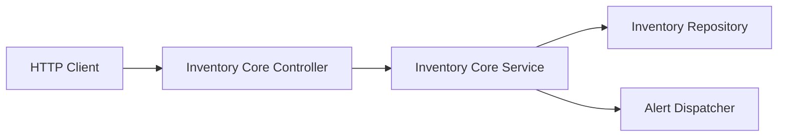
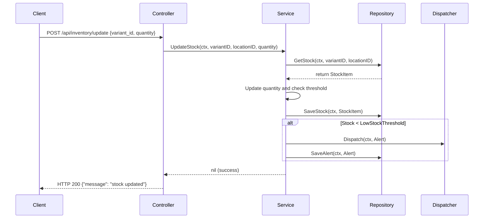

# Core Inventory Feature (`internal/core/inventory/features/core`)

This submodule implements the core inventory capabilities including stock checks, manual stock adjustments, alerting rules, location-specific configurations, and deletions.

## Features

- **Stock Checking**: Read available quantity for a product variant at a specific inventory location (defaults to `"default"`).
- **Stock Configuration**: Configure threshold alerts, backordering capability, and backorder limits per variant/location.
- **Stock Updates**: Manually adjust the quantity count of specific variants at a location.
- **Low-Stock Alerting**: Auto-detect stock dropping below configured thresholds and dispatch alert events.
- **Deletions**: Remove a variant's stock details from a location.

## Folder Structure

- [controller.go](./controller.go): Receives incoming HTTP requests, binds query strings, validates JSON request bodies, and calls the service layer.
- [service.go](./service.go): Contains business rules, evaluates low stock thresholds, and dispatches alerts when stock drops below threshold.
- [repository.go](./repository.go): Declares the storage port (`Repository`) interface.
- [alert.go](./alert.go): Defines alert dispatcher interfaces and data models for low stock alerts.
- [routes.go](./routes.go): Connects the API endpoints to the Controller handler functions.

## Architecture



## Data Flow

### Update Stock & Trigger Alert



## Usage

Instantiation occurs during dependency injection wiring:

```go
// Wire service and repository
coreService := core.NewService(inventoryRepo, alertDispatcher)
coreController := core.NewController(coreService)

// Register routes
core.RegisterRoutes(routerGroup, coreController, authMiddleware, adminOnlyMiddleware)
```
