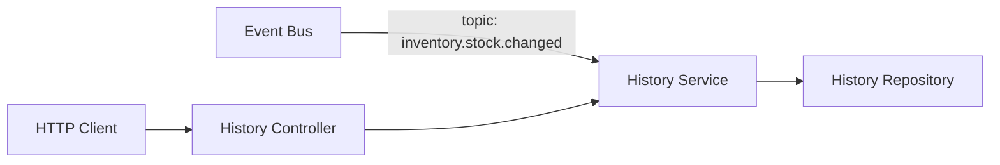
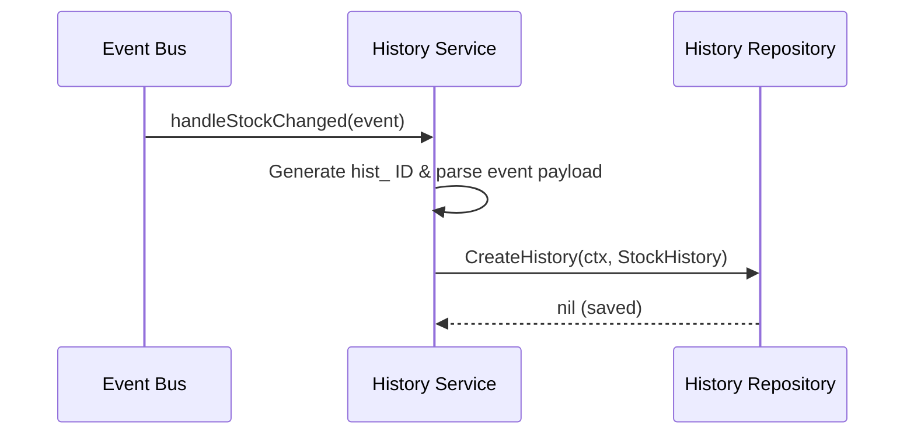

# Inventory History Feature (`internal/core/inventory/features/history`)

This submodule implements stock level history tracking. It listens to stock change events on the event bus and records an audit log entry for every stock update.

## Features

- **Stock Log Retrieval**: Retrieve a historical ledger of all stock quantity modifications for a specific product variant.
- **Event-Driven Audit Logging**: Automatically capture and store audit details (old quantity, new quantity, change reason, operator) whenever a stock change event is published.

## Folder Structure

- [controller.go](controller.go): Exposes HTTP handler to fetch history logs for a variant ID.
- [service.go](service.go): Houses logic to read audit records and subscribe to stock change event topics.
- [repository.go](repository.go): Declares the storage port (`Repository`) interfaces for logging history.
- [routes.go](routes.go): Defines endpoint mappings under `/inventory/:variantID/history`.

## Architecture



## Data Flow

### Event Logging Flow



## Usage

Instantiation occurs during dependency injection wiring:

```go
// Wire service and repository
historyService := history.NewService(historyRepo, eventBus)
historyController := history.NewController(historyService)

// Register routes
history.RegisterRoutes(routerGroup, historyController, authMiddleware)
```
