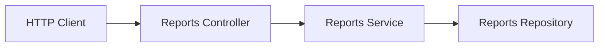
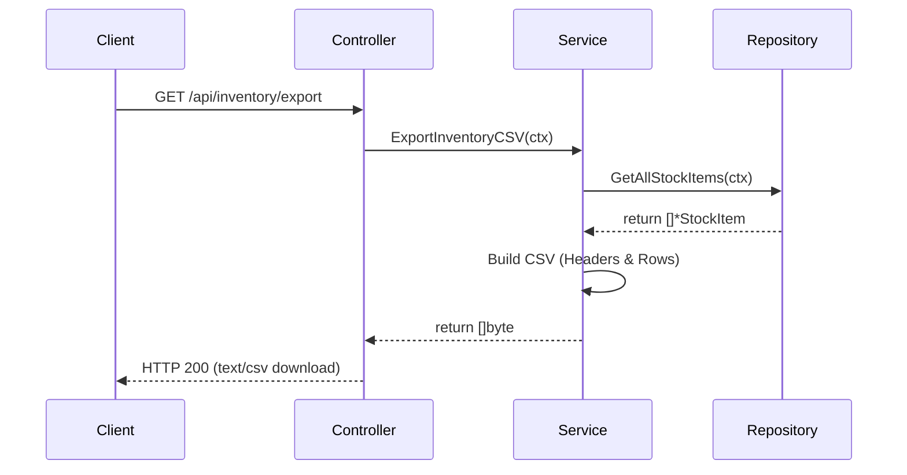

# Inventory Reports Feature (`internal/core/inventory/features/reports`)

This submodule implements inventory reporting capabilities, allowing admins to retrieve low-stock lists and export complete inventory datasets to a standard CSV format.

## Features

- **Low Stock Report**: Fetch inventory items across all locations that have currently fallen below their configured low-stock threshold.
- **CSV Export**: Export all stock items (Variant ID, Location ID, Quantity, Threshold, Backorder details) into a formatted CSV data stream.

## Folder Structure

- [controller.go](controller.go): Exposes HTTP handlers mapping responses to LowStock and CSV export outputs.
- [service.go](service.go): Contains business reporting logic, reading from repository and compiling CSV structures.
- [repository.go](repository.go): Declares the storage port (`Repository`) interfaces for reports.
- [routes.go](routes.go): Maps report HTTP endpoints to the controller.

## Architecture



## Data Flow

### CSV Export Flow



## Usage

Instantiation occurs during dependency injection wiring:

```go
// Wire service and repository
reportsService := reports.NewService(reportsRepo)
reportsController := reports.NewController(reportsService)

// Register routes
reports.RegisterRoutes(routerGroup, reportsController, authMiddleware)
```
