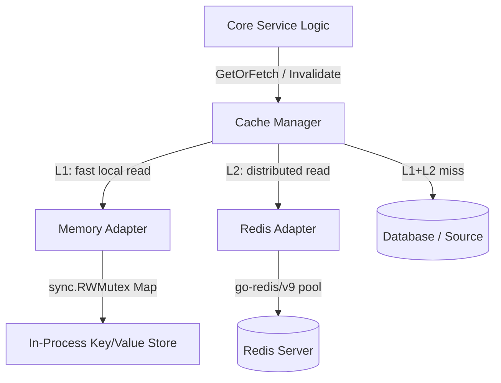

# Cache Subsystem

The Cache subsystem provides a uniform, backend-agnostic caching interface (`Cache`) to support performance optimization across the ecom-engine project. It is structured around the Ports-and-Adapters pattern and supports a two-layer (L1/L2) caching strategy through the `CacheManager`.

---

## Architecture Overview



### Two-Layer Strategy (L1 + L2)

The `CacheManager` implements a read-through, write-through cache with two layers:

| Layer | Backend   | Purpose                                       |
| ----- | --------- | --------------------------------------------- |
| L1    | In-Memory | Sub-millisecond reads, local to the process   |
| L2    | Redis     | Distributed, shared across multiple instances |

**Read path** (`GetOrFetch`):

1. Check L1 (Memory) — return immediately on hit.
2. Check L2 (Redis) — on hit, backfill L1 and return.
3. On full miss, call `fetchFn` (DB/source), populate L2 then L1.

**Write path** (after fetch):

- L2 is written with the caller-supplied `ttl`.
- L1 is written with `min(l1TTL, ttl)`. Default L1 TTL is **1 minute**.

**Invalidation** (`Invalidate`):

- Deletes the key from both L1 and L2. Errors from each layer are collected and joined — a partial failure does not suppress the other layer's delete.

---

## Cache Interface (`port.go`)

```go
type Cache interface {
    Set(ctx context.Context, key string, value interface{}, ttl time.Duration) error
    Get(ctx context.Context, key string) (string, error)
    Delete(ctx context.Context, key string) error
    Exists(ctx context.Context, key string) (bool, error)
    Increment(ctx context.Context, key string, delta int64) (int64, error)
    HealthCheck(ctx context.Context) error
    Close() error
}
```

### Method Contracts

| Method        | Behaviour                                                                                                                                                              |
| ------------- | ---------------------------------------------------------------------------------------------------------------------------------------------------------------------- |
| `Set`         | JSON-serializes `value` and stores it. `ttl <= 0` means no expiration. Never returns `ErrCacheMiss`.                                                                   |
| `Get`         | Returns the raw JSON string. Returns `ErrCacheMiss` if the key is absent or expired.                                                                                   |
| `Delete`      | Deletes the key. Deleting a non-existent key is a no-op (not an error).                                                                                                |
| `Exists`      | Returns `true` only if the key exists **and** is not expired. No value is fetched.                                                                                     |
| `Increment`   | Atomically adds `delta` to the stored integer. Key is initialized to `0` if absent. Fails with `CacheBackendError` if the stored value cannot be parsed as an integer. |
| `HealthCheck` | Pings the backend. Returns `nil` if healthy.                                                                                                                           |
| `Close`       | Closes connections / stops background goroutines. Must be called on shutdown.                                                                                          |

### Serialization Parity

Both adapters JSON-serialize values on `Set` and return raw JSON strings on `Get`. This means behaviour is identical regardless of the backend — callers must `json.Unmarshal` the result of `Get`.

**Exception:** `Increment` stores integer values as plain decimal strings (e.g. `"42"`), not JSON. This is intentional — Redis `INCRBY` operates on plain integer strings, and the memory adapter mirrors this behaviour for consistency.

---

## Error Handling (`errors.go`)

Two distinct error types are used; never expose raw backend errors to callers.

### `ErrCacheMiss`

```go
var ErrCacheMiss = errors.New("cache miss")
```

- Returned by `Get` when a key does not exist or has expired.
- This is an **expected condition**, not an application error. Handle it as a signal to fetch from source.
- Check with `cache.IsCacheMiss(err)`.

### `CacheBackendError`

```go
type CacheBackendError struct {
    Operation string // "get", "set", "delete", "increment", etc.
    Key       string
    Err       error  // wrapped underlying error
}
```

- Returned on infrastructure failures: connection refused, timeouts, serialization errors, type mismatches on `Increment`.
- Supports `errors.Unwrap` for `errors.Is`/`errors.As` chaining.
- Check with `cache.IsCacheBackendError(err)`.
- Construct with `cache.NewCacheBackendError(operation, key, err)`.

---

## In-Memory Adapter (`/memory`)

### Capacity and Limits

| Setting          | Default      | Override                     |
| ---------------- | ------------ | ---------------------------- |
| Max items        | **10,000**   | `memory.WithMaxItems(n)`     |
| Cleanup interval | **1 minute** | fixed (background goroutine) |

### Eviction Policy

When the item count reaches `maxItems`, eviction runs in two stages on every `Set`:

1. **Expired scan** — iterates up to **50** random items and deletes any that are past their TTL. This is a best-effort passive sweep.
2. **Sample-based LFU with LRU tie-breaking** — if the store is still at capacity after the expired scan, **10** random items are sampled. The item with the **lowest hit count** (`hits`) is evicted. If two items have equal hits, the one with the **oldest `lastAccess` time** (LRU tie-breaker) is evicted.

> Go map iteration is randomized, which makes the fixed-size sample an unbiased random sample without extra bookkeeping.

### TTL Expiration

TTL is stored as a Unix nanosecond timestamp (`expiration int64`). Expiration is checked **lazily on read** (both `Get` and `Exists`). On a read that finds an expired entry, the adapter upgrades to a write lock, double-checks expiration, and deletes the key before returning `ErrCacheMiss`.

The background cleanup goroutine runs every **1 minute** to sweep and delete all expired keys proactively, preventing unbounded memory growth in low-traffic scenarios.

### Hit Tracking

Each cache item tracks:

- `hits int64` — incremented atomically on every `Get` hit. Used for LFU eviction decisions.
- `lastAccess int64` — updated atomically on every `Get`. Used as LRU tie-breaker during eviction.

Stats are **preserved across overwrites**: if a `Set` targets an existing key, the previous `hits` count is carried forward (incremented by 1) rather than reset.

### Concurrency

All map access is protected by a `sync.RWMutex`. `Get` holds a read lock; `Set`, `Delete`, and `Increment` hold a write lock. Hit/access tracking uses `sync/atomic` to avoid upgrading the lock type on every read.

---

## Redis Adapter (`/redis`)

### Configuration (`config.go`)

```go
type Config struct {
    Addr         string        // "host:port", default "localhost:6379"
    Password     string        // Auth password, default "" (no auth)
    DB           int           // Logical DB index 0–15, default 0
    PoolSize     int           // Max open connections, default 10
    MinIdleConns int           // Minimum idle connections to maintain, default 2
    ReadTimeout  time.Duration // Socket read deadline, default 3s
    WriteTimeout time.Duration // Socket write deadline, default 3s
    DialTimeout  time.Duration // Connection timeout, default 5s
}
```

Use `redis.DefaultConfig()` for sensible defaults and override individual fields as needed.

### Connection Pool

The adapter uses `go-redis/v9`'s built-in connection pool:

- **`PoolSize`** caps the total number of open connections. Requests that exceed this limit will wait (bounded by `ReadTimeout`/`WriteTimeout`).
- **`MinIdleConns`** keeps warm connections ready to avoid dial latency on bursty traffic.
- A `Ping` is issued during `NewRedisAdapter` — if it fails the adapter returns a `CacheBackendError` and the client is closed.

### TTL Behaviour

TTL is passed directly to Redis `SET ... EX`. Redis enforces expiration server-side; no client-side sweep is needed. A `ttl` of `0` is passed as `0` to `go-redis`, which Redis interprets as **no expiration** (key persists indefinitely).

### Increment

Uses Redis `INCRBY`, which is atomic at the Redis level. The key does not need to exist first — Redis initializes it to `0` and applies the delta. Unlike the memory adapter, there is no type check: if the stored value is not an integer string, Redis returns an error which is wrapped as `CacheBackendError`.

---

## Key Naming Conventions

Keys are plain strings. Use structured, colon-separated namespaces to avoid collisions across modules:

```
<domain>:<entity>:<identifier>
```

Examples used across the codebase:

| Key Pattern       | Example                  | Notes                    |
| ----------------- | ------------------------ | ------------------------ |
| `user:<id>`       | `user:usr_abc123`        | Per-user data cache      |
| `rate_limit:<ip>` | `rate_limit:192.168.1.1` | Rolling request counters |
| `order:<id>`      | `order:ord_xyz789`       | Order detail cache       |
| `session:<token>` | `session:tok_...`        | Auth session state       |

Keys are case-sensitive. Prefer lowercase with underscores within segments.

---

## Cache Manager (`manager.go`)

The `CacheManager` wraps L1 + L2 into a unified read-through interface. It is the primary API for service-layer code.

```go
type Manager interface {
    GetOrFetch(ctx context.Context, key string, target interface{}, ttl time.Duration, fetchFn func() (interface{}, error)) error
    Invalidate(ctx context.Context, key string) error
    Close() error
}
```

### Construction

```go
l1 := memory.NewMemoryAdapter(memory.WithMaxItems(5000))
l2, _ := redis.NewRedisAdapter(ctx, redis.DefaultConfig())

manager := cache.NewCacheManager(l1, l2,
    cache.WithL1TTL(30*time.Second), // Override default 1-minute L1 TTL
)
```

Either layer can be `nil` — the manager skips that layer gracefully. This allows running with only Redis (L2-only) or only Memory (L1-only, e.g. in tests).

### L1 TTL Capping

The L1 TTL is capped at `min(l1TTL, ttl)`. This ensures that short-lived L2 entries (e.g. `ttl=10s`) are not cached in L1 longer than they would survive in L2, preventing stale reads after L2 expiry.

---

## Usage Examples

### 1. Read-Through with CacheManager

```go
var order Order
err := manager.GetOrFetch(ctx, "order:ord_xyz789", &order, 10*time.Minute, func() (interface{}, error) {
    return db.FindOrderByID(ctx, "ord_xyz789")
})
if err != nil {
    return nil, err
}
// order is populated from L1, L2, or DB — caller doesn't care which
```

### 2. Direct Get/Set with Miss Handling

```go
val, err := cache.Get(ctx, "user:usr_abc123")
if cache.IsCacheMiss(err) {
    user, _ := db.FindUser(ctx, "usr_abc123")
    _ = cache.Set(ctx, "user:usr_abc123", user, 15*time.Minute)
    return user, nil
}
if cache.IsCacheBackendError(err) {
    // Log and fail-open: proceed without cache
    log.Warn("cache unavailable", "err", err)
    return db.FindUser(ctx, "usr_abc123")
}
var user User
json.Unmarshal([]byte(val), &user)
return &user, nil
```

### 3. Atomic Rate-Limit Counter

```go
key := fmt.Sprintf("rate_limit:%s", clientIP)
count, err := cache.Increment(ctx, key, 1)
if err != nil {
    return false, err // fail-closed on backend error
}
return count <= 100, nil // allow up to 100 requests
```

### 4. Cache Invalidation

```go
// Invalidates from both L1 and L2
if err := manager.Invalidate(ctx, "order:ord_xyz789"); err != nil {
    log.Error("cache invalidation failed", "err", err)
}
```

---

## Security Hardening

The following protections are built into the `CacheManager` and adapters. They are all active by default.

### Cache Penetration (Negative Caching)

When `fetchFn` returns `(nil, nil)` - meaning the record genuinely does not exist - a null sentinel (`__null__`) is cached in both L1 and L2 with a short TTL (default **30 seconds**). Subsequent calls for the same key return `ErrNotFound` without touching the database, blocking repeat DB-DoS from non-existent key probes.

```go
// Configure negative cache TTL (0 disables it)
cache.NewCacheManager(l1, l2, cache.WithNegativeCacheTTL(1*time.Minute))
```

Callers distinguish `ErrNotFound` from a backend failure:

```go
err := manager.GetOrFetch(ctx, key, &target, ttl, fetchFn)
if errors.Is(err, cache.ErrNotFound) {
    // Record confirmed absent — return 404
}
```

### Cache Stampede (Singleflight Deduplication)

When a popular key expires, all concurrent goroutines that miss L1 and L2 are collapsed via `singleflight` - only **one** goroutine calls `fetchFn`. All other waiters receive the shared result. This prevents thundering herd database spikes on expiry.

### Cache Avalanche (TTL Jitter)

L2 (Redis) TTLs are automatically randomized with up to **+10% jitter** before writing. This spreads expiry times across batch-loaded keys so they don't all expire simultaneously.

```go
// Configure jitter percentage (0 disables, useful in tests)
cache.NewCacheManager(l1, l2, cache.WithTTLJitter(0.15)) // +15% max jitter
```

### Value and Key Size Limits

Both adapters reject oversized payloads before writing to prevent memory exhaustion:

| Limit          | Memory Adapter                               | Redis Adapter                                   |
| -------------- | -------------------------------------------- | ----------------------------------------------- |
| Max value size | 1 MiB (configurable via `WithMaxValueBytes`) | 5 MiB (configurable via `Config.MaxValueBytes`) |
| Max key length | 512 bytes                                    | 512 bytes                                       |

Violations return `CacheBackendError` wrapping `ErrValueTooLarge` or `ErrKeyTooLong`.

### Redis Authentication and TLS

The Redis adapter logs a warning on startup if `Password` is empty. For production:

```go
redis.Config{
    Addr:       "redis.internal:6379",
    Password:   os.Getenv("REDIS_PASSWORD"), // required in production
    TLSEnabled: true,
    TLSCA:      "/etc/ssl/redis-ca.pem",
    TLSCert:    "/etc/ssl/redis-client.pem", // for mTLS
    TLSKey:     "/etc/ssl/redis-client-key.pem",
}
```

TLS is enforced with a minimum of **TLS 1.2**. CA, client cert, and client key paths are all optional - any combination can be set independently.

### What Not to Cache

- Raw passwords, secret keys, or private tokens.
- Full payment card numbers or CVVs.
- Complete `User` structs with `passwordHash` fields — create a `UserPublic` projection and cache that instead.
- Use short TTLs (< 5 min) for session tokens and other user-specific security state.
- **Never** rely on the memory adapter for rate-limit counters in multi-instance deployments — it is process-local. Use Redis (L2) with `cache.Increment` instead.

### Key Enumeration

Always use opaque IDs (ULIDs/UUIDs) as key suffixes, never sequential integers. Sequential IDs allow attackers to probe `user:1`, `user:2`, etc. The `idgen` package in this project generates ULID-based IDs by default.

---

## Observability

All cache metrics are emitted to Prometheus under the `ecom_engine` namespace. The Redis pool collector is automatically registered in [engine.go](../../../engine/engine.go) when L2 is Redis.

### Metrics Reference

| Metric                                           | Type      | Labels                         | Description                                                     |
| ------------------------------------------------ | --------- | ------------------------------ | --------------------------------------------------------------- |
| `ecom_engine_cache_requests_total`               | Counter   | `layer`, `operation`, `result` | All cache operations with hit/miss/error/ok result              |
| `ecom_engine_cache_operation_duration_seconds`   | Histogram | `layer`, `operation`           | Operation latency (buckets: 100µs–500ms)                        |
| `ecom_engine_cache_stampede_dedup_total`         | Counter   | —                              | Requests collapsed by singleflight — high = protection firing   |
| `ecom_engine_cache_negative_cache_total`         | Counter   | —                              | Null sentinels written — spike may indicate penetration attempt |
| `ecom_engine_cache_memory_items`                 | Gauge     | —                              | Current L1 item count                                           |
| `ecom_engine_cache_memory_max_items`             | Gauge     | —                              | Configured L1 capacity limit                                    |
| `ecom_engine_cache_memory_evictions_total`       | Counter   | `reason` (expired/lfu)         | L1 evictions by reason                                          |
| `ecom_engine_cache_redis_pool_total_conns`       | Gauge     | —                              | Total connections in Redis pool                                 |
| `ecom_engine_cache_redis_pool_idle_conns`        | Gauge     | —                              | Idle connections in Redis pool                                  |
| `ecom_engine_cache_redis_pool_hits_total`        | Counter   | —                              | Pool hits (connection reused)                                   |
| `ecom_engine_cache_redis_pool_misses_total`      | Counter   | —                              | Pool misses (new connection dialed)                             |
| `ecom_engine_cache_redis_pool_timeouts_total`    | Counter   | —                              | Callers that timed out waiting for a pool connection            |
| `ecom_engine_cache_redis_pool_stale_conns_total` | Counter   | —                              | Stale connections removed from pool                             |

### Recommended Alerts

| Alert                     | Expression                                                                                             | Severity |
| ------------------------- | ------------------------------------------------------------------------------------------------------ | -------- |
| Low cache hit rate        | `rate(cache_requests_total{result="hit"}[5m]) / rate(cache_requests_total{operation="get"}[5m]) < 0.7` | Warning  |
| L1 near capacity          | `cache_memory_items / cache_memory_max_items > 0.9`                                                    | Warning  |
| High LFU eviction rate    | `rate(cache_memory_evictions_total{reason="lfu"}[5m]) > 50`                                            | Warning  |
| Redis latency spike       | `histogram_quantile(0.99, cache_operation_duration_seconds{layer="L2"}) > 0.05`                        | Critical |
| Redis pool exhausted      | `rate(cache_redis_pool_timeouts_total[1m]) > 0`                                                        | Critical |
| Penetration attack signal | `rate(cache_negative_cache_total[1m]) > 50`                                                            | Warning  |

---

## Shutdown

Always call `Close()` on shutdown to release connections and stop the memory adapter's background cleanup goroutine:

```go
defer manager.Close()
```

If using adapters directly (without Manager), close each adapter individually:

```go
defer l1.Close()
defer l2.Close()
```
