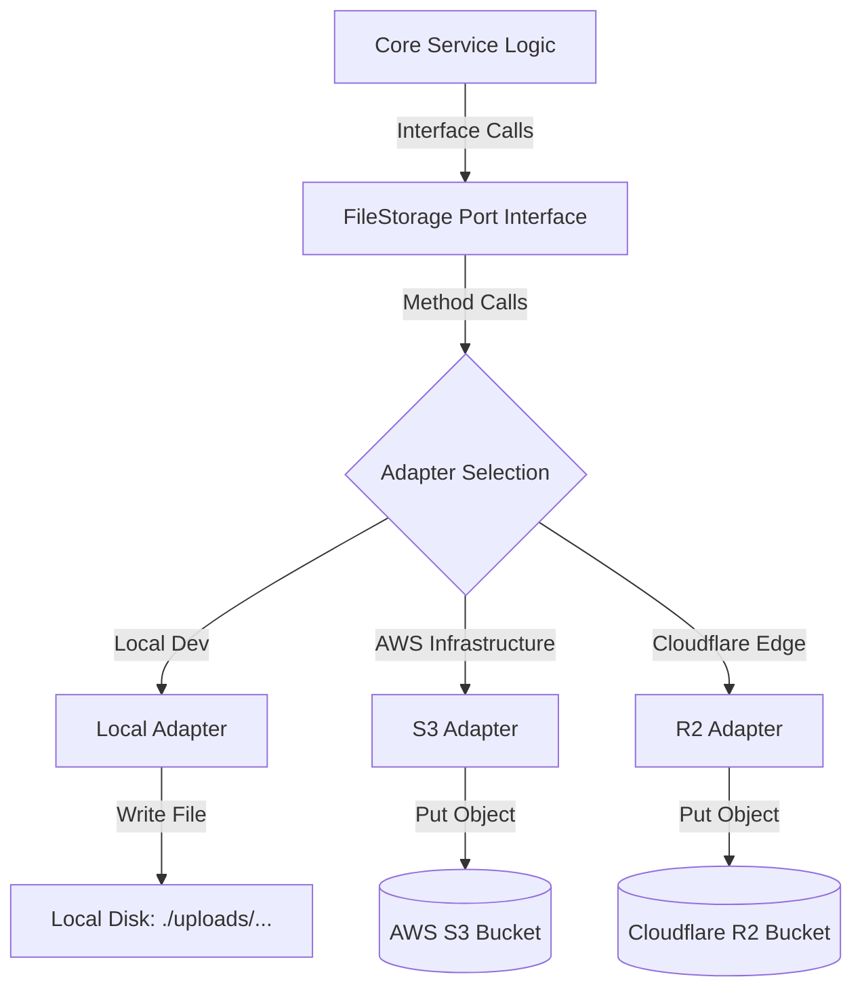
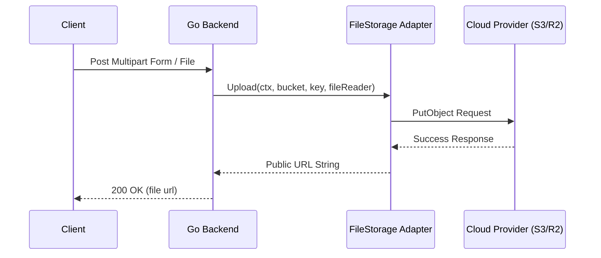
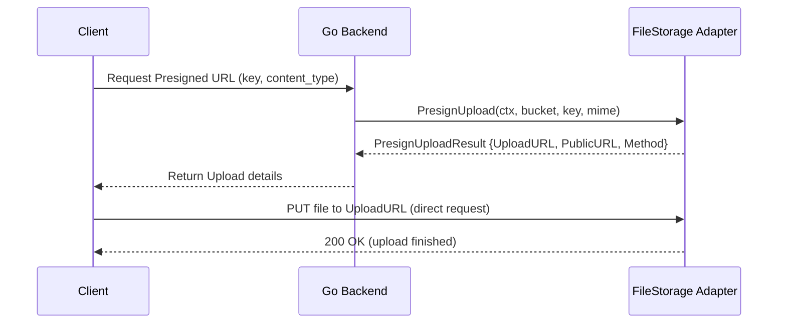

# File Storage Subsystem

The File Storage subsystem provides a uniform, backend-agnostic abstraction (`FileStorage`) for handling file uploads, downloads, deletions, and presigned links across the ecom-engine project.

---

## Overview

The storage system utilizes the Ports-and-Adapters pattern to decouple application core features (such as product image uploads, invoice creation, and report generation) from the actual physical storage providers.

Supported adapters:
- **Local Disk Storage**: Stores files in a local directory system (best for local dev/testing).
- **Amazon S3**: Production-grade object storage.
- **Cloudflare R2**: High-performance, zero-egress cost object storage.

---

## Architecture Flow



---

## Storage Port Interface (`port.go`)

Defined in [port.go](port.go):

```go
type PresignUploadResult struct {
	UploadURL string
	PublicURL string
	Method    string
}

type FileStorage interface {
	Upload(ctx context.Context, bucket, key string, data io.Reader) (string, error)
	Download(ctx context.Context, bucket, key string) (io.ReadCloser, error)
	Delete(ctx context.Context, bucket, key string) error
	PresignUpload(ctx context.Context, bucket, key, contentType string) (*PresignUploadResult, error)
	GetPublicURL(ctx context.Context, bucket, key string) (string, error)
}
```

---

## Adapters

### 1. Local Adapter (`/local`)
- Stores documents inside `./uploads/{bucket}/{key}` in the current directory directory.
- Automatically handles directory creation using `os.MkdirAll`.
- **Note**: `PresignUpload` is not supported and will return an error since local file systems do not have public presigned endpoint support.

### 2. S3 Adapter (`/s3`)
- Uses the official AWS SDK for Go v2 to interface with Amazon S3 buckets.
- Supported operations: `Upload`, `Download`, `Delete`, `PresignUpload` (via `s3.PresignClient`), and `GetPublicURL`.
- Connection details:
  - Formats standard public S3 endpoints: `https://{bucket}.s3.{region}.amazonaws.com/{key}`.
  - Automatically loads credentials using the standard AWS SDK credential chain (environment variables like `AWS_ACCESS_KEY_ID`/`AWS_SECRET_ACCESS_KEY`, shared credential profiles, or IAM task/instance roles in production).
  - Can optionally accept static keys via configuration.

### 3. R2 Adapter (`/r2`)
- Uses the official AWS SDK for Go v2 configured for Cloudflare R2's S3-compatible API.
- Connection details:
  - Custom endpoint format: `https://{accountId}.r2.cloudflarestorage.com`.
  - Region configuration: Always uses `"auto"`, as required by Cloudflare R2.
  - Generates public URLs conforming to Cloudflare R2's dev domain: `https://pub-{accountId}.r2.dev/{key}`.
  - Expects static credentials generated from the Cloudflare Dashboard.

---

## Configuration

The storage system is configured via `config.yaml` (or environment variables).

```yaml
storage:
  provider: "local"            # Options: "local", "s3", "r2"
  bucket: "products"           # Target bucket name
  region: "us-east-1"          # AWS Region (s3 only)
  account_id: ""               # Cloudflare Account ID (r2 only)
  access_key_id: ""            # Optional static credential override
  secret_access_key: ""        # Optional static credential override
```

### Environment Variable Overrides

| YAML Key | Environment Variable | Purpose |
|---|---|---|
| `storage.provider` | `STORAGE_PROVIDER` | Swaps backend adapters (`local`, `s3`, `r2`) |
| `storage.bucket` | `STORAGE_BUCKET` | The default bucket used for uploads |
| `storage.region` | `STORAGE_REGION` | AWS Region (S3 client initialization) |
| `storage.account_id` | `STORAGE_ACCOUNT_ID` | Cloudflare account hash |
| `storage.access_key_id` | `STORAGE_ACCESS_KEY_ID` | AWS or R2 static API Token Access Key |
| `storage.secret_access_key` | `STORAGE_SECRET_ACCESS_KEY` | AWS or R2 static API Token Secret Key |

*Note: For production deployments on AWS (EC2/ECS/EKS), leave `STORAGE_ACCESS_KEY_ID` and `STORAGE_SECRET_ACCESS_KEY` blank to securely leverage IAM roles.*

---

## Process Flows

### Flow: Uploading a File Directly

For processes where the backend receives the file data and pushes it to storage.



### Flow: Presigned Upload (Client-to-Cloud Upload)

For high-throughput uploads where the client sends the file directly to the cloud, reducing backend CPU/bandwidth load.



---

## Usage Examples

### 1. Uploading a Document

```go
package main

import (
	"context"
	"fmt"
	"strings"

	"ecom-engine/internal/infra/storage"
	"ecom-engine/internal/infra/storage/local"
)

func SaveProductImage(ctx context.Context, store storage.FileStorage, imageID string, rawImage []byte) (string, error) {
	bucket := "product-images"
	key := fmt.Sprintf("%s.jpg", imageID)
	
	// Create reader from byte array
	reader := strings.NewReader(string(rawImage))
	
	// Upload file through abstract port interface
	publicURL, err := store.Upload(ctx, bucket, key, reader)
	if err != nil {
		return "", fmt.Errorf("failed to upload image: %w", err)
	}
	
	return publicURL, nil
}
```

### 2. Downloading / Reading a File

```go
func ReadReport(ctx context.Context, store storage.FileStorage, filename string) ([]byte, error) {
	bucket := "reports"
	
	// Retrieve ReadCloser object
	readCloser, err := store.Download(ctx, bucket, filename)
	if err != nil {
		return nil, err
	}
	defer readCloser.Close()
	
	// Read entire content buffer
	return io.ReadAll(readCloser)
}
```
