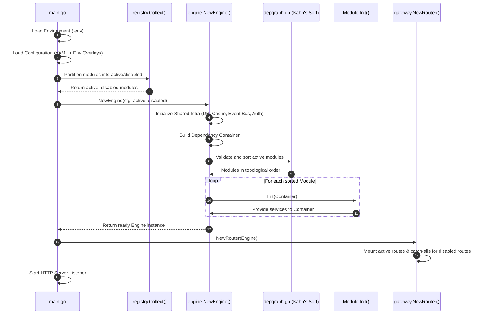

# Engine Overview

<DocBadge status="under-review" version="v0.1.0-alpha" />

The engine is the central orchestrator of the application. It owns the full startup pipeline: loading configuration, initializing shared infrastructure, sorting and booting modules in dependency order, mounting routes, and managing graceful shutdown.

---

## Boot Sequence

The boot sequence is orchestrated by `main.go` in a linear pipeline. Each step produces output consumed by the next - no step begins until the previous one succeeds.

---

## Key Concepts

Each stage of the boot sequence corresponds to a dedicated concept. Refer to these pages for the full details:

| Concept              | Description                                                                                        | Doc                                               |
| -------------------- | -------------------------------------------------------------------------------------------------- | ------------------------------------------------- |
| **Dependency Graph** | Topological sort via Kahn's algorithm - ensures modules boot in the right order and detects cycles | [Dependency Graph](./dependency-graph.md)         |
| **DI Container**     | Shared registry of infrastructure and module services, passed to every `Init()` call               | [Dependency Injection](./dependency-injection.md) |
| **Module Lifecycle** | The `Module` interface - `Init`, `RegisterRoutes`, `Shutdown`, and the directory layout            | [Module Lifecycle](./module-lifecycle.md)         |
| **Repository Layer** | Database-agnostic `RepoProvider` that routes domain interfaces to the configured DB driver         | [Repository Layer](./repository-layer.md)         |
