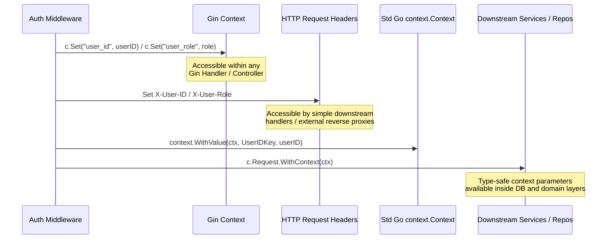

# Authentication & Identity Flow

<DocBadge status="under-review" version="v0.1.0-alpha" />

The API Gateway supports dual authentication mechanisms: local JWT validation and external OpenID Connect (OIDC) identity providers. This document outlines how authentication is selected, executed, and how identity contexts are propagated across layers.

---

## 1. Authentication Selector

At startup, the gateway delegates middleware creation to the selector defined in `middleware/auth_selector.go`. The choice is determined by the `config.Auth.Mode` setting:

```go
func NewAuthMiddleware(mode string, jwtManager *token.JWTManager, oidcValidator *token.OIDCValidator, authService auth.Service) gin.HandlerFunc {
	if mode == "oidc" && oidcValidator != nil {
		return OIDCAuthMiddleware(oidcValidator, authService)
	}
	return AuthMiddleware(jwtManager)
}
```

* **Local Mode (`local`)**: Token verification is handled in-house using symmetric HMAC keys.
* **OIDC Mode (`oidc`)**: Token verification is delegated to an external Identity Provider (IdP) via Json Web Key Sets (JWKS).

---

## 2. Authentication Mechanisms

### A. Local JWT Validation (`AuthMiddleware`)
In local mode, the gateway extracts the token from the `Authorization: Bearer <token>` header and verifies its signature using the configured symmetric `config.Secret`. 

If validation succeeds, the claims (containing `UserID` and `Role`) are unpacked. If the token is expired, tampered with, or invalid, the middleware aborts request execution and returns an HTTP `401 Unauthorized` response.

### B. External OIDC Validation (`OIDCAuthMiddleware`)
When operating in OIDC mode:
1. The gateway extracts the bearer token.
2. It validates the signature against the external Identity Provider's public keys fetched via JWKS (using `token.OIDCValidator`).
3. It extracts the OIDC claims (Subject, Email, Name, Roles).
4. It calls `authService.SyncOIDCUser` to automatically provision or update the user's profile in the local database:
   ```go
   user, err := authService.SyncOIDCUser(c.Request.Context(), claims.Subject, claims.Email, claims.Name, role)
   ```
5. If user synchronization succeeds, the local user profile is used to authorize the request. If sync fails, the request is blocked with an HTTP `500 Internal Server Error`.

---

## 3. Context & Identity Propagation

Once a user is successfully authenticated, the middleware propagates the identity payload down to the handler and database layers by injecting it into **three distinct layers**:



1. **Gin Context**:
   Identity parameters are stored as native Gin strings (`c.Set("user_id", user.ID)`), which are retrieved in delivery controllers using `c.GetString()`.
2. **HTTP Request Headers**:
   Sets headers `X-User-ID` and `X-User-Role` directly on the incoming request, maintaining compatibility with simple downstream HTTP handlers or reverse-proxy routing filters.
3. **Go Standard Library `context.Context`**:
   Propagates the credentials inside `c.Request.Context()` using type-safe keys defined in `pkg/ctxkeys`. This ensures downstream domain usecases and database repositories can extract the authenticated caller's identity without importing Gin framework concerns.

---

## 4. Role Authorization

For admin paths, the `AdminOnlyMiddleware` acts as a secondary gate. It is registered on the `/api/admin` group:

```go
func AdminOnlyMiddleware() gin.HandlerFunc {
	return func(c *gin.Context) {
		role := c.GetString(string(ctxkeys.UserRoleKey))
		if role != "admin" {
			response.GinError(c, http.StatusForbidden, "forbidden: admin role required")
			c.Abort()
			return
		}
		c.Next()
	}
}
```

The middleware extracts the role parameter injected during the authentication phase. If the user's role is not explicitly `admin`, the request is aborted with an HTTP `403 Forbidden` error.
