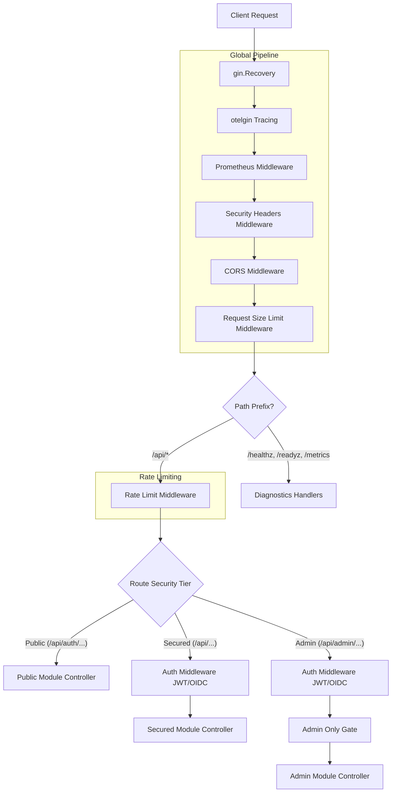

# API Gateway Architecture Overview

<DocBadge status="under-review" version="v0.1.0-alpha" />

The API Gateway is the **sole composition root** for all HTTP-related concerns in the `ecom-engine`. It instantiates the HTTP engine, applies global safety middleware, mounts core endpoints (such as authentication and diagnostic probes), and coordinates the mounting of active domain modules in a topologically sorted order.

---

## 1. High-Level Request Pipeline

Every incoming request progresses through a multi-stage global and group-level middleware pipeline before reaching its target domain controller.



---

## 2. Repository Structure

All global API Gateway concerns (global middleware, rate limiting, and main router configuration) are isolated within the `internal/gateway` package. While individual modules use Gin in their delivery controllers, this setup prevents the framework from bleeding into core business logic (Services, Repositories, and Models):

```text
internal/gateway/
├── router.go                   # NewRouter - entry-point & routing tree constructor
├── router_test.go              # Integration tests for middlewares & paths
└── middleware/
    ├── auth.go                 # Local HMAC-signed JWT validation middleware
    ├── auth_oidc.go            # JWKS-backed OIDC token validation & user sync
    ├── auth_selector.go        # Startup selector for Auth vs OIDC modes
    ├── cors.go                 # Optimized CORS header verification
    ├── prometheus.go           # Request durations & HTTP response code tracking
    ├── ratelimit.go            # Token-bucket rate limiting with Redis fallback
    └── security.go             # Clickjacking, Content Security Policy, size limiters
```

---

## 3. Modular Navigation

To understand specific elements of the API Gateway, proceed to the following detailed documentation sections:

- **[Gateway Routing & Diagnostics](routing.md)**: Route group taxonomy, health check probes, metrics exposition, and topological module routing.
- **[Security & CORS Configurations](security_cors.md)**: Mitigations against Slowloris attacks, CORS configurations, security header details, and payload limits.
- **[Authentication & Identity Flow](authentication.md)**: Local vs OIDC jwt verification, request identity context propagation, and role gating.
- **[Rate Limiting & Failover Architecture](rate_limiting.md)**: Tiered token bucket rates, atomic Redis Lua evaluation, in-memory failover, and telemetry indicators.
