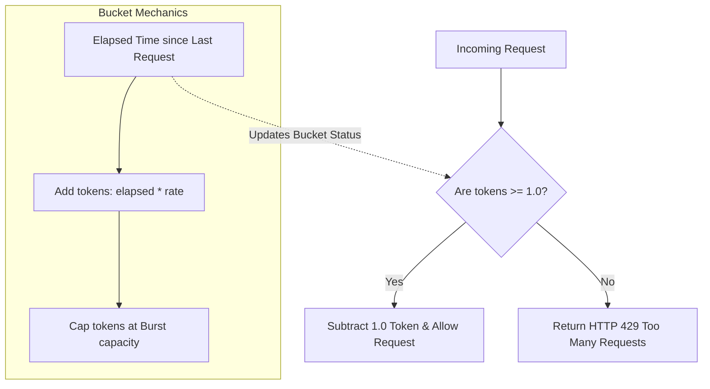
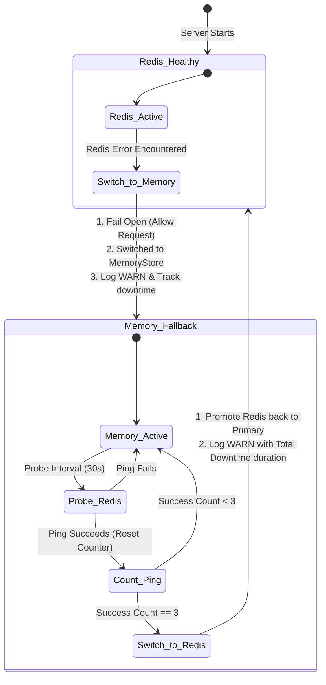

# Rate Limiting & Failover Architecture

<DocBadge status="under-review" version="v0.1.0-alpha" />

To protect system capacity and mitigate abuse, the API Gateway incorporates a tiered rate-limiting middleware. The rate limiter supports both local in-memory execution and distributed clustering using Redis, backed by a fail-open fallback mechanism.

---

## 1. Token Bucket Algorithm

The gateway utilizes the **Token Bucket** algorithm for rate limiting.



### How it works:

1. **Refill**: Every request calculates the elapsed time since the last seen request. The bucket is populated with new tokens at a defined `Rate` (tokens/second) up to the maximum `Burst` capacity.
2. **Consumption**: If the bucket contains at least `1.0` token, the request is allowed, and `1.0` token is subtracted from the bucket.
3. **Rejection**: If the bucket contains less than `1.0` token, the request is rejected immediately with an HTTP `429 Too Many Requests` status code.

---

## 2. Rate Limiting Tiers

Requests undergo three consecutive rate-limit evaluations on every `/api` path. If any evaluation fails, the request is blocked:

```text
Incoming Request
  │
  ├──► 1. Global Capacity Limit (rl:global)
  │      Is total server capacity exceeded?
  │
  ├──► 2. Per-IP Client Tier Limit (rl:ip:{addr})
  │      Does client IP exceed Public / Auth / Admin rate?
  │
  └──► 3. Sensitive Endpoint Limit (rl:ep:{name}:{addr})
         Does client IP exceed Auth / Checkout / Payment rate?
```

### A. Global Capacity Bucket (`rl:global`)

Caps total API throughput across all clients combined.

- **Rates**: Configured dynamically via `eng.Config.RateLimit.GlobalRate` and `GlobalBurst`.

### B. Per-IP Client Tiers (`rl:ip:{addr}`)

Applies role-based rate boundaries based on the client's authenticated session:

- **TierPublic**: Applied to unauthenticated requests.
  - _Rate_: 30 req/min (0.5 tokens/sec), Burst: 10
- **TierAuth**: Applied to authenticated customer sessions (`user` role).
  - _Rate_: 120 req/min (2.0 tokens/sec), Burst: 20
- **TierAdmin**: Applied to staff sessions (`admin` role).
  - _Rate_: 300 req/min (5.0 tokens/sec), Burst: 50

### C. Sensitive Endpoint Buckets (`rl:ep:{name}:{addr}`)

Tighter per-IP limits applied in addition to tier limits to prevent brute-force attacks and abuse on high-value routes:

- **Authentication Route (`/api/auth`)**: Brute-force protection.
  - _Rate_: 5 req/min (0.083 tokens/sec), Burst: 3
- **Checkout Route (`/api/checkout`)**: Automated checkout protection.
  - _Rate_: 10 req/min (0.167 tokens/sec), Burst: 5
- **Payment Route (`/api/payments`)**: Prevents duplicate transactions and carding attacks.
  - _Rate_: 10 req/min (0.167 tokens/sec), Burst: 5

---

## 3. Storage Backends

The rate limiter is configured via the `Backend` setting under the `RateLimit` block in `config.yaml`. Depending on this value, the gateway runs in one of two modes:

1. **Local Mode (`local`)**: Instantiates the thread-safe **Local Memory Store** only. Ideal for single-node deployments.
2. **Distributed Fallback Mode (`redis`)**: Enables **both** stores. The system uses the **Distributed Redis Store** as its primary validator but spins up the **Local Memory Store** alongside it as a fallback cache to keep rate limiting active if Redis fails.

### A. Local Memory Store (`memoryStore`)

A thread-safe, in-process store utilizing Go maps protected by a mutual exclusion lock (`sync.Mutex`).

- **Janitor Sweeper**: To prevent memory leaks from short-lived IPs, a background worker runs every minute to sweep and delete client buckets that have not been seen for more than `5` minutes.

### B. Distributed Store (`redisStore`)

An active Redis-backed store designed for multi-replica horizontal deployments.

To prevent race conditions (read-modify-write) between concurrent requests across different application instances, evaluations are performed atomically using a **Lua script** evaluated directly inside the Redis engine:

```lua
local key    = KEYS[1]
local rate   = tonumber(ARGV[1])
local burst  = tonumber(ARGV[2])
local now_us = tonumber(ARGV[3])
local ttl    = tonumber(ARGV[4])

local data   = redis.call('HMGET', key, 'tok', 'ref')
local tokens = tonumber(data[1])
local ref    = tonumber(data[2])

if tokens == nil then
    tokens = burst
    ref    = now_us
end

local elapsed = (now_us - ref) / 1000000
tokens = math.min(burst, tokens + elapsed * rate)
ref    = now_us

local allowed = 0
if tokens >= 1.0 then
    tokens  = tokens - 1.0
    allowed = 1
end

redis.call('HMSET', key, 'tok', tostring(tokens), 'ref', tostring(ref))
redis.call('EXPIRE', key, ttl)
return allowed
```

- **TTL Management**: Keys are configured with an automatic expiry TTL calculated as `ceil(burst/rate) + 60` seconds. Active clients remain in cache, while idle client records are automatically evicted by Redis to conserve memory.

---

## 4. Failover & Recovery (Fail-Open Strategy)

If Redis encounters a network timeout or connection loss, the `fallbackStore` initiates a fail-open sequence to ensure client traffic is not dropped during the outage:



### The Failover Lifecycle:

1. **Switch to In-Memory**: When a Redis call returns an error, the store marks Redis as unhealthy, logs a warning, starts a downtime timer, and instantly delegates the request check to the local `memoryStore`.
2. **Fail-Open Policy**: If both primary and fallback evaluations return errors, the request fails open (returns `true`), ensuring database errors or configuration mishaps never lead to user-facing service outages.
3. **Background Health Probing**: A background goroutine pings the Redis instance every **30 seconds**.
4. **Anti-Flapping Recovery**: To prevent connection flapping, Redis is only promoted back to the primary store after **3 consecutive successful pings** (~90 seconds of stable connection).
5. **Restoration**: Once promoted, the store switches back to distributed rate limiting and logs a warning containing the exact total downtime duration.

---

## 5. Telemetry & Metrics

The rate limiting middleware registers and increments the following Prometheus metrics to provide operational visibility:

- `ecom_engine_ratelimit_requests_total`: Total rate-limit evaluations, partitioned by bucket label (`global`, `tier:public`, `tier:auth`, `tier:admin`, `ep:auth`, `ep:checkout`, `ep:payments`) and decision (`allowed` or `denied`).
- `ecom_engine_ratelimit_backend_active`: Gauge set to `1` for the active store (`redis` or `memory`) and `0` for the inactive store.
- `ecom_engine_ratelimit_backend_fallbacks_total`: Total number of times the rate-limiter transitioned from Redis to the in-memory fallback.
- `ecom_engine_ratelimit_backend_recoveries_total`: Total number of times the rate-limiter successfully restored Redis connection.
- `ecom_engine_ratelimit_redis_errors_total`: Accumulator tracking all raw Redis socket errors.
