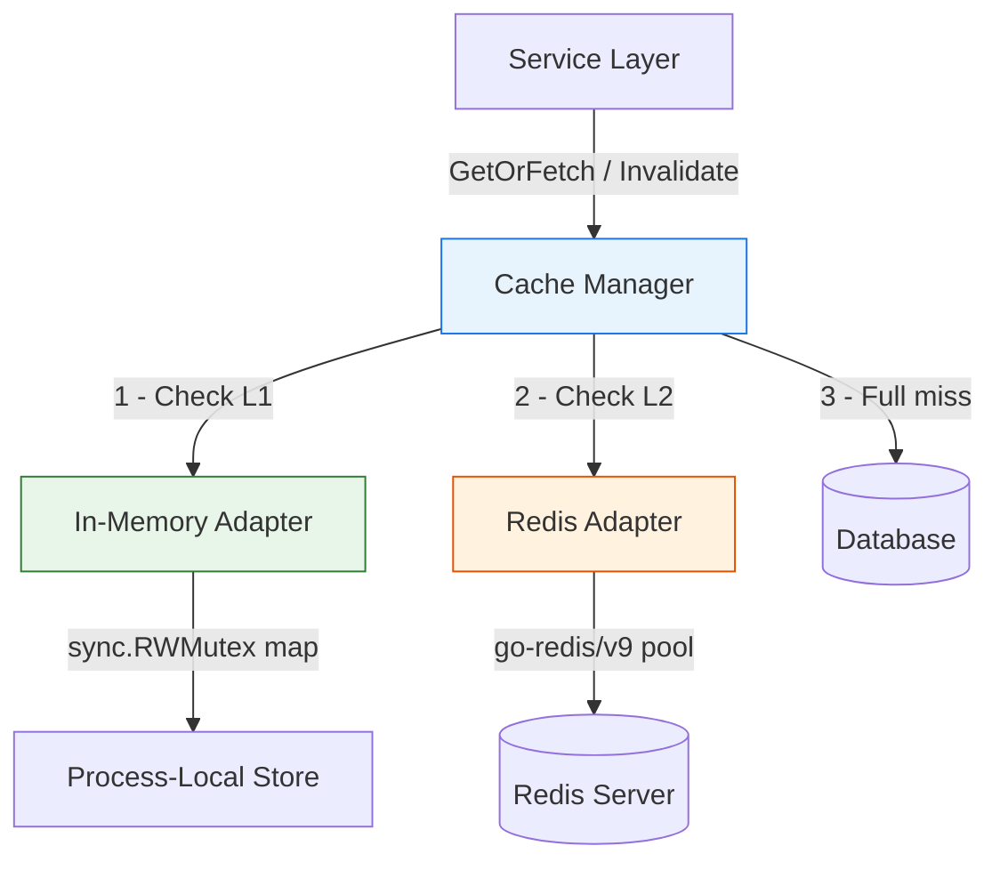
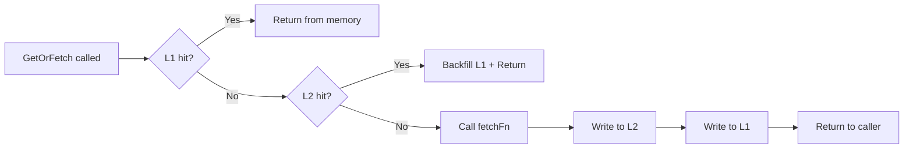
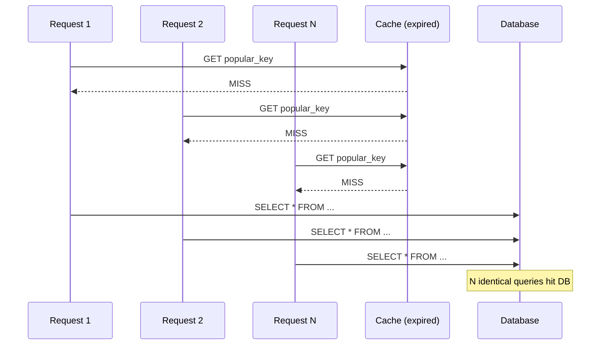
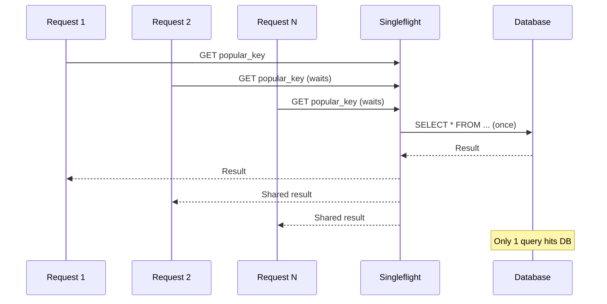
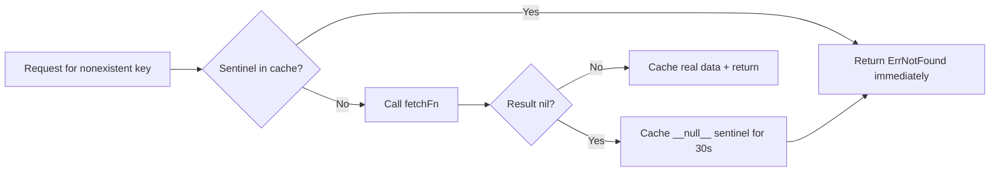

# Cache Layer

<DocBadge status="under-review" version="v0.1.0-alpha" />

The cache layer provides a backend-agnostic caching interface built on the Ports-and-Adapters pattern. It uses a **two-layer strategy** — a fast in-process memory cache (L1) backed by a distributed Redis cache (L2) — unified behind a single `CacheManager` that handles read-through fetching, write-through population, and coordinated invalidation.

---

## 1. Architecture



The Cache Manager is the primary API for all service-layer code. Individual adapters are never used directly in production — the manager orchestrates both layers transparently.

| Layer | Backend   | Speed              | Scope                                  |
| ----- | --------- | ------------------ | -------------------------------------- |
| L1    | In-Memory | Sub-millisecond    | Local to the process                   |
| L2    | Redis     | Single-digit ms    | Shared across all application instances |

---

## 2. How Read-Through Works

When a service calls `GetOrFetch(key, target, ttl, fetchFn)`, the manager walks through a three-step lookup. The first layer to return data wins — no further layers are consulted.



1. **L1 check** — look up the key in the in-process map. On a hit, return immediately with zero network overhead.
2. **L2 check** — query Redis over the network. On a hit, backfill L1 so subsequent reads are local, then return.
3. **Full miss** — call the provided `fetchFn` (typically a database query). Write the result to L2 first, then L1, and return.

The caller never needs to know which layer served the data:

```go
var order Order
err := manager.GetOrFetch(ctx, "order:ord_xyz789", &order, 10*time.Minute, func() (interface{}, error) {
    return db.FindOrderByID(ctx, "ord_xyz789")
})
// order is populated — caller doesn't care whether it came from L1, L2, or DB
```

---

## 3. TTL Management

TTLs control how long cached data stays valid. The system uses separate TTL strategies for each layer to balance freshness against performance.

### L2 (Redis) TTL

The caller supplies a TTL when calling `GetOrFetch`. This TTL is applied to the Redis entry via `SET ... EX`. Redis enforces expiration server-side — no client-side sweep is needed.

A TTL of `0` means the key persists indefinitely (no expiration).

### L1 (Memory) TTL

L1 uses a shorter TTL to keep the local cache fresh relative to the shared L2 state. The effective L1 TTL is:

```
effective_l1_ttl = min(configured_l1_ttl, caller_ttl)
```

The default L1 TTL is **1 minute**. This means even if a caller requests a 10-minute TTL, the in-memory copy expires after 1 minute — forcing a re-check against Redis, which is the distributed source of truth.

This prevents a scenario where L2 has been invalidated but L1 keeps serving stale data.

### TTL Expiration in Memory

TTL is stored as a Unix nanosecond timestamp. Expiration is checked **lazily on every read** — if a `Get` or `Exists` call finds an expired entry, the adapter deletes it and returns a cache miss. A background goroutine also sweeps all expired keys every minute to prevent memory growth in low-traffic scenarios.

---

## 4. The In-Memory Adapter (L1)

The memory adapter is a process-local key-value store protected by a `sync.RWMutex`. It provides sub-millisecond reads without any network round-trip.

### Capacity and Eviction

| Setting          | Default    | Override                 |
| ---------------- | ---------- | ------------------------ |
| Max items        | 10,000     | `memory.WithMaxItems(n)` |
| Cleanup interval | 1 minute   | Fixed                    |

When the store reaches capacity, eviction runs in two stages on every `Set`:

1. **Expired scan** — sample up to 50 random items and delete any that have passed their TTL.
2. **Sample-based LFU** — if still at capacity, sample 10 random items and evict the one with the **lowest hit count**. Ties are broken by evicting the **least recently accessed** item (LRU tie-breaker).

Go's randomized map iteration makes the fixed-size sample an unbiased random sample without extra bookkeeping.

### Hit Tracking

Each item tracks two counters updated atomically (via `sync/atomic`) on every `Get`:

- **`hits`** — total read count, used for LFU eviction ranking.
- **`lastAccess`** — timestamp of the most recent read, used as the LRU tie-breaker.

Hit stats are **preserved across overwrites** — updating an existing key carries forward the previous hit count (incremented by 1) rather than resetting it. This prevents frequently accessed keys from losing their eviction priority after a refresh.

### Concurrency Model

- `Get` and `Exists` hold a **read lock** — multiple goroutines can read concurrently.
- `Set`, `Delete`, and `Increment` hold a **write lock** — exclusive access during mutations.
- Hit and access counters use `sync/atomic`, so reads never need to upgrade to a write lock just for tracking.

---

## 5. Where Cache Is Used

The cache layer is wired into the engine at startup and injected into domain modules through the dependency container. Typical use cases across the codebase:

| Use Case               | Key Pattern                  | TTL        | Notes                                                    |
| ---------------------- | ---------------------------- | ---------- | -------------------------------------------------------- |
| User profile lookups   | `user:<ulid>`                | 15 min     | Cached as `UserPublic` projection (no password hash)     |
| Order detail reads     | `order:<ulid>`               | 10 min     | Invalidated on order status changes                      |
| Rate limiting counters | `rate_limit:<ip>`            | Window TTL | Uses `Increment` — **must use Redis (L2)** in multi-instance |
| Session state          | `session:<token>`            | < 5 min    | Short TTL for security                                   |

### Key Naming Convention

Keys follow a colon-separated namespace pattern to avoid collisions:

```
<domain>:<entity>:<identifier>
```

Keys are case-sensitive. Use lowercase with underscores within segments. Always use opaque IDs (ULIDs/UUIDs) as key suffixes — never sequential integers, which allow attackers to enumerate entries.

---

## 6. Stampede Protection

A **cache stampede** (or thundering herd) occurs when a popular key expires and hundreds of concurrent requests all miss the cache simultaneously, flooding the database with identical queries.

### How It Happens



### How We Prevent It

The Cache Manager uses Go's `singleflight` package. When multiple goroutines request the same key and all miss L1 + L2, only **one** goroutine executes `fetchFn`. All others block and receive the shared result.



This is transparent to callers — no code changes are needed. The `ecom_engine_cache_stampede_dedup_total` metric tracks how often deduplication fires. A high value means the protection is actively saving your database from load spikes.

---

## 7. Avalanche Prevention

A **cache avalanche** happens when many keys expire at the same time (e.g., after a bulk import), causing a sudden wave of cache misses that overwhelms the database.

### TTL Jitter

The Cache Manager automatically adds **up to +10% random jitter** to every L2 (Redis) TTL before writing. This spreads expiry times across keys so they don't all expire in the same instant.

For example, if 1,000 keys are all written with a 10-minute TTL:
- **Without jitter**: all 1,000 expire at exactly the same moment, triggering 1,000 simultaneous DB queries.
- **With jitter**: keys expire between 10m 0s and 11m 0s, spreading the load over a 60-second window.

The jitter percentage is configurable:

```go
cache.NewCacheManager(l1, l2, cache.WithTTLJitter(0.15)) // up to +15% jitter
cache.NewCacheManager(l1, l2, cache.WithTTLJitter(0))    // disable (useful in tests)
```

---

## 8. Negative Caching (Penetration Protection)

**Cache penetration** is an attack pattern where repeated requests target keys that don't exist in the database. Since the data genuinely doesn't exist, every request passes through the cache and hits the database — effectively bypassing the cache entirely.

### How It Works

When `fetchFn` returns `(nil, nil)` — meaning the record does not exist — the manager caches a **null sentinel** (`__null__`) in both L1 and L2 with a short TTL (default **30 seconds**). Subsequent requests for the same key get an immediate `ErrNotFound` response without touching the database.



Callers distinguish "not found" from infrastructure errors:

```go
err := manager.GetOrFetch(ctx, key, &target, ttl, fetchFn)
if errors.Is(err, cache.ErrNotFound) {
    // Record confirmed absent — safe to return 404
}
```

The negative cache TTL is configurable (set to `0` to disable):

```go
cache.NewCacheManager(l1, l2, cache.WithNegativeCacheTTL(1*time.Minute))
```

The `ecom_engine_cache_negative_cache_total` metric tracks how many null sentinels are written. A sudden spike may indicate a penetration attack probing for nonexistent records.

---

## 9. Invalidation

When data changes, the cache must be invalidated to prevent serving stale results. The manager provides a single `Invalidate` method that deletes the key from **both** L1 and L2:

```go
if err := manager.Invalidate(ctx, "order:ord_xyz789"); err != nil {
    log.Error("cache invalidation failed", "err", err)
}
```

Errors from each layer are collected and joined — a failure to delete from L1 does not prevent the L2 delete (and vice versa). Deleting a key that doesn't exist is a no-op, not an error.

---

## 10. Fallback Behavior

The cache layer is designed to degrade gracefully rather than fail hard.

### Layer Independence

Either L1 or L2 can be `nil` when constructing the manager — the manager simply skips that layer. This enables:

- **L1-only** (memory only) — useful in tests or single-instance deployments where Redis isn't available.
- **L2-only** (Redis only) — when process-local caching isn't desired.
- **Both nil** — every call goes straight to `fetchFn`. The manager effectively becomes a pass-through.

### Error Isolation

Cache errors never bubble up as application-breaking failures when using `GetOrFetch`. The pattern is:

1. If L1 fails, try L2.
2. If L2 fails, call `fetchFn` directly.
3. The application continues to function — just with higher latency.

For direct adapter usage, the recommended pattern is **fail-open**:

```go
val, err := cache.Get(ctx, "user:usr_abc123")
if cache.IsCacheBackendError(err) {
    // Log the error but continue without cache
    log.Warn("cache unavailable", "err", err)
    return db.FindUser(ctx, "usr_abc123")
}
```

### Error Types

Two error types separate expected conditions from infrastructure failures:

| Error               | Meaning                                             | Action                         |
| ------------------- | --------------------------------------------------- | ------------------------------ |
| `ErrCacheMiss`      | Key doesn't exist or is expired — normal condition  | Fetch from source              |
| `CacheBackendError` | Connection refused, timeout, serialization failure  | Log and fail-open              |

Check errors with `cache.IsCacheMiss(err)` and `cache.IsCacheBackendError(err)`.

---

## 11. Security Hardening

### Value and Key Size Limits

Both adapters reject oversized payloads before writing to prevent memory exhaustion:

| Limit          | Memory Adapter | Redis Adapter | Configurable Via              |
| -------------- | -------------- | ------------- | ----------------------------- |
| Max value size | 1 MiB          | 5 MiB         | `WithMaxValueBytes` / Config  |
| Max key length | 512 bytes      | 512 bytes     | Fixed                         |

Violations return `CacheBackendError` wrapping `ErrValueTooLarge` or `ErrKeyTooLong`.

### Redis Authentication and TLS

The Redis adapter enforces security best practices:

- **Authentication** — logs a warning on startup if no password is configured. In production, always set `REDIS_PASSWORD`.
- **TLS** — supports TLS 1.2+ with optional mutual TLS (mTLS). CA certificate, client certificate, and client key paths can be set independently.

```go
redis.Config{
    Addr:       "redis.internal:6379",
    Password:   os.Getenv("REDIS_PASSWORD"),
    TLSEnabled: true,
    TLSCA:      "/etc/ssl/redis-ca.pem",
    TLSCert:    "/etc/ssl/redis-client.pem",
    TLSKey:     "/etc/ssl/redis-client-key.pem",
}
```

### What Should Never Be Cached

- Raw passwords, secret keys, or private tokens.
- Full payment card numbers or CVVs.
- Complete `User` structs containing `passwordHash` — create a `UserPublic` projection instead.
- Session tokens should use short TTLs (under 5 minutes).

### Key Enumeration Prevention

Always use opaque IDs (ULIDs/UUIDs) as key suffixes. Sequential integer IDs like `user:1`, `user:2` allow attackers to enumerate entries. The `idgen` package generates ULID-based IDs by default.

---

## 12. Monitoring

All cache metrics are emitted to Prometheus under the `ecom_engine` namespace.

### Key Metrics

| Metric | Type | What It Tells You |
| --- | --- | --- |
| `cache_requests_total` | Counter | Total cache operations, labeled by `layer`, `operation`, and `result` (hit/miss/error) |
| `cache_operation_duration_seconds` | Histogram | Latency per operation — use to spot Redis slowdowns |
| `cache_stampede_dedup_total` | Counter | Requests collapsed by singleflight — high value = protection actively working |
| `cache_negative_cache_total` | Counter | Null sentinels written — spike may signal a penetration attempt |
| `cache_memory_items` | Gauge | Current L1 item count |
| `cache_memory_max_items` | Gauge | Configured L1 capacity |
| `cache_memory_evictions_total` | Counter | L1 evictions by `reason` (expired or lfu) |
| `cache_redis_pool_*` | Various | Redis connection pool health: total/idle connections, hits, misses, timeouts, stale connections |

All metrics are prefixed with `ecom_engine_` in Prometheus.

### Recommended Alerts

| Condition | Expression | Severity |
| --- | --- | --- |
| Low hit rate | `rate(cache_requests_total{result="hit"}[5m]) / rate(cache_requests_total{operation="get"}[5m]) < 0.7` | Warning |
| L1 near capacity | `cache_memory_items / cache_memory_max_items > 0.9` | Warning |
| High LFU evictions | `rate(cache_memory_evictions_total{reason="lfu"}[5m]) > 50` | Warning |
| Redis P99 latency spike | `histogram_quantile(0.99, cache_operation_duration_seconds{layer="L2"}) > 0.05` | Critical |
| Redis pool exhausted | `rate(cache_redis_pool_timeouts_total[1m]) > 0` | Critical |
| Penetration attack | `rate(cache_negative_cache_total[1m]) > 50` | Warning |

---

## 13. Shutdown

Always close the manager on application shutdown to release Redis connections and stop the memory adapter's background cleanup goroutine:

```go
defer manager.Close()
```

The engine handles this automatically during its graceful shutdown sequence.
