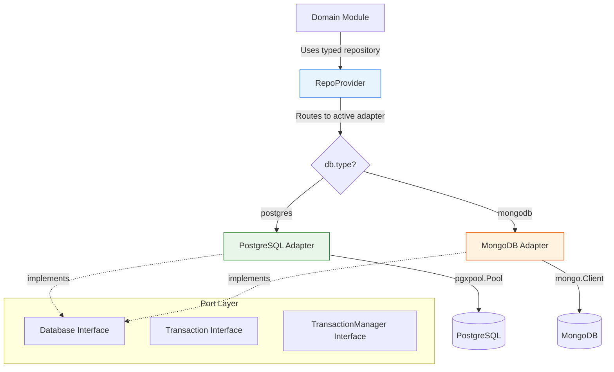
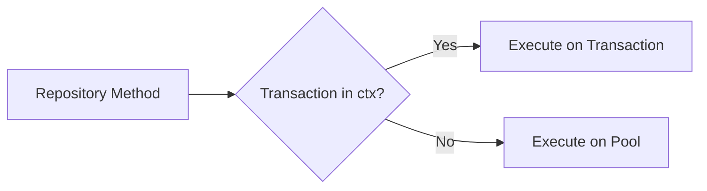
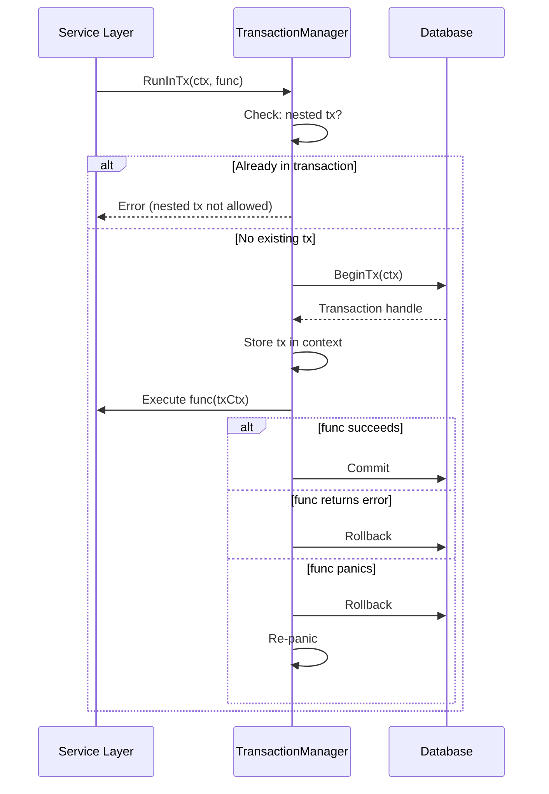
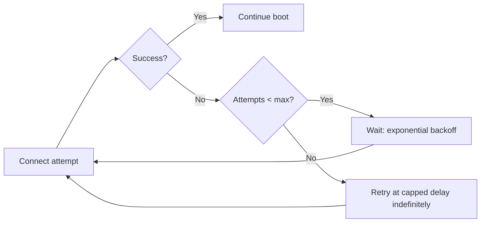
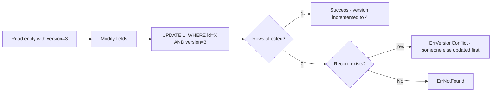

# Database Layer

<DocBadge status="under-review" version="v0.1.0-alpha" />

The database layer follows the Ports-and-Adapters pattern to provide a **database-agnostic** interface for all data access. A single `Database` port defines the contract; two adapters — PostgreSQL (via pgx/v5) and MongoDB (via mongo-driver/v2) — implement it. The active database is selected by a single configuration value, and the rest of the application never knows which backend is running.

---

## 1. Architecture



### How Modules Access Data

Modules never import a database driver directly. Instead, the engine creates a `RepoProvider` at startup that maps each domain interface (e.g., `CatalogCoreRepo()`, `OrderRepo()`) to the correct adapter-specific implementation. Modules call the RepoProvider method, get a typed repository, and operate on domain objects — completely unaware of the underlying database.

---

## 2. The Database Port

The core interface lives in `port.go` and defines the contract every adapter must satisfy:

```go
type Database interface {
    Connect(ctx context.Context, connectionString string) error
    Close(ctx context.Context) error
    Exec(ctx context.Context, query string, args ...any) error
    ExecResult(ctx context.Context, query string, args ...any) (Result, error)
    Query(ctx context.Context, query string, args ...any) (Rows, error)
    BeginTx(ctx context.Context) (Transaction, error)
}
```

| Method       | Purpose                                                        |
| ------------ | -------------------------------------------------------------- |
| `Connect`    | Initialize the connection pool using the provided DSN          |
| `Close`      | Gracefully drain all connections on shutdown                    |
| `Exec`       | Run a write query (INSERT, UPDATE, DELETE) — no result needed  |
| `ExecResult` | Run a write query and return metadata (e.g., rows affected)    |
| `Query`      | Run a read query (SELECT) and return a cursor over rows        |
| `BeginTx`    | Start a database transaction, returning a `Transaction` handle |

Supporting interfaces:

| Interface           | Purpose                                                        |
| ------------------- | -------------------------------------------------------------- |
| `Transaction`       | Extends `Database` with `Commit` and `Rollback`                |
| `TransactionManager`| Provides `RunInTx` for automatic commit/rollback/panic recovery|
| `Result`            | Exposes `RowsAffected()` from write operations                 |
| `Rows`              | Cursor with `Next()`, `Scan()`, `Err()`, `Close()`            |
| `PoolStatsProvider` | Exposes live `PoolStats` for Prometheus collection             |

---

## 3. PostgreSQL Adapter

The PostgreSQL adapter is the primary production adapter. It uses `pgxpool` from jackc/pgx/v5 for connection pooling and query execution.

### Connection Pool

The adapter manages a pool of persistent connections to PostgreSQL. Pool sizing and lifecycle are fully configurable:

| Setting                 | Default | Purpose                                                |
| ----------------------- | ------- | ------------------------------------------------------ |
| `MaxPoolSize`           | 25      | Maximum open connections                               |
| `MinPoolSize`           | 5       | Minimum idle connections kept warm                     |
| `MaxConnIdleTime`       | 15m     | Close idle connections after this duration             |
| `MaxConnLifetime`       | 1h      | Recycle connections after this duration                |
| `MaxConnLifetimeJitter` | 2m      | Randomize recycling to prevent thundering herd         |
| `HealthCheckInterval`   | 30s     | How often to ping idle connections                     |
| `ConnectTimeout`        | 10s     | Timeout for establishing a new connection              |

#### Connection Lifetime Jitter

`MaxConnLifetimeJitter` adds random variance to connection recycling. Without it, all connections created at the same time would be recycled simultaneously, causing a brief spike of new connection handshakes. With 2 minutes of jitter on a 1-hour lifetime, recycling is spread across a 4-minute window.

### Session-Level Parameters

Each new connection has PostgreSQL session parameters set via an `AfterConnect` hook:

- **`statement_timeout`** — kills any query running longer than the configured limit, preventing runaway queries from holding connections.
- **`lock_timeout`** — limits how long a query can wait to acquire a lock, preventing deadlock-related pile-ups.
- **`application_name`** — shows up in `pg_stat_activity`, making it easy to identify the application's connections in database monitoring tools.

### Query Execution with Transaction Awareness

Every `Exec`, `ExecResult`, and `Query` call checks the context for an active transaction. If one exists, the operation runs on the transaction connection — otherwise it uses the pool. This is transparent to repository code:



Repositories never need to know whether they're inside a transaction or not — the adapter handles it automatically.

---

## 4. MongoDB Adapter

The MongoDB adapter provides the same repository interfaces backed by MongoDB collections. It uses the official Go driver (mongo-driver/v2).

### Key Differences from PostgreSQL

| Aspect              | PostgreSQL                          | MongoDB                                       |
| ------------------- | ----------------------------------- | --------------------------------------------- |
| Query model         | SQL via `Exec`/`Query`              | Direct collection operations (`Find`, `InsertOne`, etc.) |
| Connection pool     | pgxpool with full stats             | mongo-driver internal pool (no stats export)  |
| Transactions        | Context-based pgx.Tx                | Session-based `WithTransaction` callback      |
| Migrations          | SQL files (up/down)                 | JSON index specifications                     |

### MongoDB Repositories

Unlike PostgreSQL, MongoDB repositories don't use the generic `Exec`/`Query` methods. They interact with collections directly through the mongo-driver API, building queries with `bson.M` filters. The adapter primarily provides transaction coordination and connection lifecycle management.

---

## 5. Transaction Management

### The RunInTx Pattern

`TransactionManager.RunInTx` is the standard way to execute transactional work. It handles the full lifecycle automatically:



Key behaviors:

1. **Nested transactions are blocked** — if the context already contains a transaction, `RunInTx` returns an error immediately. This prevents accidental double-begin issues.
2. **Panic recovery** — if the function panics, the transaction is rolled back and the panic is re-raised. The connection is never left in a dangling transaction state.
3. **Transaction timeout** — an optional `TransactionTimeout` (default 60s) is applied via context deadline, preventing long-running transactions from holding connections.

### Context-Based Propagation

Transactions are stored in the context using a private key type. This means:

- The service layer calls `RunInTx` once.
- Every repository method called within that function receives the same context.
- The adapter detects the transaction in the context and routes all queries through it.
- Repositories don't import transaction types, don't call commit/rollback, and don't know they're in a transaction.

```go
// Service layer — only place that knows about transactions
err := txManager.RunInTx(ctx, func(txCtx context.Context) error {
    if err := orderRepo.Create(txCtx, order); err != nil {
        return err
    }
    if err := inventoryRepo.Reserve(txCtx, order.Items); err != nil {
        return err
    }
    return paymentRepo.Charge(txCtx, order.PaymentInfo)
})
// All three operations share one transaction — commit or all rollback
```

---

## 6. Connection Startup and Retry

In containerized deployments, the database may not be available when the application starts (e.g., the database container is still initializing). The engine uses exponential backoff retry to handle this:



| Setting              | Default | Purpose                                    |
| -------------------- | ------- | ------------------------------------------ |
| `RetryMaxAttempts`   | 20      | Attempts before switching to capped retry  |
| `RetryInitialDelay`  | 1s      | First retry wait                           |
| `RetryMaxDelay`      | 30s     | Maximum wait between retries               |

The delay doubles after each attempt (1s, 2s, 4s, 8s, ...) up to the cap. After exhausting `RetryMaxAttempts`, the engine continues retrying at `RetryMaxDelay` indefinitely — this lets the application eventually recover even from extended database outages without operator intervention.

---

## 7. Repository Organization

Repositories are organized by domain module and feature, with parallel implementations for each database:

```
internal/infra/db/
  port.go                          # Core interfaces
  postgres/
    adapter.go                     # PostgreSQL adapter
    auth/                          # Auth repositories
      user_repository.go
      token_repository.go
    catalog/
      core/repository.go           # Products, categories, variants
      bulk/repository.go           # Batch operations
      discounts/repository.go
      images/repository.go
      reviews/repository.go
      variants/repository.go
    inventory/
      core/repository.go
      bulk/repository.go
      history/repository.go
      reservation/repository.go
      ...
    orders/order_repo.go
    payments/payment_repo.go
    shipping/shipment_repo.go
    outbox/repository.go           # Transactional outbox pattern
  mongodb/
    adapter.go                     # MongoDB adapter
    auth/                          # Same structure, different implementation
    catalog/
    inventory/
    orders/
    payments/
    shipping/
    outbox/
```

The `RepoProvider` in the engine maps each domain interface to the correct implementation based on the configured `db.type`. Modules call methods like `repoProvider.CatalogCoreRepo()` and receive a ready-to-use repository — no awareness of the underlying database.

---

## 8. Query Patterns

### Preventing N+1 Queries (PostgreSQL)

The PostgreSQL repositories explicitly prevent the N+1 query problem when loading entities with related data. For example, listing products with their variants and images:

1. **One query** for the main product records.
2. **One batch query** for all variants where `product_id IN (...)`.
3. **One batch query** for all images where `product_id IN (...)`.
4. Client-side grouping by product ID into maps, then assembling the final result.

This turns what could be `1 + N + N` queries into exactly **3 queries**, regardless of how many products are returned.

### Optimistic Locking

Both adapters implement optimistic concurrency control using a `version` field:



The update query includes `AND version = $expected` in the WHERE clause. If another process updated the record between the read and write, the version won't match, zero rows are affected, and a `ErrVersionConflict` error is returned. The caller can then re-read and retry.

---

## 9. Error Handling

Database errors are mapped to domain-specific error types so that service and controller layers never see raw driver errors.

| Database Condition              | Domain Error                | How It's Detected                               |
| ------------------------------- | --------------------------- | ------------------------------------------------ |
| Unique constraint violation     | `ErrEmailAlreadyExists` etc.| PostgreSQL error code `23505` / `duplicate key`  |
| Record not found                | `ErrProductNotFound` etc.   | `rows.Next()` returns false / `ErrNoDocuments`   |
| Optimistic lock failure         | `ErrVersionConflict`        | `RowsAffected == 0` when record exists           |

All errors are:
- **Wrapped** with `fmt.Errorf("context: %w", err)` for stack context.
- **Recorded** on the active OpenTelemetry span via `span.RecordError(err)`.
- **Logged** at appropriate severity (DEBUG for normal operations, ERROR for failures).

---

## 10. Migrations

The migration system is module-based — each domain module owns its own migration files, and only enabled modules are migrated.

### PostgreSQL Migrations

Migration files live in `migrations/postgres/{module}/` and follow the naming convention:

```
{version}_{description}.up.sql     # Apply schema change
{version}_{description}.down.sql   # Revert schema change
```

A `schema_migrations` tracking table records which versions have been applied:

```sql
schema_migrations(module TEXT, version INT, applied_at TIMESTAMPTZ)
```

CLI commands:

| Command                              | Action                                        |
| ------------------------------------ | --------------------------------------------- |
| `go run ./cmd/migrate up`            | Apply all pending migrations for enabled modules |
| `go run ./cmd/migrate down {module}` | Rollback the latest version for a module      |
| `go run ./cmd/migrate status`        | Show applied vs. latest version per module    |

At startup, the engine runs `migrate.QuickCheck()` which verifies the tracking table exists and the core module's migrations are applied — a fast sanity check without running the full migration system.

### MongoDB Seeding

MongoDB uses JSON index specifications in `migrations/mongodb/{module}/indexes.json`. The seed command ensures collections and indexes exist:

```
go run ./cmd/migrate seed
```

### Integrity Verification

Both adapters support schema verification that checks all expected tables/collections, columns, and indexes exist. This is useful for CI pipelines and post-deploy validation.

---

## 11. Configuration Reference

All database settings are configurable via YAML config and overridable with environment variables:

### Common Settings

| Setting              | Env Var                    | Default  | Purpose                               |
| -------------------- | -------------------------- | -------- | ------------------------------------- |
| `type`               | `DB_TYPE`                  | —        | `postgres` or `mongodb`               |
| `connectionString`   | `DB_CONNECTION_STRING`     | —        | Full DSN / connection URI             |
| `database`           | `DB_DATABASE`              | —        | Database / schema name                |
| `maxPoolSize`        | `DB_MAX_POOL_SIZE`         | 25       | Max open connections                  |
| `minPoolSize`        | `DB_MIN_POOL_SIZE`         | 5        | Min idle connections                  |
| `maxConnIdleTime`    | `DB_MAX_CONN_IDLE_TIME`    | 15m      | Close idle connections after          |
| `maxConnLifetime`    | `DB_MAX_CONN_LIFETIME`     | 1h       | Recycle connections after             |
| `connectTimeout`     | `DB_CONNECT_TIMEOUT`       | 10s      | Connection establishment timeout      |
| `queryTimeout`       | `DB_QUERY_TIMEOUT`         | 30s      | Per-query timeout                     |
| `transactionTimeout` | `DB_TRANSACTION_TIMEOUT`   | 60s      | Max transaction duration              |

### PostgreSQL-Specific

| Setting              | Env Var                    | Default  | Purpose                               |
| -------------------- | -------------------------- | -------- | ------------------------------------- |
| `maxConnLifetimeJitter` | `DB_MAX_CONN_LIFETIME_JITTER` | 2m  | Stagger connection recycling          |
| `healthCheckInterval`| `DB_HEALTH_CHECK_INTERVAL` | 30s      | Ping interval for idle connections    |
| `statementTimeout`   | `DB_STATEMENT_TIMEOUT`     | —        | Kill queries exceeding this duration  |
| `lockTimeout`        | `DB_LOCK_TIMEOUT`          | —        | Max wait for lock acquisition         |
| `sslMode`            | `DB_SSL_MODE`              | —        | PostgreSQL SSL mode                   |
| `applicationName`    | `DB_APPLICATION_NAME`      | —        | Shown in pg_stat_activity             |

### MongoDB-Specific

| Setting                  | Env Var                        | Default    | Purpose                            |
| ------------------------ | ------------------------------ | ---------- | ---------------------------------- |
| `serverSelectionTimeout` | `DB_SERVER_SELECTION_TIMEOUT`  | 10s        | Timeout for server selection       |
| `socketTimeout`          | `DB_SOCKET_TIMEOUT`            | 30s        | Socket read/write timeout          |
| `retryWrites`            | `DB_RETRY_WRITES`              | true       | Auto-retry write operations        |
| `retryReads`             | `DB_RETRY_READS`               | true       | Auto-retry read operations         |
| `writeConcern`           | `DB_WRITE_CONCERN`             | `majority` | Write acknowledgement level        |
| `readPreference`         | `DB_READ_PREFERENCE`           | `primary`  | Read routing preference            |

---

## 12. Monitoring

### Pool Metrics (PostgreSQL Only)

The PostgreSQL adapter implements `PoolStatsProvider`, which is registered with Prometheus when metrics are enabled. All metrics are under the `ecom_engine` namespace:

| Metric                                        | Type    | What It Tells You                                      |
| ---------------------------------------------- | ------- | ------------------------------------------------------ |
| `ecom_engine_db_pool_max_conns`               | Gauge   | Configured maximum pool size                           |
| `ecom_engine_db_pool_total_conns`             | Gauge   | Current total connections (active + idle)               |
| `ecom_engine_db_pool_acquired_conns`          | Gauge   | Connections currently in use by queries                |
| `ecom_engine_db_pool_idle_conns`              | Gauge   | Connections sitting idle in the pool                   |
| `ecom_engine_db_pool_acquire_count_total`     | Counter | Cumulative successful connection acquisitions          |
| `ecom_engine_db_pool_empty_acquire_count_total`| Counter | Acquisitions that required dialing a new connection    |
| `ecom_engine_db_pool_acquire_duration_seconds_total` | Counter | Cumulative time spent waiting for a connection    |

### What to Watch

- **`acquired_conns` near `max_conns`** — the pool is saturated; queries are waiting for connections. Increase `maxPoolSize` or optimize slow queries.
- **High `empty_acquire_count`** — connections are being created frequently instead of reused. Check if `minPoolSize` is too low or connections are being recycled too aggressively.
- **Growing `acquire_duration`** — queries are spending more time waiting for a connection than executing. Indicates pool exhaustion or contention.

### Distributed Tracing

Every repository method creates an OpenTelemetry span (e.g., `PostgresCatalogRepository.CreateProduct`). Errors are recorded on the span, making it easy to trace a failed request from the API gateway through the service layer down to the exact database operation that failed.

---

## 13. Shutdown

The engine calls `Close(ctx)` on the active adapter during graceful shutdown. For PostgreSQL, this drains the connection pool — in-flight queries are allowed to complete, but no new connections are accepted. For MongoDB, the driver's `Disconnect` method handles session and connection cleanup.

```go
defer adapter.Close(ctx)
```

The engine manages this automatically as part of its shutdown sequence.
