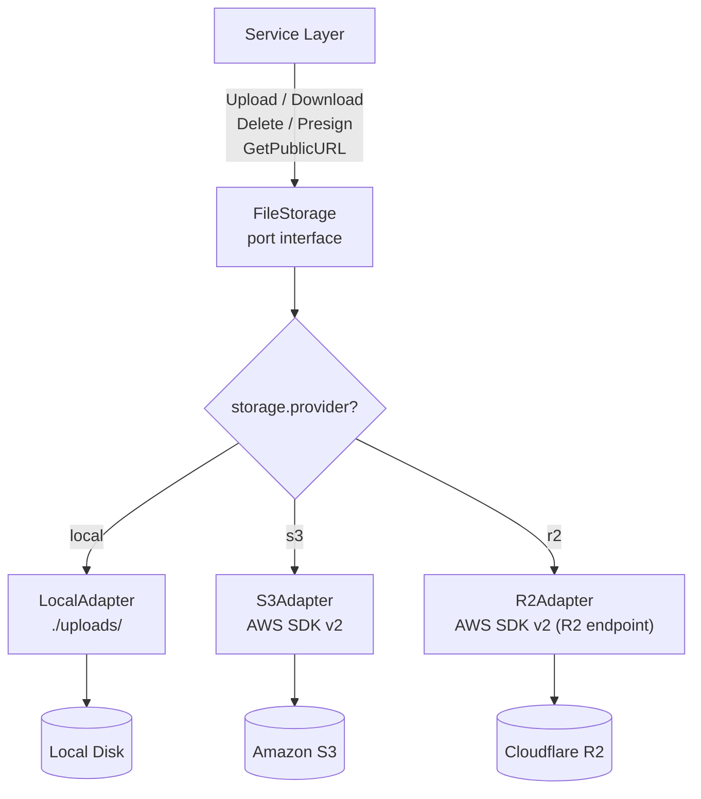
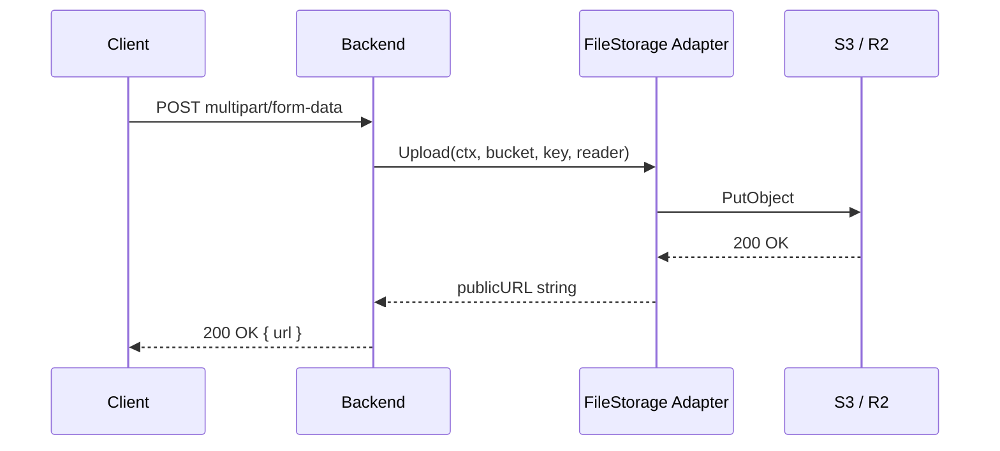
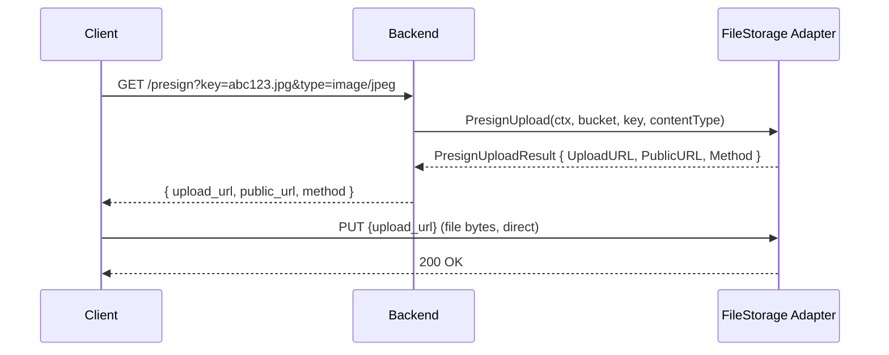

# File Storage Infrastructure

<DocBadge status="under-review" version="v0.1.0-alpha" />

The `internal/infra/storage` package provides a single, backend-agnostic `FileStorage` port with three pluggable adapters: local disk (development), Amazon S3, and Cloudflare R2. The active backend is selected by a single configuration value — the rest of the application never references an adapter directly.

---

## 1. Architecture



The engine initialises the correct adapter at startup and injects it into the dependency container as `FileStorage`. No module ever imports an adapter package directly.

---

## 2. Port Interface

Defined in `internal/infra/storage/port.go`:

```go
type PresignUploadResult struct {
    UploadURL string  // pre-authorised PUT/POST destination
    PublicURL string  // permanent public URL of the object
    Method    string  // HTTP method for the presigned request (PUT)
}

type FileStorage interface {
    Upload(ctx context.Context, bucket, key string, data io.Reader) (string, error)
    Download(ctx context.Context, bucket, key string) (io.ReadCloser, error)
    Delete(ctx context.Context, bucket, key string) error
    PresignUpload(ctx context.Context, bucket, key, contentType string) (*PresignUploadResult, error)
    GetPublicURL(ctx context.Context, bucket, key string) (string, error)
}
```

| Method | Returns | Notes |
|---|---|---|
| `Upload` | Public URL string | Streams `data` directly to the backend |
| `Download` | `io.ReadCloser` | Caller must close the reader |
| `Delete` | `error` | Permanent removal — no soft delete |
| `PresignUpload` | `*PresignUploadResult` | Not supported on local adapter |
| `GetPublicURL` | URL string | Derives the public URL without fetching the object |

---

## 3. Adapters

### 3.1 Local Adapter (Development)

`internal/infra/storage/local/adapter.go`

Writes files to `./uploads/{bucket}/{key}` relative to the process working directory. Directories are created automatically with `os.MkdirAll`.

| Operation | Behaviour |
|---|---|
| `Upload` | Creates `./uploads/{bucket}/{key}`, returns `/uploads/{bucket}/{key}` |
| `Download` | Opens the file and returns an `*os.File` (implements `io.ReadCloser`) |
| `Delete` | `os.Remove` — returns an error if the file does not exist |
| `PresignUpload` | Always returns an error — not supported for local disk |
| `GetPublicURL` | Returns `/uploads/{bucket}/{key}` (relative path) |

Use this adapter during local development and in unit tests. It requires no credentials or network access.

---

### 3.2 Amazon S3 Adapter

`internal/infra/storage/s3/adapter.go`

Uses the official **AWS SDK for Go v2**. Initialised with `NewS3Adapter(ctx, region, accessKeyID, secretAccessKey)`.

**Credential resolution:**

- If `accessKeyID` is non-empty → static credentials are used.
- If empty → the standard AWS credential chain is consulted: environment variables (`AWS_ACCESS_KEY_ID` / `AWS_SECRET_ACCESS_KEY`), shared credential profiles, EC2/ECS/EKS IAM instance roles. Leave the config fields blank in production on AWS to use IAM roles.

| Operation | SDK call | Notes |
|---|---|---|
| `Upload` | `s3.PutObject` | Returns the canonical S3 public URL on success |
| `Download` | `s3.GetObject` | Returns `out.Body` (`io.ReadCloser`) |
| `Delete` | `s3.DeleteObject` | — |
| `PresignUpload` | `PresignPutObject` | Expires in **15 minutes** |
| `GetPublicURL` | — | `https://{bucket}.s3.{region}.amazonaws.com/{key}` |

---

### 3.3 Cloudflare R2 Adapter

`internal/infra/storage/r2/adapter.go`

Uses the AWS SDK for Go v2 pointed at Cloudflare R2's S3-compatible API endpoint. Initialised with `NewR2Adapter(ctx, accountId, accessKeyId, secretAccessKey)`.

Key differences from S3:

| Detail | Value |
|---|---|
| Endpoint | `https://{accountId}.r2.cloudflarestorage.com` |
| Region | Always `"auto"` (required by R2) |
| Credentials | Always static — generate from the Cloudflare Dashboard |
| Public URL | `https://pub-{accountId}.r2.dev/{key}` |
| Presign expiry | 15 minutes (same as S3) |

R2 charges no egress fees, making it preferable for media-heavy workloads delivered to end users.

---

## 4. Upload Flows

### Direct Upload (backend streams to storage)

The client POSTs a file to the backend; the backend pipes the reader directly to the storage adapter.



```go
publicURL, err := container.FileStorage.Upload(ctx, "product-images", "abc123.jpg", fileReader)
if err != nil {
    return fmt.Errorf("upload: %w", err)
}
```

---

### Presigned Upload (client uploads directly to cloud)

The backend generates a short-lived signed URL; the client uploads directly to S3/R2, bypassing the backend entirely. This eliminates backend bandwidth and CPU cost for large files.



```go
result, err := container.FileStorage.PresignUpload(ctx, "product-images", "abc123.jpg", "image/jpeg")
if err != nil {
    return fmt.Errorf("presign: %w", err)
}
// Return result.UploadURL and result.PublicURL to the client
```

> `PresignUpload` returns an error when `storage.provider` is `"local"`. Guard against this in handlers that call it, or only expose the presign endpoint when a cloud provider is configured.

---

## 5. Configuration

```yaml
storage:
  provider: "local"          # local | s3 | r2
  bucket: "products"         # default bucket
  region: "us-east-1"        # S3 only
  account_id: ""             # R2 only — Cloudflare account hash
  access_key_id: ""          # optional static override (leave blank for IAM on AWS)
  secret_access_key: ""      # optional static override
```

### Environment Variable Overrides

| YAML key | Environment variable | Purpose |
|---|---|---|
| `storage.provider` | `STORAGE_PROVIDER` | Selects the active adapter (`local`, `s3`, `r2`) |
| `storage.bucket` | `STORAGE_BUCKET` | Default bucket for uploads |
| `storage.region` | `STORAGE_REGION` | AWS region for S3 client |
| `storage.account_id` | `STORAGE_ACCOUNT_ID` | Cloudflare account ID for R2 |
| `storage.access_key_id` | `STORAGE_ACCESS_KEY_ID` | Static API key (AWS or R2) |
| `storage.secret_access_key` | `STORAGE_SECRET_ACCESS_KEY` | Static secret (AWS or R2) |

---

## 6. Adapter Comparison

| Feature | Local | S3 | R2 |
|---|---|---|---|
| External dependency | None | AWS | Cloudflare |
| Credential chain (IAM) | N/A | Yes | No (static only) |
| `PresignUpload` | Not supported | Yes (15 min) | Yes (15 min) |
| Public URL format | `/uploads/{bucket}/{key}` | `https://{bucket}.s3.{region}.amazonaws.com/{key}` | `https://pub-{accountId}.r2.dev/{key}` |
| Egress cost | None | Standard AWS rates | Zero |
| Recommended use | Local dev, tests | AWS-native infra | Edge / media-heavy |
