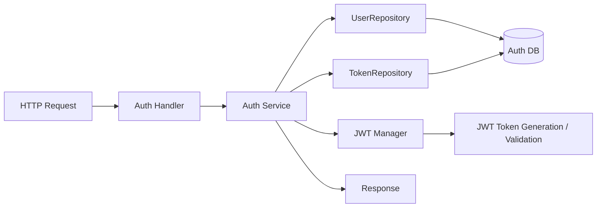
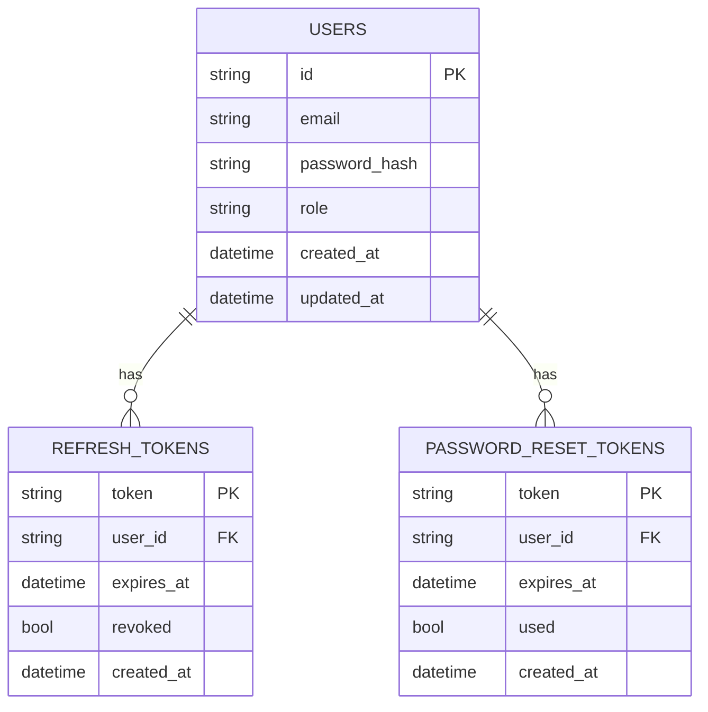

<DocBadge status="under-review" version="v0.1.0-alpha" />

# Authentication Module

The Authentication module provides secure user authentication, registration, and session token generation for AxCom.

## Overview

- **User Registration**: Create new user accounts (defaults to the `customer` role if unspecified) with secure validation and password hashing.
- **Secure Password Hashing**: Passwords are encrypted using `bcrypt` before storage.
- **User Login**: Validate user credentials and return an active JWT session.
- **Role-Based Tokens**: Session tokens embed user roles to authorize operations downstream.
- **Input Validation**: Enforce validation rules (valid email format, minimum 8-character password with at least one letter and one number).
- **Custom Sentinel Errors**: Distinguish error conditions clearly (`ErrEmailAlreadyExists`, `ErrInvalidCredentials`, `ErrUserNotFound`).
- **Activity Logging**: Track request activities, successes, and failures using structured log levels.

---

## Architecture



- `Auth Handler` receives credentials and validates payloads.
- `Auth Service` contains business rules for registration, login, token refresh, password recovery, and logout.
- `UserRepository` and `TokenRepository` are storage contracts for user and token persistence.
- `JWT Manager` handles signing and verifying access tokens.

---

## Module Structure

| File            | Role                                                     |
| :-------------- | :------------------------------------------------------- |
| `handler.go`    | HTTP controllers — validates requests, encodes responses |
| `service.go`    | Core business logic; exposes the `Service` interface     |
| `model.go`      | Data schemas: `User`, `Session`                          |
| `repository.go` | `UserRepository` storage contract                        |
| `errors.go`     | Domain-specific sentinel errors                          |

---

## Database Design



---

## What this module needs

- A `UserRepository` implementation to persist and retrieve users.
- A `TokenRepository` implementation for refresh tokens and password reset tokens.
- A secure password hashing mechanism (`bcrypt` or equivalent).
- A JWT manager for generating and validating access tokens.
- Structured application errors for invalid credentials, unauthorized access, and duplicate accounts.
- Request validation for email format, password strength, and required fields.

---

## Usage

Handlers rely on the `Service` interface for all tasks, allowing the service layer to be mocked or replaced easily.

```go
authService := auth.NewAuthService(userRepo, jwtManager)
authHandler := auth.NewAuthHandler(authService)
```
