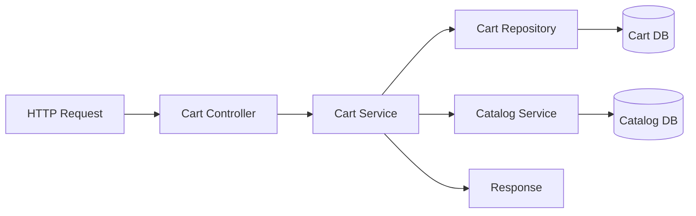
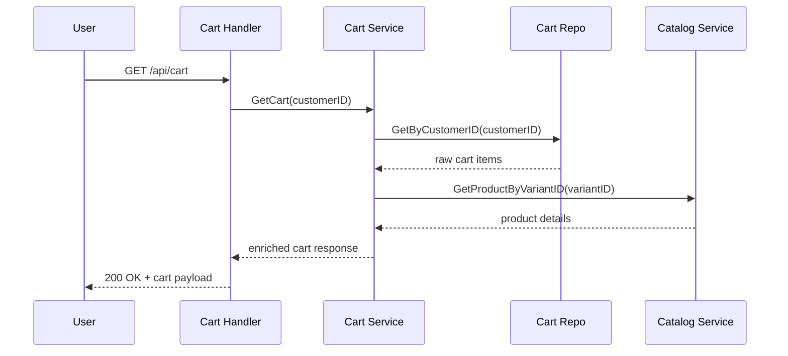
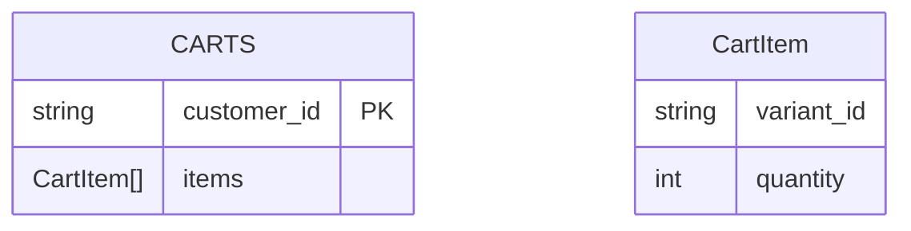

<DocBadge status="under-review" version="v0.1.0-alpha" />

# Cart Module

The Cart module manages the authenticated user's shopping cart and provides a lightweight item count endpoint. It stores minimal cart state in the repository and enriches cart items using product catalog data.

---

## Capabilities

- `GET /api/cart` — Retrieve the authenticated user's full enriched cart.
- `GET /api/cart/count` — Retrieve total item count (lightweight, for UI badges).
- `POST /api/cart` — Add a product variant to the cart.
- `PUT /api/cart/items/:variantId` — Update the quantity of an existing cart item.
- `DELETE /api/cart/items/:variantId` — Remove a variant from the cart.
- `DELETE /api/cart` — Clear the authenticated user's cart.
- `POST /api/cart/merge` — Merge a guest cart into an authenticated user's cart.

---

## Architecture



- `Cart Controller` handles request auth, validation, and response encoding.
- `Cart Service` handles persistence, catalog enrichment, and cart count logic.
- `Cart Repository` stores raw carts as customer ID + variant quantities.
- `Catalog Service` resolves product metadata for cart items.

---

## Module Structure

| File/Dir        | Role                                                |
| :-------------- | :-------------------------------------------------- |
| `controller.go` | HTTP handlers and request validation                |
| `routes.go`     | Route registration for cart endpoints               |
| `service.go`    | Business logic, cart enrichment, count calculations |
| `repository.go` | Cart persistence contract and repository wiring     |
| `model.go`      | Domain models used by the cart repository           |
| `errors.go`     | Module-specific sentinel error definitions          |
| `dto/`          | Request and response DTOs for cart API payloads     |
| `merge/`        | Isolated guest-cart merge submodule                 |

---

## Data Flow



---

## Database Design



---

## DTOs

| DTO                 | Fields                                                                         |
| :------------------ | :----------------------------------------------------------------------------- |
| `AddItemRequest`    | `variant_id`, `quantity`                                                       |
| `UpdateItemRequest` | `quantity`                                                                     |
| `CartItemResponse`  | `name`, `sku`, `price`, `discounted_price`, `image_url`, `stock`, `attributes` |
| `CartResponse`      | `customer_id`, `items`                                                         |
| `CartCountResponse` | `count`                                                                        |

---

## Merge Submodule

The merge logic lives in `internal/core/cart/merge`, keeping guest-cart merge behavior isolated from normal cart operations.

| File                  | Role                             |
| :-------------------- | :------------------------------- |
| `merge/dto.go`        | Merge request/response payloads  |
| `merge/controller.go` | Guest cart merge handler         |
| `merge/service.go`    | Merge business logic             |
| `merge/routes.go`     | Dedicated `POST /api/cart/merge` |

---

## Usage

```go
cartService := cart.NewCartService(cartRepo, catalogService)
cartController := cart.NewController(cartService)
cart.RegisterRoutes(routerGroup, cartController)

// For guest-cart merging:
cartMergeService := merge.NewMergeService(cartService, cartRepo)
cartMergeController := merge.NewController(cartMergeService)
merge.RegisterRoutes(routerGroup, cartMergeController)
```
