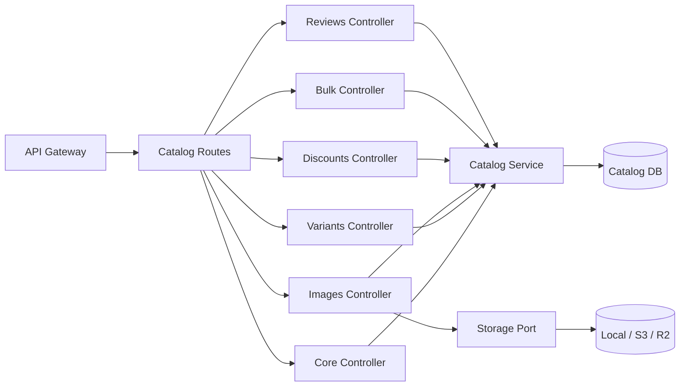
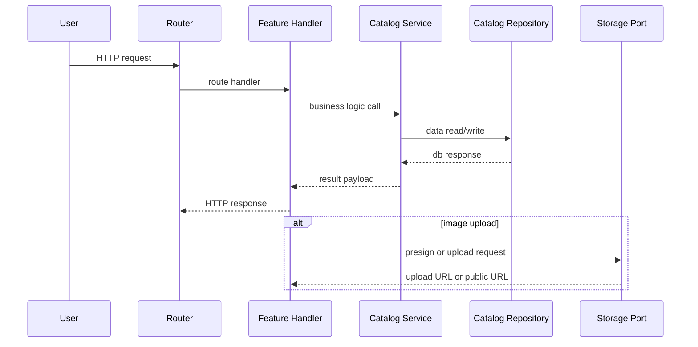
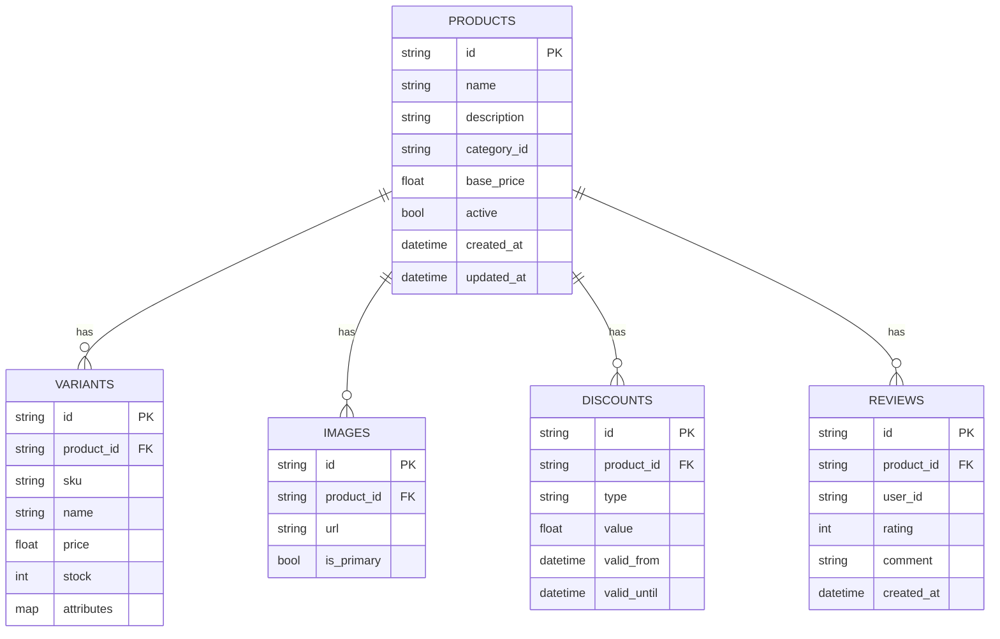
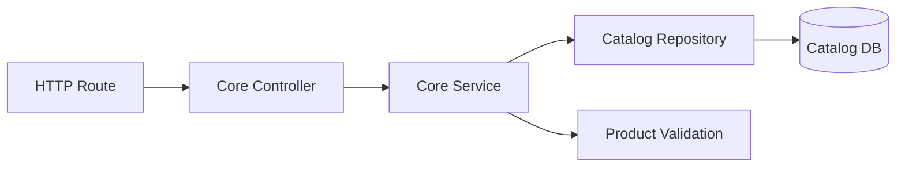
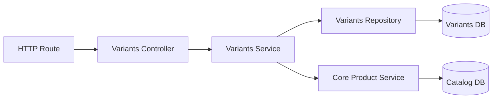
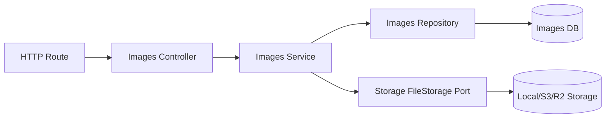
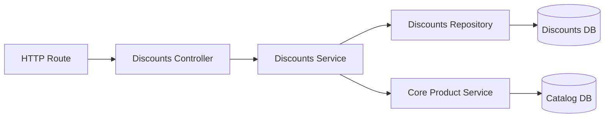
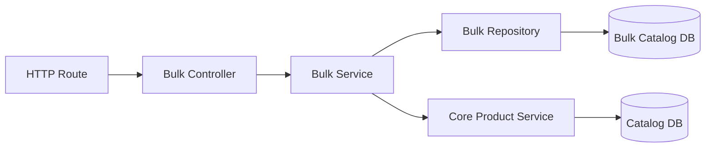
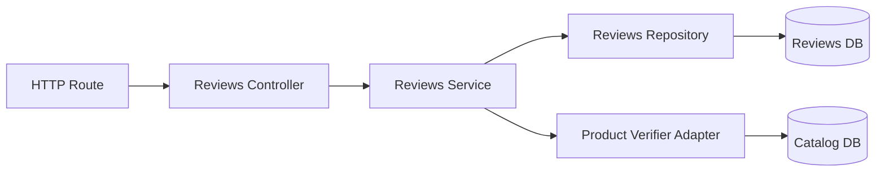

<DocBadge status="under-review" version="v0.1.0-alpha" />

# Catalog Module

The Catalog module provides product catalog functionality through several feature submodules. It exposes catalog endpoints for product core data, variants, images, discounts, bulk operations, and reviews.

---

## Overview

The catalog module is organized as a collection of feature packages. Each feature has its own controller, service, and repository port, and the module wires them together through `RegisterRoutes`.

---

## Features

| Feature     | Description                                       |
| :---------- | :------------------------------------------------ |
| `core`      | Core product CRUD, search, and catalog retrieval  |
| `variants`  | Product variant management (SKU, stock, price)    |
| `images`    | Product image upload, retrieval, presign URL flow |
| `discounts` | Discount metadata and pricing rules               |
| `bulk`      | Bulk catalog operations and batch imports         |
| `reviews`   | Product reviews with optional guest support       |

---

## Module Structure

| File/Dir              | Role                                               |
| :-------------------- | :------------------------------------------------- |
| `routes.go`           | Aggregates and registers all feature routes        |
| `features/core/`      | Core product catalog controller and routes         |
| `features/variants/`  | Variant-specific API and controller                |
| `features/images/`    | Product image endpoints and presign flow           |
| `features/discounts/` | Discount and pricing endpoints                     |
| `features/bulk/`      | Bulk catalog operations                            |
| `features/reviews/`   | Review endpoints and optional guest review support |

---

## Architecture



---

## How Features Connect

Each feature follows the same basic flow:

- `routes.go` — defines HTTP endpoints and applies middleware.
- `controller.go` — validates requests and delegates to the service.
- `service.go` — contains business logic and orchestrates data access.
- `repository.go` — defines a storage port interface for the feature.

### Shared Core Service

The core catalog feature provides the canonical product data service. Variants, discounts, and images are all tied to the same product entity and may use the core product service to validate product existence.

### Images Feature

`images/controller.go` handles both direct uploads and presign URL requests. `images/service.go` uses a storage port supporting local uploads or external storage providers.

### Reviews

Reviews are modular and may use a memory repository or a database-backed repository. The review feature can also validate product references using a product verifier adapter.

---

## Ports and Adapters

Feature-specific repository interfaces define the port boundary for each feature. The engine wiring provides concrete repository implementations.

### Storage Port for Images

`internal/infra/storage/port.go` defines a `FileStorage` interface with `Upload`, `Download`, `Delete`, `PresignUpload`, and `GetPublicURL`.

| Adapter                        | Use Case                       |
| :----------------------------- | :----------------------------- |
| `internal/infra/storage/local` | Local disk uploads             |
| `internal/infra/storage/s3`    | S3-compatible external storage |
| `internal/infra/storage/r2`    | Cloudflare R2                  |

The engine selects the adapter at startup using `STORAGE_PROVIDER`.

---

## Data Flow



---

## Database Design



---

## Feature Architectures

### Core



### Variants



### Images



### Discounts



### Bulk



### Reviews



---

## Routes and Integration

`RegisterRoutes` registers only features that have been instantiated:

```go
func RegisterRoutes(rg *gin.RouterGroup, controllers *ModuleControllers, authMiddleware gin.HandlerFunc) {
    if controllers.Core != nil {
        core.RegisterRoutes(rg, controllers.Core, authMiddleware)
    }
    if controllers.Images != nil {
        images.RegisterRoutes(rg, controllers.Images, authMiddleware)
    }
    if controllers.Variants != nil {
        variants.RegisterRoutes(rg, controllers.Variants, authMiddleware)
    }
    if controllers.Discounts != nil {
        discounts.RegisterRoutes(rg, controllers.Discounts, authMiddleware)
    }
    if controllers.Bulk != nil {
        bulk.RegisterRoutes(rg, controllers.Bulk, authMiddleware)
    }
    if controllers.Reviews != nil {
        reviews.RegisterRoutes(rg, controllers.Reviews, authMiddleware)
    }
}
```

---

## Usage

Instantiate only the features you need, then build the `ModuleControllers` and register routes.

```go
catalogControllers := &catalog.ModuleControllers{
    Core:      catalogCoreCtrl,
    Images:    catalogImagesCtrl,
    Variants:  catalogVariantsCtrl,
    Discounts: catalogDiscountsCtrl,
    Bulk:      catalogBulkCtrl,
    Reviews:   catalogReviewsCtrl,
}

catalog.RegisterRoutes(api, catalogControllers, authMiddleware)
```

> Each feature is optional and registered only when the controller is not nil. This module is designed for modular expansion.
