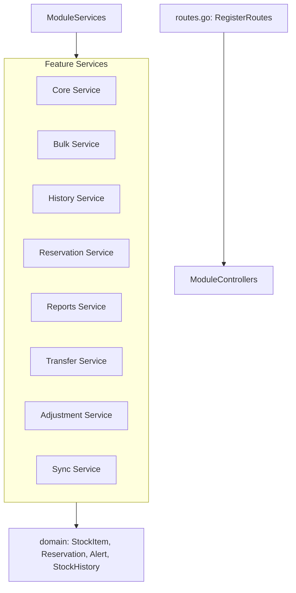

<DocBadge status="under-review" version="v0.1.0-alpha" />

# Inventory Module

The Inventory module is responsible for managing stock availability, reservations, history/audit trails, transfers, manual adjustments, bulk imports/exports, reporting, and synchronization with external systems.

---

## Module Structure

The inventory module is composed of:

1. **Domain Models** (`domain/`): Defines the core domain concepts (`StockItem`, `Reservation`, `Alert`, `StockHistory`).
2. **Features**: Submodules representing distinct business features, each containing its own service, controllers, and feature-specific documentation.

---

## Features

| Feature       | Description                                                       |
| :------------ | :---------------------------------------------------------------- |
| `core`        | Basic stock queries, configuration, updates, and low-stock alerts |
| `bulk`        | Bulk stock import, export, and updates                            |
| `history`     | Audit trail of stock mutations                                    |
| `reservation` | Holding stock temporarily during checkouts                        |
| `reports`     | Aggregations and analytical reports on stock levels               |
| `transfer`    | Inter-warehouse or multi-location stock movements                 |
| `adjustment`  | Manual stock correction tools for administrators                  |
| `sync`        | Synchronization with external channels, ERPs, or suppliers        |

---

## Module Entry Points

| File         | Role                                                                             |
| :----------- | :------------------------------------------------------------------------------- |
| `service.go` | `ModuleServices` struct bundling all sub-feature service instances               |
| `routes.go`  | `ModuleControllers` struct and `RegisterRoutes` for binding all inventory routes |
| `model.go`   | Shared DTOs and models across the module                                         |
| `errors.go`  | Package-level error definitions for inventory operations                         |

---

## Architecture

---

## Testing

Unit and integration tests for the inventory module are documented in `tests.md` within each feature directory.
