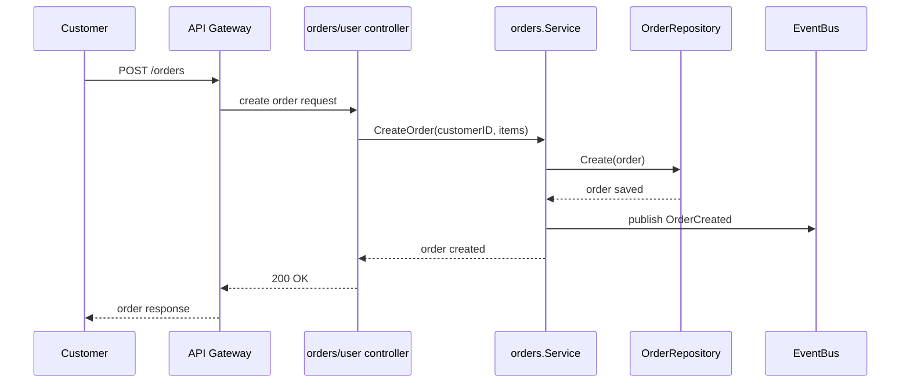
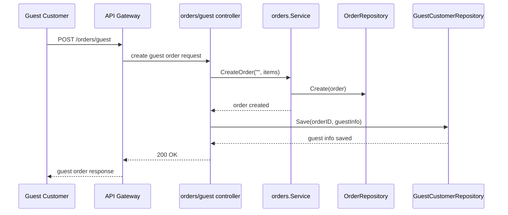
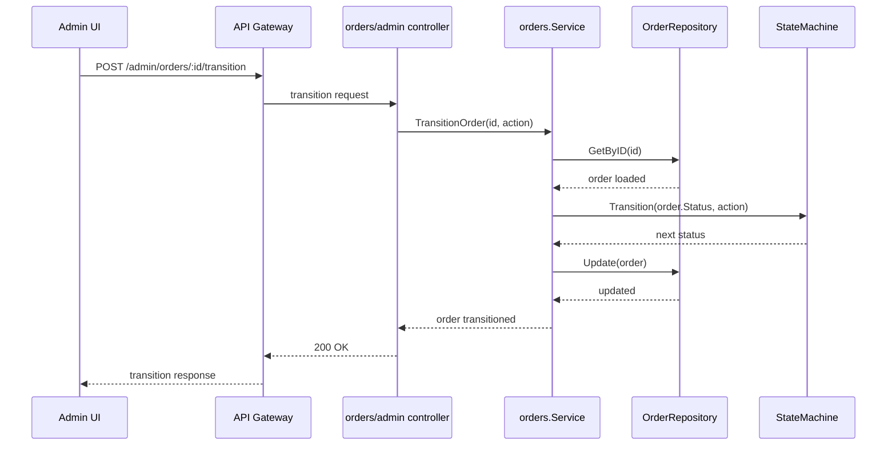

<DocBadge status="under-review" version="v0.1.0-alpha" />

# Orders Module

The Orders module implements the `orders` domain for AxCom. It contains the business logic, HTTP controllers, state machine, repository contract, and guest checkout support for order processing.

---

## Capabilities

- Creates and validates orders for authenticated users and guests.
- Manages order lifecycle transitions using a state machine.
- Exposes customer-facing and admin-facing HTTP endpoints.
- Persists orders via the `OrderRepository` interface.
- Publishes events for order creation, payment success, and order status changes.

---

## Module Structure

| File/Dir          | Role                                                                      |
| :---------------- | :------------------------------------------------------------------------ |
| `service.go`      | Core order business service — creation, transitions, retrieval, listing   |
| `repository.go`   | Repository contract for saving, retrieving, and listing orders            |
| `model.go`        | Re-exports domain types: `Order`, `OrderItem`, `OrderStatus`, `GuestInfo` |
| `statemachine.go` | Order state machine adapter                                               |
| `errors.go`       | Order-specific error definitions                                          |
| `admin/`          | Admin HTTP handlers and DTOs                                              |
| `user/`           | Authenticated customer order handlers and DTOs                            |
| `guest/`          | Guest checkout handler, request/response models, and repository           |
| `domain/`         | Order domain model, validation, and state machine logic                   |

---

## Key Components

### `service.go`

- Implements order creation, status transitions, retrieval, and listing.
- Uses `OrderRepository` to persist and retrieve orders.
- Uses `OrderStateMachine` to validate state transitions.
- Subscribes to payment success events and transitions orders to `paid` when payments complete.

### `statemachine.go`

Delegates transition logic to the domain implementation:

| From               | To         |
| :----------------- | :--------- |
| `pending`          | `paid`     |
| `paid`             | `shipped`  |
| `shipped`          | `done`     |
| `pending` / `paid` | `canceled` |

---

## API Routes

### Customer Endpoints (`user/`)

| Method | Route         | Description                                    |
| :----- | :------------ | :--------------------------------------------- |
| `POST` | `/orders`     | Create an authenticated order                  |
| `GET`  | `/orders/:id` | Get a specific order (own orders only)         |
| `GET`  | `/orders`     | List all orders for the authenticated customer |

### Guest Endpoints (`guest/`)

| Method | Route           | Description                                 |
| :----- | :-------------- | :------------------------------------------ |
| `POST` | `/orders/guest` | Create a guest order without authentication |

### Admin Endpoints (`admin/`)

| Method | Route                          | Description                        |
| :----- | :----------------------------- | :--------------------------------- |
| `GET`  | `/admin/orders`                | List all orders                    |
| `GET`  | `/admin/orders/:id`            | Get any order by ID                |
| `POST` | `/admin/orders/:id/transition` | Trigger an order status transition |

---

## Order Status Lifecycle

```
pending → paid → shipped → done
pending → canceled
paid    → canceled
```

Status constants exposed by the module:

- `StatusPending`
- `StatusPaid`
- `StatusShipped`
- `StatusDone`
- `StatusCanceled`

These are aliases of the internal domain constants defined in `internal/core/orders/domain`.

---

## Key Flows

### Authenticated Order Creation



### Guest Order Creation



### Admin Order Transition



---

## Integrating the Orders Module

1. Implement `orders.OrderRepository` for the chosen database.
2. Register the order service with the event bus.
3. Create `admin`, `user`, and `guest` controllers with the service.
4. Mount the controllers in the router under `/admin/orders`, `/orders`, and `/orders/guest`.

---

## Notes

- The service emits events for created orders and payment success.
- Guest checkout stores contact data separately from the main order record.
- Order lifecycle rules are enforced by the state machine; invalid transitions return errors.
- Admin controllers can resolve guest details using `GuestInfoProvider`.
