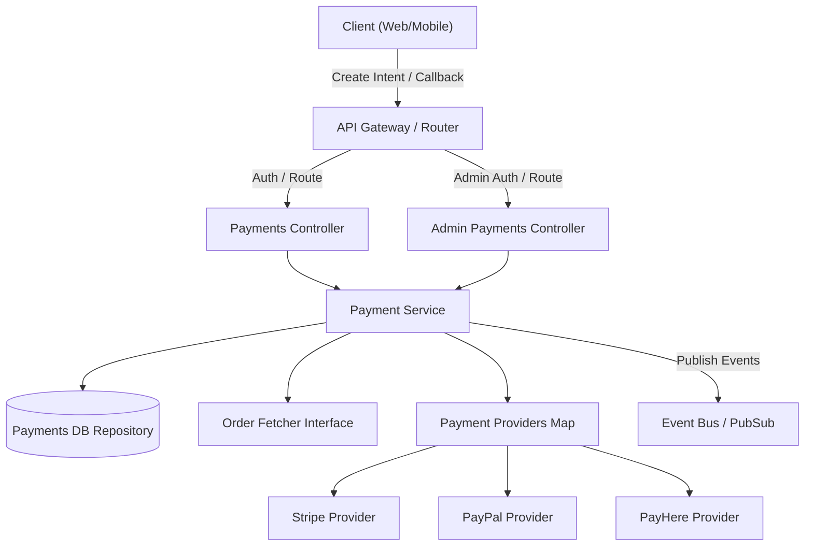
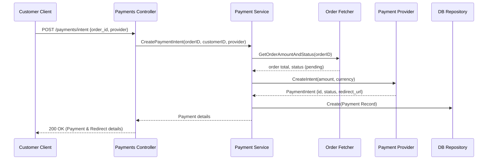
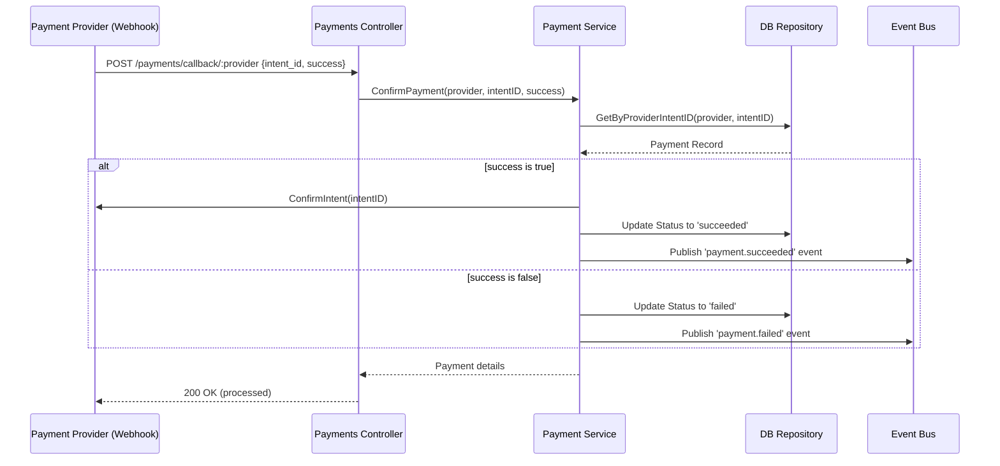
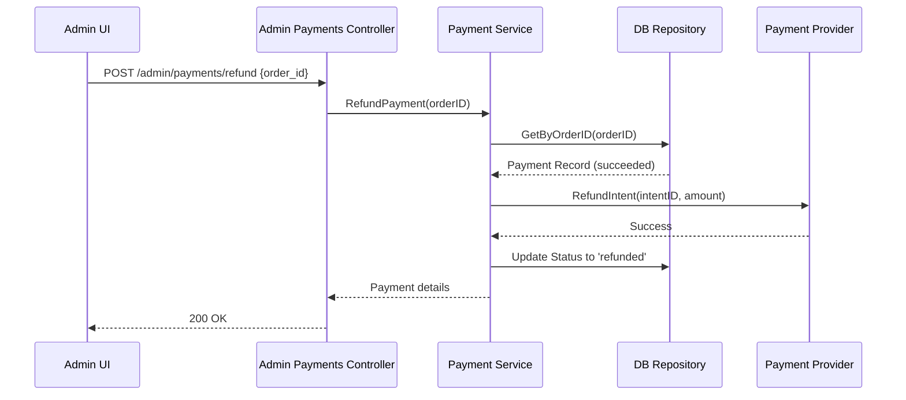

<DocBadge status="under-review" version="v0.1.0-alpha" />

# Payments Module

The Payments module orchestrates transaction flows with external payment gateways, handles callbacks/webhooks, maintains audit state of payment intents, and manages administrative tasks such as listing and refunds.

---

## Overview

The payments subsystem provides abstraction over multiple third-party payment providers (e.g., Stripe, PayPal, PayHere). It facilitates:

- **Payment Intents**: Initiating payments for pending customer orders.
- **Provider Callbacks**: Processing asynchronous webhooks or return URLs to verify transaction results.
- **Admin Actions**: Refunding successful transactions and listing execution history.
- **Event-Driven Workflows**: Publishing `payment.succeeded` or `payment.failed` to notify downstream services (Inventory, Orders).

---

## Architecture

---

## API Routes

### Customer Endpoints

| Method | Route                          | Description                                                    | Auth           |
| :----- | :----------------------------- | :------------------------------------------------------------- | :------------- |
| `POST` | `/payments/intent`             | Creates a transaction intent with a specified/default provider | Yes (Customer) |
| `POST` | `/payments/callback/:provider` | Receives status callbacks/webhooks from the payment gateway    | No (Public)    |

### Admin Endpoints

| Method | Route                    | Description                                  | Auth        |
| :----- | :----------------------- | :------------------------------------------- | :---------- |
| `GET`  | `/admin/payments`        | Lists all payment logs/transactions          | Yes (Admin) |
| `POST` | `/admin/payments/refund` | Initiates a refund for a specific paid order | Yes (Admin) |

---

## Data Model

| Status      | Description                         |
| :---------- | :---------------------------------- |
| `pending`   | Intent created, awaiting completion |
| `succeeded` | Successfully captured               |
| `failed`    | Failed to capture                   |
| `refunded`  | Refunded by admin                   |

---

## Key Flows

### Create Payment Intent

### Process Payment Callback (Webhook)

### Admin Refund

---

## Event Subscriptions

| Event               | Trigger               | Consumers                                                    |
| :------------------ | :-------------------- | :----------------------------------------------------------- |
| `payment.succeeded` | Confirmation succeeds | Orders module (mark paid), Inventory (finalize reservations) |
| `payment.failed`    | Payment fails         | Inventory (release reservations)                             |
