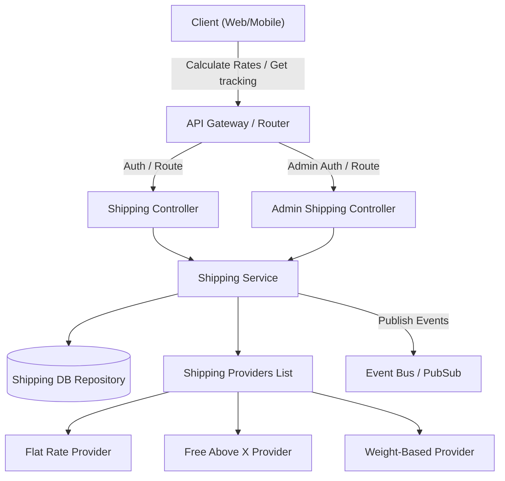
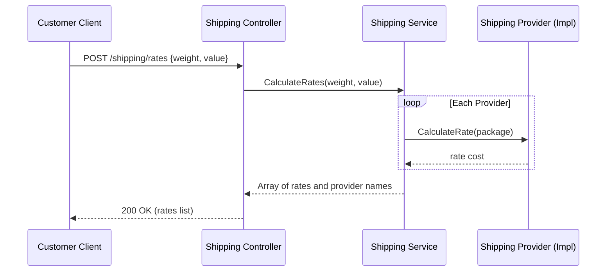
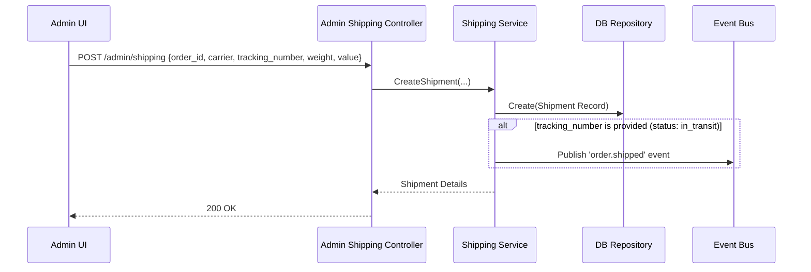
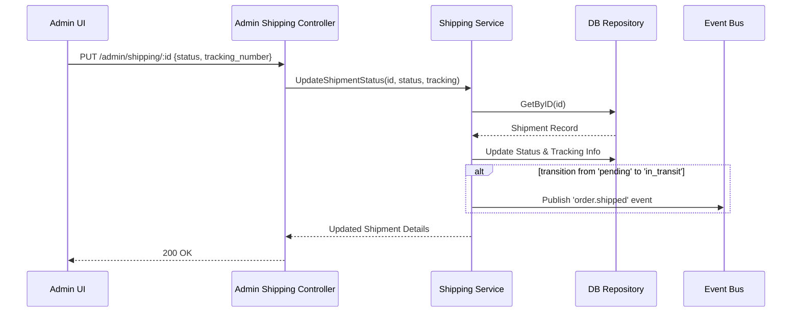
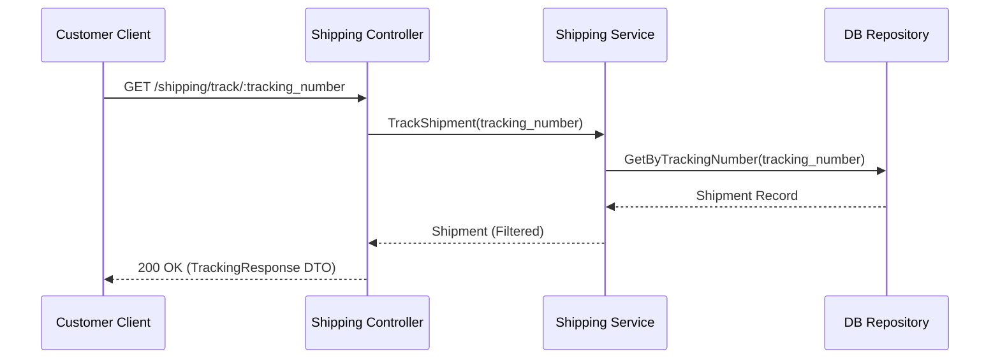

<DocBadge status="under-review" version="v0.1.0-alpha" />

# Shipping Module

The Shipping module handles package rate calculation, shipping carrier integration, tracking registration, and shipment status management.

---

## Overview

The shipping subsystem allows querying rates across multiple configured shipping providers (e.g., Flat Rate, Free Above X, Weight-Based) and manages the lifecycle of order shipments. It supports:

- **Rate Calculation**: Estimating shipping costs based on weight and order value.
- **Shipment Creation**: Logging tracking information, assigning carrier details, and initiating shipping logs.
- **Status Tracking**: Transitioning shipment statuses (e.g., from pending to in-transit or delivered).
- **Event Dispatching**: Publishing `order.shipped` events when packages transition to the transit stage, enabling external modules to trigger notifications.

---

## Architecture

---

## API Routes

### Customer Endpoints

| Method | Route                              | Description                                                | Auth           |
| :----- | :--------------------------------- | :--------------------------------------------------------- | :------------- |
| `POST` | `/shipping/rates`                  | Calculates delivery rates across all providers             | No (Public)    |
| `GET`  | `/shipping/order/:order_id`        | Fetches shipment and tracking details for a specific order | Yes (Customer) |
| `GET`  | `/shipping/track/:tracking_number` | Public tracking lookup by tracking number                  | No (Public)    |

### Admin Endpoints

| Method | Route                 | Description                                 | Auth        |
| :----- | :-------------------- | :------------------------------------------ | :---------- |
| `GET`  | `/admin/shipping`     | Lists all shipments in the database         | Yes (Admin) |
| `POST` | `/admin/shipping`     | Creates a new shipment record for an order  | Yes (Admin) |
| `PUT`  | `/admin/shipping/:id` | Updates tracking number and shipment status | Yes (Admin) |

---

## Data Model

| Status       | Description                                              |
| :----------- | :------------------------------------------------------- |
| `pending`    | Shipment record created, package not yet dispatched      |
| `in_transit` | Package handed over to carrier; tracking number assigned |
| `delivered`  | Successfully received by the customer                    |
| `returned`   | Package returned to origin                               |

---

## Key Flows

### Calculate Shipping Rates

### Admin Create Shipment

### Update Shipment Status

### Track Shipment by Tracking Number

---

## Event Subscriptions

| Event           | Trigger                            | Consumers                                                |
| :-------------- | :--------------------------------- | :------------------------------------------------------- |
| `order.shipped` | Shipment enters `in_transit` phase | Notifications module (send tracking details to customer) |
