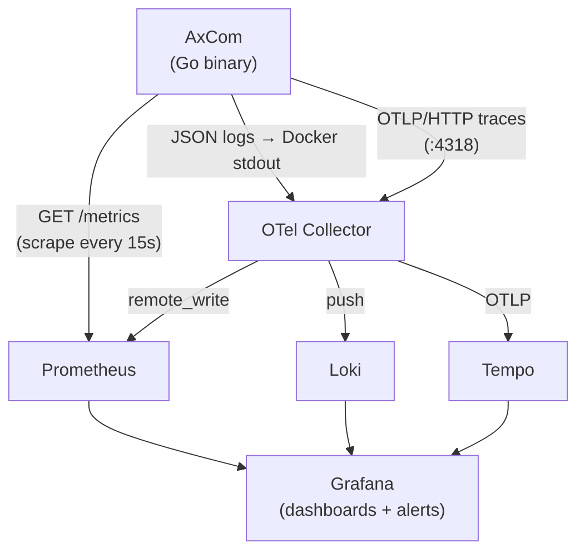

<DocBadge status="under-review" version="v0.1.0-alpha" />

# Observability Overview

AxCom emits three observability signals from the same running process: **metrics**, **structured logs**, and **distributed traces**. Together they let you answer any operational question without guessing.

| Signal  | What it answers                                                 | Backend                              |
| ------- | --------------------------------------------------------------- | ------------------------------------ |
| Metrics | "Is the service healthy right now? What are the trends?"        | Prometheus → Grafana                 |
| Logs    | "What happened, and why?"                                       | Loki (via OTel Collector) → Grafana  |
| Traces  | "Which code path did this request take, and where was it slow?" | Tempo (via OTel Collector) → Grafana |

---

## Signal Routing

All signals converge in Grafana, making cross-signal navigation possible: click a spike in a metric graph, jump to the log stream for that time window, then click a trace ID in the logs to open the full trace.

---

## How Each Signal is Produced

### Metrics

The `pkg/metrics` package registers all Prometheus metrics on the default registry at import time using `promauto`. Metrics are grouped into five subsystems:

| Subsystem         | Prefix                                            | What it covers                                |
| ----------------- | ------------------------------------------------- | --------------------------------------------- |
| HTTP              | `ecom_engine_http_*`                              | Request rate, latency, in-flight count        |
| Database          | `ecom_engine_db_pool_*`                           | PostgreSQL connection pool stats              |
| Cache             | `ecom_engine_cache_*`                             | L1/L2 hit rates, operation latency, evictions |
| Rate limiting     | `ecom_engine_ratelimit_*`                         | Allow/deny counts, backend fallbacks          |
| Runtime & process | `ecom_engine_runtime_*` / `ecom_engine_process_*` | Go heap, GC, goroutines, CPU %, RSS           |

Prometheus scrapes `app:8080/metrics` every **15 seconds**. Pre-computed recording rules in `prometheus/rules/recording-rules.yml` materialise expensive expressions once so dashboards load instantly.

See [Metrics](./metrics.md) for the full metric catalog and PromQL examples.

### Logs

The `pkg/logger` package writes structured logs using Go's `log/slog`. In production (`LOG_FORMAT=json`) every log line is a JSON object conforming to **Elastic Common Schema (ECS) 8.11**, ready for Loki ingestion.

All log methods have `*Ctx` variants that automatically inject `trace.id` and `span.id` from the active OpenTelemetry span - enabling direct log-to-trace navigation in Grafana.

See [Logs](./logs.md) for the full schema and correlation guide.

### Traces

The `pkg/telemetry` package bootstraps the OpenTelemetry SDK and registers a global `TracerProvider`. Traces are exported via OTLP/HTTP to the OTel Collector which forwards them to Tempo.

Sampling is controlled by `OTEL_TRACE_SAMPLE` (default: 1% in production). W3C TraceContext and Baggage propagators are registered globally, so incoming trace context from upstream services is respected automatically.

See [Traces](./traces.md) for span conventions and sampling configuration.

---

## Dashboards at a Glance

Eight Grafana dashboards are provisioned automatically on first start. Start at **Service Health** during an incident and drill into the focused dashboard that matches the symptom.

| Dashboard         | UID                    | When to use                                  |
| ----------------- | ---------------------- | -------------------------------------------- |
| Service Health    | `ecom-engine-health`   | On-call first look, SLO monitoring           |
| HTTP Traffic      | `ecom-engine-http`     | Request rate / latency / 5xx investigation   |
| Database          | `ecom-engine-db`       | Connection pool saturation                   |
| Cache             | `ecom-engine-cache`    | Hit rate drops, Redis pool issues            |
| Business Events   | `ecom-engine-business` | Order/payment drops, cart abandonment        |
| Security          | `ecom-engine-security` | Auth failures, rate limit health             |
| Logs              | `ecom-engine-logs`     | Ad-hoc log search with level/trace filtering |
| Runtime & Process | `ecom-engine-runtime`  | Go heap, GC, goroutines, CPU/memory          |

See [Dashboards](./dashboards.md) for a full description of every panel.

---

## Alert Layers

Alerts are defined in two independent layers so they survive partial outages:

| Layer                     | File                                  | Fires even if                                   |
| ------------------------- | ------------------------------------- | ----------------------------------------------- |
| Prometheus alerting rules | `prometheus/rules/alerting-rules.yml` | Grafana is down                                 |
| Grafana unified alerting  | `grafana/provisioning/alerting/*.yml` | Prometheus is unreachable (Loki-sourced alerts) |

See [Alerts](./alerts.md) for the full alert catalog and response playbooks.

---

## Deployment

The monitoring stack runs as a separate Docker Compose layer and can be added to any deployment scenario. See [Ops & Deploy → Monitoring](../ops-deploy/monitoring.md) for setup instructions.
