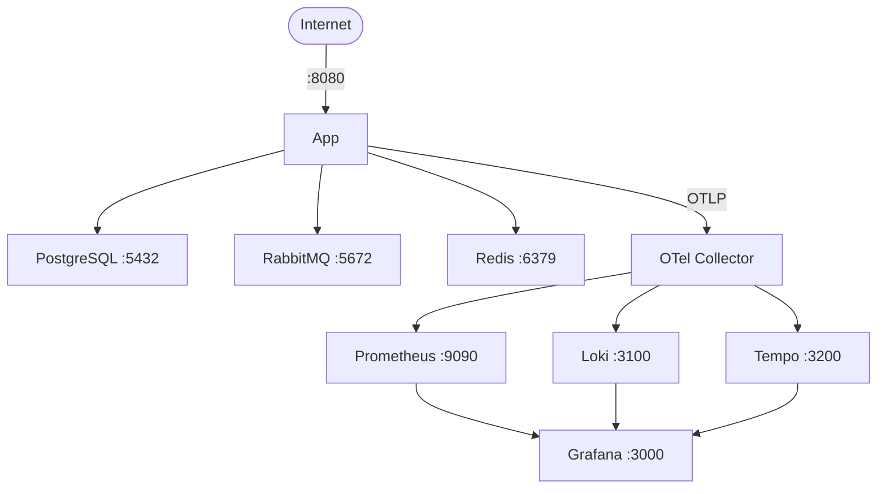

<DocBadge status="under-review" version="v0.1.0-alpha" />

# Full Stack

This page shows how to run all stacks together — app, database, messaging, cache, and observability — on a single host or a small set of servers.

---

## Example: PostgreSQL + RabbitMQ + Redis + Self-Hosted Monitoring

The most complete single-VPS setup.

### Architecture



### Start Order

Services must be started in dependency order. The app needs the database and infra to be healthy before it starts.

```bash
# Step 1 — Shared network (one-time)
docker network create ecom-net

# Step 2 — Copy env files
cd ecom-backend
cp .env.example .env.dev
# Edit .env.dev: set JWT_SECRET, PAYMENT_API_KEY, POSTGRES_PASSWORD

cd deployments/monitoring
cp .env.example .env
# Edit .env: set GRAFANA_PASSWORD

# Step 3 — Start RabbitMQ + Redis
cd ecom-backend/deployments/rabbitmq-redis
docker compose up -d

# Step 4 — Start monitoring stack
cd ../monitoring
docker compose up -d

# Step 5 — Start app + PostgreSQL (full config)
cd ../postgres
# Ensure docker-compose.yml mounts config.full.yaml:
#   volumes:
#     - ./config.full.yaml:/app/config.yaml:ro
docker compose up -d
```

### Verify All Services Are Running

```bash
docker ps --format "table {{.Names}}\t{{.Status}}\t{{.Ports}}"
```

Expected output (abbreviated):

```
NAMES              STATUS          PORTS
postgres-app-1     Up              0.0.0.0:8080->8080/tcp
postgres-db-1      Up (healthy)    0.0.0.0:5432->5432/tcp
rabbitmq-1         Up (healthy)    0.0.0.0:5672->5672/tcp, 0.0.0.0:15672->15672/tcp
redis-1            Up (healthy)    0.0.0.0:6379->6379/tcp
monitoring-otelcol-1    Up         0.0.0.0:4317->4317/tcp, 0.0.0.0:4318->4318/tcp
monitoring-prometheus-1 Up         0.0.0.0:9090->9090/tcp
monitoring-loki-1       Up         0.0.0.0:3100->3100/tcp
monitoring-tempo-1      Up         0.0.0.0:3200->3200/tcp
monitoring-grafana-1    Up         0.0.0.0:3000->3000/tcp
```

### Service URLs

| Service           | URL                       |
|-------------------|---------------------------|
| App API           | http://localhost:8080     |
| Grafana           | http://localhost:3000     |
| Prometheus        | http://localhost:9090     |
| RabbitMQ Console  | http://localhost:15672    |

---

## Example: MongoDB + Grafana Cloud Monitoring

Best for when you want zero observability backend maintenance.

```bash
# Step 1 — Network (one-time)
docker network create ecom-net

# Step 2 — Env files
cp ecom-backend/.env.example ecom-backend/.env.dev
# Set: JWT_SECRET, PAYMENT_API_KEY

cp ecom-backend/deployments/monitoring/.env.example ecom-backend/deployments/monitoring/.env
# Set: GRAFANA_CLOUD_OTLP_ENDPOINT, GRAFANA_CLOUD_INSTANCE_ID, GRAFANA_CLOUD_API_KEY

# Step 3 — Monitoring (cloud only — just the collector)
cd ecom-backend/deployments/monitoring
docker compose -f docker-compose.yml -f docker-compose.cloud.yml up -d

# Step 4 — App + MongoDB
cd ../mongodb
docker compose up -d
```

---

## Environment Variable Cross-Reference

Variables used across stacks (set in `ecom-backend/.env.dev`):

| Variable                      | Used By          | Description |
|-------------------------------|------------------|-------------|
| `JWT_SECRET`                  | App              | Token signing key |
| `PAYMENT_API_KEY`             | App              | Stripe API key |
| `POSTGRES_PASSWORD`           | App, PostgreSQL  | DB password |
| `OTEL_ENABLED`                | App              | Enable OTel (true/false) |
| `OTEL_EXPORTER_OTLP_ENDPOINT` | App              | OTel Collector URL |
| `RABBITMQ_USER`               | RabbitMQ         | Broker username |
| `RABBITMQ_PASS`               | RabbitMQ         | Broker password |
| `GRAFANA_PASSWORD`            | Grafana          | Admin password |
| `GRAFANA_CLOUD_API_KEY`       | OTel Collector   | Grafana Cloud token |

---

## Teardown

```bash
# Stop individual stacks (keeps data volumes)
cd deployments/postgres    && docker compose down
cd deployments/rabbitmq-redis && docker compose down
cd deployments/monitoring  && docker compose down

# Or stop everything and delete all data
cd deployments/postgres    && docker compose down -v
cd deployments/rabbitmq-redis && docker compose down -v
cd deployments/monitoring  && docker compose down -v
```

---

## Upgrade Procedure

1. Pull latest images: `docker compose pull` in each stack directory
2. Rebuild the app: `docker compose build app` in the database directory
3. Apply PostgreSQL migrations (if using Postgres): `docker compose run --rm migrate`
4. Rolling restart: `docker compose up -d` in each stack directory

---

## Hardware Sizing

Rough guidelines for a single-VPS deployment:

| Tier | Scenario | Min RAM | Min CPU | Min Disk |
|------|----------|---------|---------|----------|
| Minimal | App only | 512 MB | 1 vCPU | 5 GB |
| With DB | App + PostgreSQL | 1 GB | 1 vCPU | 10 GB |
| With Infra | + RabbitMQ + Redis | 2 GB | 2 vCPU | 10 GB |
| Full stack | + Self-hosted monitoring | 4 GB | 2 vCPU | 20 GB |
| Full stack | + Grafana Cloud monitoring | 2 GB | 2 vCPU | 10 GB |

Grafana Cloud significantly reduces the RAM and disk requirements since Prometheus, Loki, and Tempo don't run locally.
