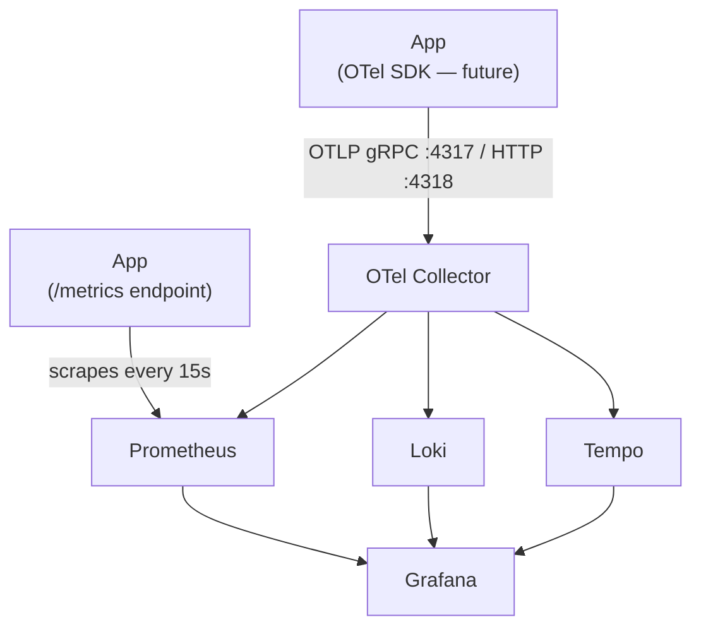

<DocBadge status="under-review" version="v0.1.0-alpha" />

# Monitoring

The monitoring stack adds full observability to any app deployment — metrics, logs, and distributed traces in Grafana. Two options are available:

> This page covers **deployment and setup only**. For what the signals mean, the full metric catalog, dashboard descriptions, and alert playbooks, see the **[Observability](../observability/overview.md)** section.

| Option | Stack | Cost |
|--------|-------|------|
| **Scenario 5** — Self-hosted | OTelCol + Prometheus + Loki + Tempo + Grafana | VPS resources only |
| **Scenario 6** — Grafana Cloud | OTelCol → Grafana Cloud OTLP endpoint | Grafana Cloud free tier (10k metrics, 50 GB logs, 50 GB traces/month) |

Both share the same OTel Collector pipeline — only the exporter config differs.

---

## Signal Routing



**Metrics** — `prometheus/client_golang` is already wired. Prometheus scrapes `app:8080/metrics` on every 15-second interval. No app changes needed.

**Logs** — The OTel Collector tails Docker JSON log files and ships structured log lines to Loki. The app's JSON log output is parsed automatically.

**Traces** — When the app's OTel SDK is initialized, traces are pushed via OTLP to the Collector and forwarded to Tempo. The infrastructure is ready; SDK instrumentation is the next step.

---

## Scenario 5 — Self-Hosted

### Prerequisites

Complete the [Prerequisites](./prerequisites.md) page. The monitoring stack requires:
- `ecom-net` Docker network
- A copy of `monitoring/.env` (copy from `.env.example`)

### Start

```bash
cd ecom-backend/deployments/monitoring
cp .env.example .env         # edit if you want to change ports or Grafana credentials
docker compose up -d
```

### Services

| Service    | Default URL            | Purpose                          |
|------------|------------------------|----------------------------------|
| Grafana    | http://localhost:3000  | Dashboards, alerts               |
| Prometheus | http://localhost:9090  | Metric storage and query         |
| Loki       | http://localhost:3100  | Log storage and query            |
| Tempo      | http://localhost:3200  | Trace storage and query          |

Default Grafana credentials: `admin` / `admin` (change in `.env`).

### Connect the App

Add to your app deployment's environment (or `.env.dev`):

```env
OTEL_ENABLED=true
OTEL_EXPORTER=otlp
OTEL_EXPORTER_OTLP_ENDPOINT=http://otelcol:4318
```

Because both stacks are on `ecom-net`, the app can reach the OTel Collector by service name `otelcol`.

### Pre-built Dashboards

Grafana is provisioned with eight dashboards automatically on first start:

| Dashboard       | When to use                                |
|-----------------|---------------------------------------------|
| Service Health  | On-call first look, SLO monitoring          |
| HTTP Traffic    | Request rate / latency / 5xx investigation  |
| Database        | DB connection pool saturation               |
| Cache           | Cache hit rate drops, Redis pool issues     |
| Business Events | Order/payment drops, cart abandonment       |
| Security        | Auth failures, rate limiting health         |
| Logs            | Ad-hoc log search with level/trace filtering|
| Runtime         | Go heap, GC, goroutines, CPU/memory         |

Start at **Service Health** during an incident, then drill into the relevant focused dashboard.

### Prometheus Alerts

Metric-based alerts are defined in `prometheus/rules/alerting-rules.yml` and fire even when Grafana is down:

| Alert | Condition |
|-------|-----------|
| `HighHttpErrorRate` | 5xx rate > 5% for 5m |
| `HighP99Latency` | p99 > 2s for 5m |
| `DbPoolExhausted` | pool utilization > 90% for 2m |
| `LowCacheHitRate` | Redis hit rate < 50% for 10m |
| `HighCpuUsage` | CPU > 80% for 5m |
| `GoroutineLeak` | goroutines > 500 for 15m |

Grafana alerts (in `grafana/provisioning/alerting/`) extend these with Loki-based log alerts:

| Alert | Condition |
|-------|-----------|
| `ErrorLogSpike` | > 50 error logs in 5m |
| `PaymentErrorSpike` | > 10 payment error logs in 5m |
| `AuthFailureSpike` | > 30 auth failure logs in 5m |

---

## Scenario 6 — Grafana Cloud

Use Grafana Cloud as the observability backend. Only the OTel Collector runs locally; all storage and dashboards are managed by Grafana Cloud.

### Get Grafana Cloud Credentials

1. Sign up or log in at [grafana.com](https://grafana.com)
2. Go to your stack → **OpenTelemetry tile → Configure**
3. Note your:
   - **OTLP endpoint** (e.g. `https://otlp-gateway-prod-us-east-0.grafana.net/otlp`)
   - **Instance ID** (numeric stack ID)
   - **API key** (create one with MetricsPublisher + LogsPublisher + TracesPublisher roles)

### Configure

Add to `ecom-backend/deployments/monitoring/.env`:

```env
GRAFANA_CLOUD_OTLP_ENDPOINT=https://otlp-gateway-prod-us-east-0.grafana.net/otlp
GRAFANA_CLOUD_INSTANCE_ID=123456
GRAFANA_CLOUD_API_KEY=glc_eyJ...
```

### Start (Cloud Override)

```bash
cd ecom-backend/deployments/monitoring
docker compose -f docker-compose.yml -f docker-compose.cloud.yml up -d
```

This starts **only the OTel Collector**. Prometheus, Loki, Tempo, and Grafana are all provided by Grafana Cloud — nothing to manage locally.

### What the Cloud Collector Does

The cloud config (`otelcol/otelcol-cloud.yml`) runs a `prometheus` receiver that scrapes `app:8080/metrics` and a `filelog` receiver for logs. All three signals (metrics + logs + traces) are forwarded to the single Grafana Cloud OTLP endpoint over HTTPS with Basic Auth.

---

## Stopping / Upgrading

```bash
# Stop monitoring (does not stop the app)
docker compose down

# Upgrade images and restart
docker compose pull && docker compose up -d

# Remove all monitoring data
docker compose down -v
```

> Removing volumes deletes all local Prometheus metrics, Loki logs, and Tempo traces. Only do this if you want a clean slate.
