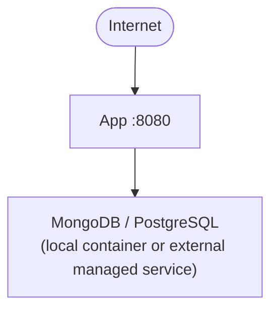
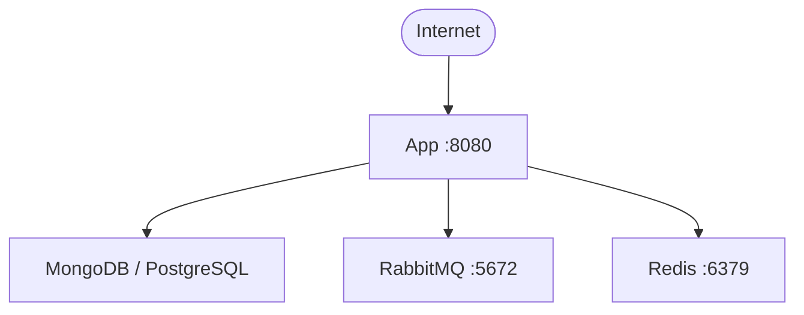
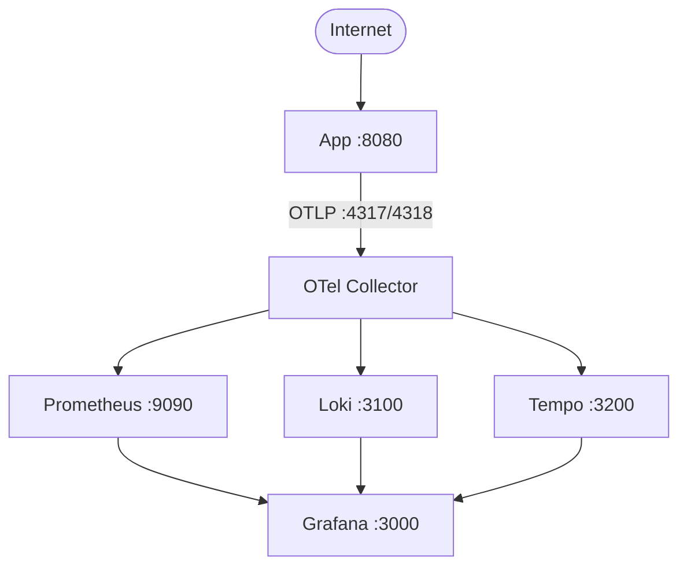
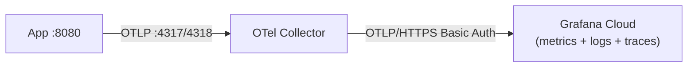

<DocBadge status="under-review" version="v0.1.0-alpha" />

AxCom ships as a single Go binary packaged in a Docker image. The deployment system is built from composable Docker Compose stacks that communicate over a shared `ecom-net` network.

This section covers all deployment scenarios — from the cheapest single-VPS setup to a full self-hosted stack with observability.

---

## Scenario Matrix

| #   | Name                         | Stack                                 | Typical Use Case                              |
| --- | ---------------------------- | ------------------------------------- | --------------------------------------------- |
| 0   | App only                     | App + external managed DB             | Hobby / startup, cloud DB (Atlas, Supabase)   |
| 1   | App + MongoDB                | App + local MongoDB                   | Single VPS, self-hosted NoSQL                 |
| 2   | App + MongoDB + infra        | + RabbitMQ + Redis                    | Growing team, async events, distributed cache |
| 3   | App + PostgreSQL             | App + local PostgreSQL                | Single VPS, self-hosted SQL                   |
| 4   | App + PostgreSQL + infra     | + RabbitMQ + Redis                    | Growing team, SQL + messaging                 |
| 5   | + Monitoring (self-hosted)   | + Prometheus + Loki + Tempo + Grafana | Full observability, VPS or bare metal         |
| 6   | + Monitoring (Grafana Cloud) | + OTel Collector → Grafana Cloud      | Low-cost observability, no backend to run     |

Monitoring (scenarios 5 and 6) is an independent stack that layers on top of any of the database scenarios.

---

## Architecture Tiers

### Tier 1 — Minimal (Scenarios 0–1)



The app uses an in-memory event bus and memory-only L1 cache. No external dependencies beyond the database.

### Tier 2 — With Infra (Scenarios 2, 4)



- **RabbitMQ** handles async domain events (order placed, inventory updated, etc.)
- **Redis** provides a distributed L2 cache in front of the database

### Tier 3 — With Monitoring (Scenario 5)



### Tier 3 — Grafana Cloud Variant (Scenario 6)



Scenario 6 replaces the three local backends with a single Grafana Cloud endpoint. Only the OTel Collector runs locally.

---

## How the Stacks Layer

All stacks share a single external Docker network (`ecom-net`). You start them independently and they discover each other by service name.

```bash
docker network create ecom-net          # one-time setup

# 1. Start infra (optional)
cd deployments/rabbitmq-redis && docker compose up -d

# 2. Start monitoring (optional)
cd deployments/monitoring && docker compose up -d

# 3. Start the app + database
cd deployments/postgres && docker compose up -d
```

The app container joins both `ecom-net` (to reach RabbitMQ, Redis, the OTel Collector) and its default Compose network (to reach the database container).

---

## Choosing a Database

|                  | MongoDB                             | PostgreSQL                      |
| ---------------- | ----------------------------------- | ------------------------------- |
| Schema           | Flexible document model             | Strict relational schema        |
| Migrations       | Automatic (schema-on-write)         | Requires `migrate up` on deploy |
| Transactions     | Requires replica set mode (`rs0`)   | Native                          |
| Managed services | MongoDB Atlas (free tier available) | Supabase, Neon, Railway         |

Both work identically from the application's perspective. Switch by using a different deployment folder.

---

## Next Steps

- [Prerequisites](./prerequisites.md) — Docker setup, network, env files
- [App Only](./app-only.md) — Scenario 0: cheapest option
- [With Database](./with-database.md) — Scenarios 1–4: local DB deployments
- [Monitoring](./monitoring.md) — Scenarios 5–6: add observability
- [Full Stack](./full-stack.md) — Combining everything
- [Config Reference](./config-yaml.md) — All app config options
