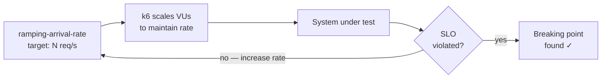

# Breaking-Point Testing

<DocBadge status="under-review" version="v0.1.0-alpha" />

The goal of breaking-point testing is to find the **exact request rate at which the system violates its SLOs** (`p95 latency > 350 ms` or `error rate > 1%`). The standard profiles top out at 200 VUs. To find the true ceiling, use the `ramping-arrival-rate` executor, which drives a fixed request rate regardless of response time.

---

## Why Arrival-Rate, Not VUs?

`ramping-vus` scales concurrency. Under slow response times, a fixed VU count generates *fewer* requests — masking the real bottleneck.

`ramping-arrival-rate` targets a fixed **requests/second** independently of VU pool size. When the system slows down, k6 allocates more VUs to maintain the target rate, until either `maxVUs` is exhausted or the system cracks.



---

## The `breaking-point.js` Script

Located at `load-tests/scenarios/breaking-point.js`. Run it directly (not via `main.js`):

```powershell
k6 run -e BASE_URL=http://localhost:8080 load-tests/scenarios/breaking-point.js
```

### Stage Ladder

| Stage | Duration | Target rate |
|---|---|---|
| 1 | 2 m | 10 → 50 req/s |
| 2 | 2 m | 50 → 100 req/s |
| 3 | 2 m | 100 → 150 req/s |
| 4 | 2 m | 150 → 200 req/s |
| 5 | 2 m | 200 → 250 req/s |
| 6 | 2 m | 250 → 300 req/s |
| Ramp down | 1 m | 300 → 0 req/s |

Total duration: ~13 minutes. `maxVUs: 300` caps the VU pool.

### Threshold Strategy

The script uses **soft thresholds** so the test runs to completion rather than aborting early. One hard abort is set to stop data collection if the error rate becomes destructive:

| Threshold | Type | Value |
|---|---|---|
| `http_req_failed` | Soft | `rate < 0.05` — logged but does not abort |
| `http_req_duration p(95)` | Soft | `< 1000 ms` — logged but does not abort |
| `http_req_failed` (hard) | **Abort** | `rate >= 0.20` — stops test at 20% error rate |

---

## What to Look For

| Signal | Interpretation |
|---|---|
| `http_req_duration{p95}` climbs past 350 ms | Latency SLO breached — note the req/s at this point |
| `http_req_failed rate` exceeds 1% | Error SLO breached |
| `dropped_iterations` counter appears | k6 cannot allocate VUs fast enough — real saturation |
| Server CPU spikes in OS monitor / `docker stats` | CPU-bound bottleneck |
| Memory grows linearly at constant rate | Goroutine or heap leak |

### Latency Curve

```
              │ p95 latency
   350ms ─────┼──────────────────────────── SLO line
              │                   ╱ breaking point
              │               ╱
              │           ╱
              │       ╱
              │   ╱
              └───────────────────────────── req/s
                  ↑ safe zone  ↑ degraded   ↑ failed
```

---

## Using the Result

Once you find the breaking point RPS:

1. **Set your autoscaling trigger** at **80% of that value**. This gives headroom before SLOs are violated.
2. **Tune database pool size** if `pool_timeout_errors` appears before the CPU saturates — the DB is the bottleneck, not the app.
3. **Increase `maxVUs`** in the script and re-run if `dropped_iterations` appears before SLOs break — the VU pool ran out before the system did.

```
Breaking point: 180 req/s
Autoscale trigger: 180 × 0.80 = 144 req/s
```
