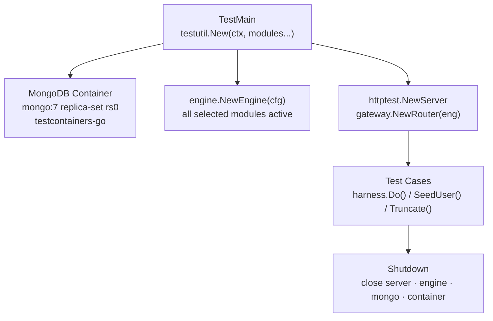
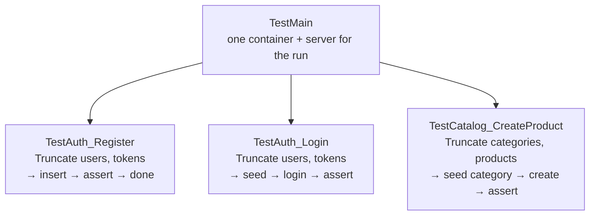

# End-to-End Tests

<DocBadge status="under-review" version="v0.1.0-alpha" />

The `tests/e2e/` package contains end-to-end tests that run the **full engine** — real MongoDB container, real HTTP server, real business logic — via Go's standard `testing` package. They are gated behind the `e2e` build tag so they never run during a plain `go test ./...`.

---

## How It Works



One MongoDB container and one HTTP server are shared across **all tests in the package** (started once in `TestMain`). Individual tests isolate state by calling `harness.Truncate()` at the top of each test, which drops the relevant collections.

---

## Running

Docker must be available and running.

```bash
# Run the full e2e suite
go test -tags e2e -v ./tests/e2e/... -timeout 300s

# Run a single test file / suite
go test -tags e2e -v -run TestAuth ./tests/e2e/... -timeout 120s
go test -tags e2e -v -run TestCatalog ./tests/e2e/... -timeout 120s
go test -tags e2e -v -run TestOrders ./tests/e2e/... -timeout 300s

# Run a single test case
go test -tags e2e -v -run TestAuth_Register/successful_registration ./tests/e2e/... -timeout 60s
```

> The 300s timeout is needed for the MongoDB replica-set container to initialise on first pull. Subsequent runs are faster (~30–60s) once the image is cached locally.

---

## Test Harness (`testutil.Harness`)

Defined in `tests/e2e/testutil/harness.go`. The harness wraps the container, engine, and server with helper methods for tests.

### `New(ctx, modules...)`

Spins up a fresh `mongo:7` container with `WithReplicaSet("rs0")` (replica-set required for multi-document transactions), boots the engine with only the requested modules enabled, and starts an `httptest.Server`.

```go
harness, err = testutil.New(ctx, "catalog", "inventory", "cart", "orders", "shipping", "dashboard")
```

### `harness.Do(t, method, path, body, token)`

Fires an HTTP request at the test server. Marshals `body` to JSON, sets `Content-Type: application/json`, and optionally adds a `Bearer` token header.

```go
resp := harness.Do(t, http.MethodPost, "/api/auth/register", map[string]string{
    "email":    "user@example.com",
    "password": "Password123!",
}, "")
require.Equal(t, http.StatusOK, resp.StatusCode)
```

### `harness.SeedUser(t, email, password, role)`

Inserts a user **directly into MongoDB**, bypassing the API registration endpoint. This is the only way to create `admin` or `merchant` users in tests (the API enforces a role whitelist). Returns the generated user ID.

```go
adminID := harness.SeedUser(t, "admin@example.com", "Admin123!", "admin")
```

### `harness.LoginAs(t, email, password)`

POSTs to `/api/auth/login` and returns `(accessToken, refreshToken)`. Used to obtain bearer tokens for authenticated requests.

```go
token, _ := harness.LoginAs(t, "admin@example.com", "Admin123!")
resp := harness.Do(t, http.MethodGet, "/api/admin/orders", nil, token)
```

### `harness.Truncate(t, collections...)`

Drops the named MongoDB collections in the test database. Call at the top of each test to prevent state leaking between test functions.

```go
func TestAuth_Register(t *testing.T) {
    harness.Truncate(t, "users", "refresh_tokens")
    // ... test body
}
```

---

## Test Configuration

The harness always boots with:

| Setting | Value |
|---|---|
| DB type | `mongodb` |
| DB name | `ecom_e2e_test` |
| Cache | `memory` (no Redis needed) |
| Storage | `local` (no S3/R2 needed) |
| Events | `local` bus, 1 retry, minimal backoff |
| Outbox | disabled |
| Auth mode | `local` (JWT, no OIDC) |

This means e2e tests run with **zero external service dependencies** beyond Docker.

---

## Test Suites

| File | Collections truncated | Coverage |
|---|---|---|
| `auth_test.go` | `users`, `refresh_tokens`, `password_reset_tokens` | Register, login, refresh, logout, password reset, role enforcement |
| `catalog_test.go` | `categories`, `products` | Category CRUD, product CRUD, variant management |
| `cart_test.go` | `carts`, `users` | Add item, view cart, update quantity, remove item, guest cart merge |
| `inventory_test.go` | `inventory`, `inventory_history` | Configure, adjust, reserve, transfer, bulk ops |
| `orders_test.go` | `orders`, `carts`, `inventory`, `users` | Place order, status transitions (pay → ship → complete), admin actions |
| `shipping_test.go` | `shipping_methods`, `orders` | Flat-rate provider, rate lookup, admin management |
| `dashboard_test.go` | *(read-only)* | Analytics summary, tier-based caching |

---

## Isolation Model



- Each **test function** calls `Truncate` on the collections it touches at the start — not at the end. This means a failing test leaves data intact for inspection.
- Tests within a function use `t.Run` sub-tests and share the parent's truncation.
- Tests across suites (auth vs catalog) touch different collections, so ordering between suites doesn't matter.

---

## Adding a New E2E Test

1. Create a file `tests/e2e/<feature>_test.go`.
2. Add the build tag at the top: `//go:build e2e`.
3. Declare which collections your test touches as a package-level `var`.
4. Call `harness.Truncate(t, ...)` at the start of each top-level test function.
5. Use `harness.SeedUser` + `harness.LoginAs` for any authenticated flows.
6. Add the collection names to the module list in `testutil.New(ctx, ...)` in `main_test.go` if a new module is needed.
