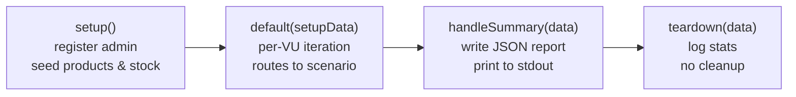

# Load Testing — Overview

<DocBadge status="under-review" version="v0.1.0-alpha" />

The ecom-engine load test suite is built on **[k6](https://k6.io)** and covers three user-journey scenarios — product browsing, cart management, and full checkout — across five named load profiles ranging from a 10-second smoke test to a 30-minute soak test.

---

## Prerequisites

| Tool | Minimum version | Install |
|---|---|---|
| k6 | 0.50+ | `winget install k6` or `choco install k6` |
| ecom-backend | running | `go run ./cmd/api/...` or Docker |
| PostgreSQL | 15+ | Run `./migrate up` before starting the backend |
| MongoDB | replica-set | Required when `db.type: mongodb` (transactions) |

Only one database backend is needed. Set `db.type` in `config.yaml` to `postgres` or `mongodb`.

---

## Directory Structure

```
load-tests/
├── main.js                   # Entrypoint — setup / default / handleSummary / teardown
├── config/
│   └── profiles.js           # Named load profiles + global SLO thresholds
├── helpers/
│   ├── api.js                # Typed HTTP wrappers with URL-name tags
│   └── data.js               # Test-data generators (users, products)
├── scenarios/
│   ├── browsing.js           # Product listing & search
│   ├── cart.js               # Add-to-cart & cart management
│   ├── checkout.js           # Full order lifecycle + admin fulfilment
│   ├── breaking-point.js     # Step-load throughput finder
│   ├── max-concurrency.js    # Peak concurrent-user finder
│   ├── throughput.js         # Arrival-rate RPS ceiling finder
│   ├── db-saturation.js      # DB connection-pool exhaustion test
│   ├── memory-leak.js        # 30-minute sustained load for heap drift
│   └── race-conditions.js    # Stock atomicity verification
└── reports/                  # Auto-generated JSON reports (git-ignored)
```

---

## Quick Start

Start the backend before running any test:

```powershell
# Terminal 1 — backend
cd ecom-backend
go run ./cmd/api/...

# Terminal 2 — run a smoke test
k6 run -e PROFILE=smoke load-tests/main.js
```

### Common Commands

```powershell
# Smoke (1 VU, 10 s) — sanity check
k6 run -e PROFILE=smoke load-tests/main.js

# Run a single scenario in smoke mode
k6 run -e PROFILE=smoke -e SCENARIO=browsing  load-tests/main.js
k6 run -e PROFILE=smoke -e SCENARIO=cart      load-tests/main.js
k6 run -e PROFILE=smoke -e SCENARIO=checkout  load-tests/main.js

# Normal load test against a remote server
k6 run -e PROFILE=load -e BASE_URL=https://api.example.com load-tests/main.js

# Stress test (skip rate limiting locally)
k6 run -e PROFILE=stress -e SKIP_RATE_LIMIT=true load-tests/main.js

# Spike test
k6 run -e PROFILE=spike load-tests/main.js

# Soak test (30 min sustained)
k6 run -e PROFILE=soak load-tests/main.js
```

---

## Environment Variables

| Variable | Default | Description |
|---|---|---|
| `PROFILE` | `smoke` | Load profile name — see [Profiles](./profiles) |
| `SCENARIO` | *(all)* | Force a single scenario: `browsing`, `cart`, `checkout` |
| `BASE_URL` | `http://localhost:8080` | Target API base URL (no trailing slash) |
| `SKIP_RATE_LIMIT` | `false` | Set `true` to bypass backend rate limiting for local high-VU tests |

---

## Test Lifecycle

`main.js` implements the standard k6 lifecycle:



**Setup** registers a fresh admin user, then either seeds 3 products with profile-appropriate stock quantities or tops up existing variants:

| Profile | Stock seeded per variant |
|---|---|
| `smoke` | 100 |
| `load` | 5 000 |
| `stress` / `spike` | 50 000 |
| `soak` | 10 000 |

**Teardown** is informational only — test data (users, carts, orders) is **not cleaned up**. Reset the database between full regression runs.
