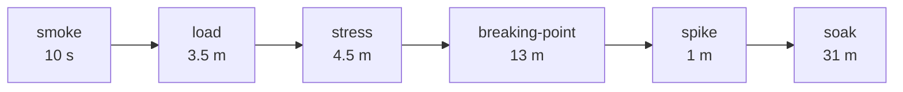

# Load Profiles

<DocBadge status="under-review" version="v0.1.0-alpha" />

Profiles are defined in `load-tests/config/profiles.js`. Pass a profile name via `-e PROFILE=<name>`. An unknown name throws immediately with the list of valid options.

---

## Summary

| Profile | Executor | Peak VUs | Duration | Purpose |
|---|---|---|---|---|
| `smoke` | constant-vus | **1** | 10 s | Sanity — does the suite wiring work? |
| `load` | ramping-vus | **50** | ~3 m 30 s | Typical production traffic |
| `stress` | ramping-vus | **150** | ~4 m 30 s | Above-normal load — finds bottlenecks |
| `spike` | ramping-vus | **200** | ~1 m 10 s | Sudden traffic burst — tests elasticity |
| `soak` | ramping-vus | **30** | ~31 m | Long-duration — detects memory leaks & drift |

---

## Profile Stages

### `smoke`

Single VU for 10 seconds. Confirms the test harness, API connectivity, and scenario scripts all execute without errors before committing to a longer run.

```
VUs │ 1 ──────────────────────────── 0
    └────────── 10 s ───────────────▶
```

---

### `load`

Simulates a realistic production traffic ramp. Two-tier ramp: initial comfortable level, then peak.

| Stage | Duration | VUs |
|---|---|---|
| Ramp up | 30 s | 0 → 20 |
| Steady | 1 m | 20 |
| Ramp up | 30 s | 20 → 50 |
| Steady | 1 m | 50 |
| Ramp down | 30 s | 50 → 0 |

```
VUs │        50 ──────────────
    │  20 ──────       ╲
    │ ╱           ─────  ╲
    └────────────────────────▶ time
```

---

### `stress`

Three-tier ramp to 150 VUs to identify where latency starts climbing and which component becomes the bottleneck.

| Stage | Duration | VUs |
|---|---|---|
| Ramp | 30 s | 0 → 50 |
| Steady | 1 m | 50 |
| Ramp | 30 s | 50 → 100 |
| Steady | 1 m | 100 |
| Ramp | 30 s | 100 → 150 |
| Steady | 1 m | 150 |
| Ramp down | 30 s | 150 → 0 |

---

### `spike`

Rapid ramp from baseline to 200 VUs and back. Tests whether the system can absorb a sudden traffic surge and recover cleanly.

| Stage | Duration | VUs |
|---|---|---|
| Baseline | 10 s | 0 → 20 |
| **Spike** | 10 s | 20 → 200 |
| Hold spike | 30 s | 200 |
| Scale back | 10 s | 200 → 20 |
| Ramp down | 10 s | 20 → 0 |

```
VUs │          200 ──────
    │         ╱           ╲
    │ 20 ────╱             ╲──── 0
    └────────────────────────────▶ time
```

---

### `soak`

Gentle ramp to 30 VUs held for **30 minutes**. The goal is not to stress the system but to observe behaviour over time: heap growth, goroutine leaks, connection pool drift, or GC pressure.

| Stage | Duration | VUs |
|---|---|---|
| Ramp up | 30 s | 0 → 30 |
| Sustained | **30 m** | 30 |
| Ramp down | 30 s | 30 → 0 |

Run `docker stats` or watch the Grafana process metrics panel concurrently to observe memory behaviour.

---

## Recommended Sequence

Run profiles in this order to maximise signal and minimise wasted time:



1. **`smoke`** — confirm the suite is wired correctly before anything else
2. **`load`** — verify baseline: system performs comfortably at expected traffic
3. **`stress`** — find where latency begins climbing
4. **`breaking-point`** — pinpoint the exact RPS where SLOs are violated (see [Breaking Point](./breaking-point))
5. **`spike`** — confirm the system recovers from a burst
6. **`soak`** — verify no degradation over time at moderate load
