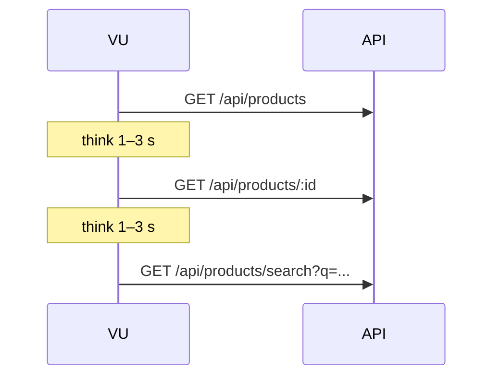
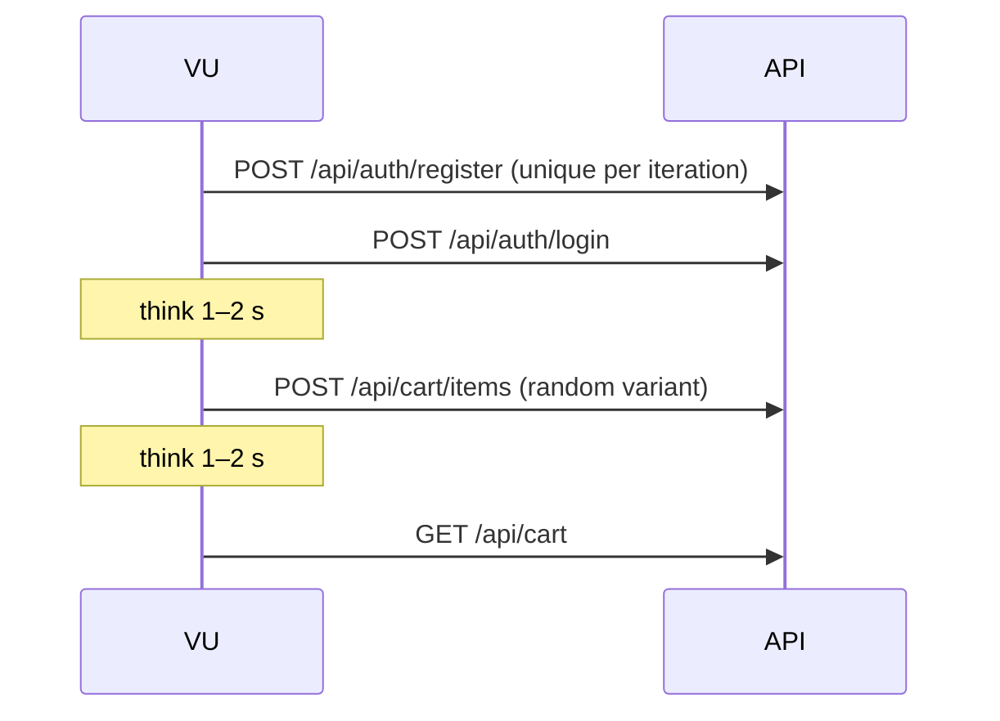
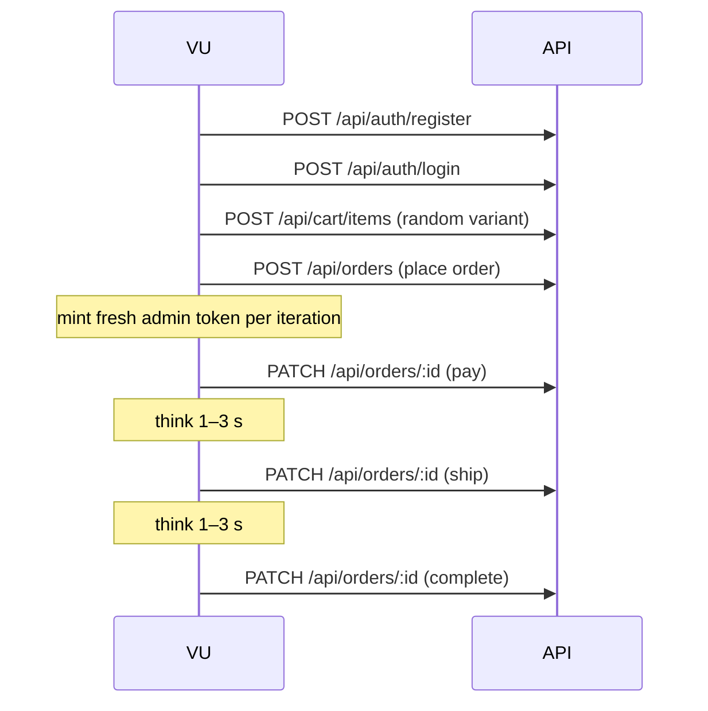
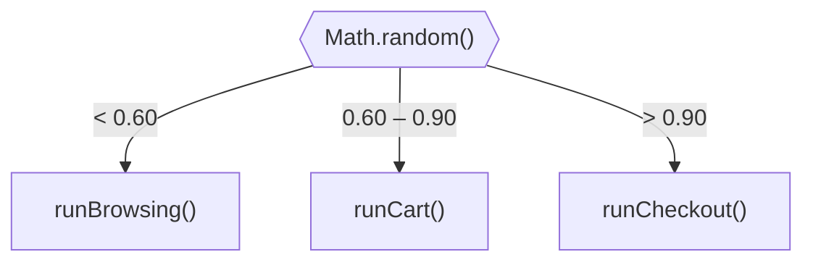

# Test Scenarios

<DocBadge status="under-review" version="v0.1.0-alpha" />

All scenarios live in `load-tests/scenarios/`. Each is a JavaScript module that exports a default function `(api, setupData) => void`. They are imported and dispatched from `main.js`.

Every HTTP call carries a `name` tag (e.g., `name: "GET /api/products"`) so k6 groups metrics by route in dashboards and the JSON report.

---

## Scenario: `browsing`

**File**: `scenarios/browsing.js`

Simulates a user discovering the product catalogue — the dominant traffic pattern in most e-commerce workloads.

### Flow

### Checks

- HTTP status 200 on all three requests
- Response body is valid JSON

### Think Time

1–3 seconds randomised between steps to simulate realistic reading / interaction time.

---

## Scenario: `cart`

**File**: `scenarios/cart.js`

Simulates a user registering, logging in, and adding items to their cart.

### Flow

Each VU registers a unique user (`loadtest_<uuid>@axiolon.test`) on every iteration — no shared-state conflicts between virtual users.

### Checks

- `POST /api/cart/items` → HTTP 200
- `GET /api/cart` → HTTP 200, item count ≥ 1, valid JSON

### Think Time

1–2 seconds randomised between steps.

---

## Scenario: `checkout`

**File**: `scenarios/checkout.js`

The most complex scenario. Tests the full purchase and admin fulfilment lifecycle, including state transitions.

### Flow

A **fresh admin token is minted inline per iteration** to prevent expiry during long soak tests (the global `merchantToken` from `setup()` is only used for seeding).

### Checks

- Order status is `pending` after `POST /api/orders`
- Order status is `paid` after pay transition
- Order status is `shipped` after ship transition
- Order status is `completed` after complete transition

### Think Time

1–3 seconds randomised between transition steps.

---

## Mixed-Mode Traffic Distribution

When no `SCENARIO` environment variable is set, each VU iteration is routed randomly according to realistic e-commerce weights:

| Scenario | Weight | Rationale |
|---|---|---|
| `browsing` | 60% | Most visitors only browse |
| `cart` | 30% | Engaged shoppers add to cart |
| `checkout` | 10% | Only a fraction complete purchase |

Override with `-e SCENARIO=checkout` to isolate a single flow — useful when debugging a specific endpoint or measuring scenario-specific latency.

---

## Adding a New Scenario

1. Create `load-tests/scenarios/<name>.js` — export a default function `(api, setupData) => void`
2. Import and call it in `main.js` inside the traffic distribution block
3. Add the scenario name to the `SCENARIO` env-var table in [Overview](./overview)
